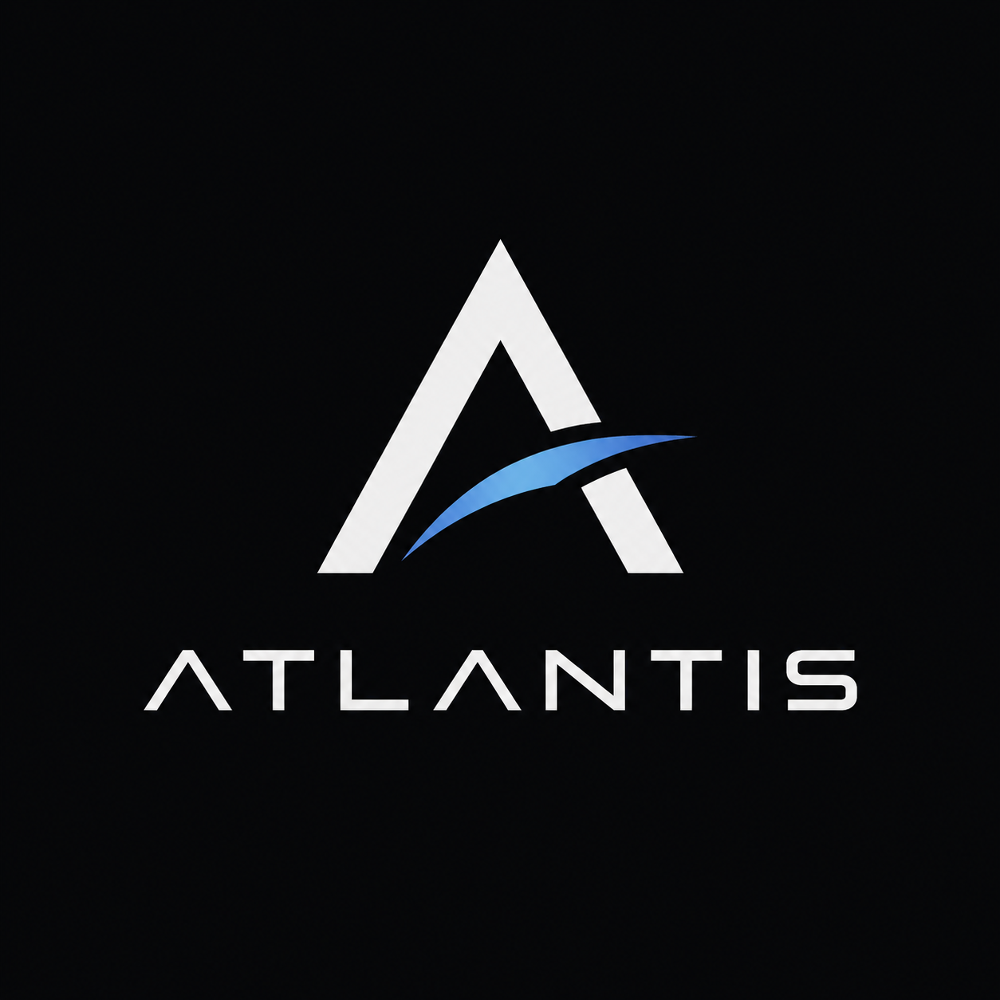

# Atlantis

<p align="center">
  
</p>

Atlantis is a long-term, real-time rendering engine project. It is currently
in its **engineering-foundation stage**: Core, Windows Platform, a
backend-independent RHI, a Vulkan windowed presentation foundation, a
RenderGraph, a first Renderer, and a Shader System are implemented — the
Windows Vulkan path now draws a real, visible, depth-tested mesh with a
working camera and a minimal material sourced from a real build-time Slang
shader pipeline, not just a cleared color or checked-in bytecode. Headless
rendering is also implemented — an offscreen `RenderTarget` source plus
GPU-to-CPU readback, sharing the same Renderer/RHI/RenderGraph/Vulkan
Backend stack (Spec 0010, `Approved`, implemented and merged via
[PR #48](https://github.com/slmao/Atlantis/pull/48)). A real Windows
windowed composition root, Atlantis Runtime, is also implemented —
composing Platform, RHI, Vulkan Backend, Renderer, Shader System,
Asset System, and World into a real windowed application (Spec 0013,
`Approved`, implemented and merged via
[PR #63](https://github.com/slmao/Atlantis/pull/63)). Runtime now
loads a real, cooked scene asset at startup — a five-cube, one-camera
scene reproducing the project's own former hardcoded validation scene
byte-for-byte — through a manifest-driven cook → decode → resolve →
load → instantiate pipeline, not a fixed, hardcoded scene construction
(Spec 0015, `Approved`, implemented and merged via
[PR #74](https://github.com/slmao/Atlantis/pull/74)). Android and iOS
remain unimplemented.
This repository holds the process and structure the project will be
built with.

## Phase 1 technical scope

- C++20
- CMake
- **Target platforms:** Windows and Android (primary), Vulkan on both.
  iOS is a future target (not started, not designed) — see below.
- **Linux is not a target platform.** No Linux-specific source, build
  config, CI jobs, or dependencies.
- A backend-independent RHI (Render Hardware Interface)
- An Atlantis Platform module abstracting per-OS windowing/surface/
  lifecycle (Win32, Android NDK, future iOS) — kept out of the Renderer
  entirely
- A Render Graph as the central rendering abstraction
- Windowed rendering first — the initial working milestone is an
  interactive, on-screen swapchain path, on Windows and/or Android
- Headless rendering after that — implemented (Spec 0010, `Approved`,
  [PR #48](https://github.com/slmao/Atlantis/pull/48)), sharing the same
  Renderer/RHI/RenderGraph/Vulkan Backend stack as the windowed path;
  what unlocked image regression testing
- Image regression testing — implemented (Spec 0011, `Approved`,
  [PR #52](https://github.com/slmao/Atlantis/pull/52)): a golden-image
  comparison harness (`tests/image_regression/`) with a working
  local/manual gate, verified on one reference GPU/driver. Automated
  CI-enforced gating is not yet implemented (see
  [docs/process/ci-strategy.md](docs/process/ci-strategy.md))
- Asset System foundation — implemented (Spec 0012, `Approved`,
  [PR #58](https://github.com/slmao/Atlantis/pull/58)): a deterministic
  authoring-source → runtime-artifact pipeline (`src/asset_system/`),
  proven end to end against the existing image regression golden with
  zero channel difference. Extended with a second asset type, scene
  graphs (Spec 0015, `Approved`,
  [PR #74](https://github.com/slmao/Atlantis/pull/74)): a scene
  authoring grammar, cook/decode pipeline, and a Runtime-side,
  build-tree-private dependency manifest, proven end to end against
  the existing World Scene golden with zero pixel difference. Extended
  again with a third asset type, textures (Spec 0016, `Approved`,
  [PR #78](https://github.com/slmao/Atlantis/pull/78)): a new RHI
  `SampledTexture`/`Sampler` pair, a RenderGraph sampled-resource
  binding kind, a one-time CPU→GPU upload sharing the same
  `Device::submit()` call as the real draw and readback, and a
  `Material` that may optionally sample one fixed texture. A post-merge
  Human Review Correction ([PR #79](https://github.com/slmao/Atlantis/pull/79),
  [PR #80](https://github.com/slmao/Atlantis/pull/80)) fixed an initial
  implementation gap where two color-space variants of the same texture
  silently shared one Asset ID — every cooked texture asset now has its
  own unique, normalized logical path and Asset ID. Extended once more
  with a real, mandatory UV0 vertex attribute (Spec 0017, `Approved`,
  implemented and merged via
  [PR #84](https://github.com/slmao/Atlantis/pull/84)): the static mesh
  format bumped to version 2 (position+color+UV0, 32-byte stride), and
  the textured-quad fixture's own two quad meshes are now genuinely
  Asset-System-sourced rather than fixture-hardcoded, closing Spec
  0016's own disclosed follow-up — proven end to end against the
  existing `textured_quad` golden with zero pixel difference. Extended
  once more with a fourth asset type, Material (Spec 0018, `Approved`,
  implemented and merged via
  [PR #88](https://github.com/slmao/Atlantis/pull/88)): a small,
  versioned DTO naming a closed `MaterialKind`, a texture Asset ID, and
  RHI `Sampler` parameters; the Scene Asset format and `World::Renderable`
  each gained an *optional* material reference (absent means the
  existing untextured fallback, unchanged pixel output for every
  scene that does not opt in); and Runtime's own scene-loading pipeline
  now resolves, loads, and deferred-GPU-realizes real, asset-sourced
  materials/textures per entity — closing the loop first opened by Spec
  0016's texture support and Spec 0017's asset-sourced UV0, so a
  Runtime-loaded scene can finally look genuinely textured, proven end
  to end against a new `material_demo` golden. Extended once more with
  a real, mandatory object-space normal vertex attribute (Spec 0020,
  `Approved`, implemented and merged via
  [PR #93](https://github.com/slmao/Atlantis/pull/93)): the static mesh
  format bumped to version 3 (position+color+UV0+normal, 44-byte
  stride), with a double-precision length-squared numeric contract
  independently re-derived at both cook and load time (no
  auto-generation from position, no normalization) — a normal *data
  contract* only, with zero new shader, zero new golden, and zero
  rendered-output change; it exists purely as this codebase's own
  named, hard prerequisite for Lighting Foundation (Spec 0019, below).
  Lighting Foundation itself is now implemented (Spec 0019, `Approved`,
  implemented and merged via
  [PR #96](https://github.com/slmao/Atlantis/pull/96)): `World` gains a
  third optional component, `Light` (Directional or Point); the Scene
  Asset format gains an optional, capped light node; `Material` gains a
  second kind, `LitTextured`; Runtime computes a fixed-size array of
  active lights exactly once per session (a static snapshot — a
  `World::setLight()` call after that point changes CPU state only, it
  is never reflected in a rendered frame without a full scene reload)
  and publishes it through the existing camera uniform buffer, widened
  from vertex-only to vertex-and-fragment visibility; a new
  `lit_textured` shader pair applies exact Lambertian diffuse shading
  against the real, Spec-0020-sourced per-vertex normal, proven end to
  end against a new, human-reviewed `lighting_demo` golden with zero
  change to any of the four pre-existing goldens. Shadows, PBR,
  image-based lighting, and post-processing are all explicitly
  unimplemented — this Spec's own Non-Goals, see `src/README.md`. A
  real, pre-existing (Plan 0018-introduced, not Lighting-Foundation-
  specific) Vulkan Backend limitation was found and disclosed during
  this Spec's own final review — the RHI descriptor pool's fixed
  capacity (`maxSets = 4`) was exceeded by a real, currently-supported
  two-distinct-material color-format change, reproduced by a real GPU
  regression test — and has since been fixed: Descriptor Pool Capacity
  Foundation (Spec 0021, `Approved`, implemented and merged via
  [PR #100](https://github.com/slmao/Atlantis/pull/100)) gives
  `VulkanDevice` a private, growable descriptor-pool set (a fixed
  `std::array`, never a `std::vector`) that scans existing pools before
  growing (geometric doubling: 4, 8, 16, 32 — 60 concurrent descriptor
  sets total), removing the ceiling for the arbitrary-N-material model
  Spec 0018 already supports, with zero RHI/Renderer/Material public
  API change — see `src/README.md`'s own `vulkan_backend/` entry. A
  four-pool/60-concurrent-descriptor-set hard ceiling remains a real,
  disclosed limit — not bindless, not descriptor indexing, not
  unlimited material support. A distributable,
  cross-session Asset Catalog and rename-stable GUID identity remain
  future work (Candidate Order 7, `specs/README.md`) — see
  `src/README.md`'s own `asset_system/`/`tools/asset_cooker/` entries
- Vulkan Validation Layers as a correctness gate
- RenderDoc-based debugging

## Planned future phases (not started, not designed yet)

- iOS support — either Vulkan via MoltenVK, or a native Metal RHI
  backend; the choice is explicitly undecided and not to be designed
  ahead of its own spec
- GPU-driven rendering
- Neural rendering / neural shading
- 3D Gaussian Splatting
- World-model–related workloads

These are listed here to communicate direction, not to authorize starting
them. Each will require its own spec before any design work begins.

## Spec-Driven Development

Atlantis is built with a strict, enforced workflow so that architecture is
always a deliberate, reviewed decision — including (especially) when the
work is done by an AI agent:

```
Spec  →  Plan  →  Human Review  →  Implementation  →  Verification  →  PR  →  Merge
```

| Stage | Lives in | Purpose |
|---|---|---|
| Spec | [specs/](specs/) | What problem, what requirements, what design, what's out of scope |
| Plan | [plans/](plans/) | How an approved spec becomes an ordered, reviewable set of changes |
| Human Review | — | Explicit human sign-off on spec + plan before implementation begins |
| ADR | [adr/](adr/) | Permanent record of any architectural decision and why it was made |
| Implementation | `src/`, `tests/` | Code written strictly against the approved plan |
| Verification | PR | Checked against the plan's verification checklist and the [Definition of Done](docs/process/definition-of-done.md) |
| PR → Merge | GitHub | An agent opens the PR; a human reviews and merges — never the reverse |

See [AGENTS.md](AGENTS.md) for the full rules that govern this — including
for AI agents working in this repo — and
[docs/process/git-workflow.md](docs/process/git-workflow.md) for how this
maps onto branches and PRs.

## Repository layout

```
AGENTS.md          Canonical agent operating rules (read this first)
CLAUDE.md           Claude Code–specific pointer to AGENTS.md
README.md           This file
docs/               Architecture records (as-built) and process docs
specs/              Proposed work, pre-implementation
plans/              Approved implementation plans
adr/                Architectural decision records
src/                Source — src/core/ (Atlantis Core, spec/plan/ADR 0001/0006-0010); src/platform/ (Atlantis Platform's Windows path, spec/plan 0002, ADR-0005/0010-0013 — Android/iOS specified but not implemented); src/rhi/ and src/vulkan_backend/ (backend-independent RHI and its sole Phase 1 backend — Windows windowed Vulkan presentation, spec/plan 0003, ADR-0001-0003/0014-0016; frame-scoped acquire/present, RenderTarget, and CommandList/submission, spec/plan 0006, ADR-0019-0021; Buffer/Texture/Pipeline and the draw-command surface, spec/plan 0007, ADR-0023-0025; OffscreenTarget and GPU-to-CPU readback for headless rendering, spec/plan 0010, ADR-0038-0040); src/render_graph/ (RenderGraph construction/compilation, spec/plan 0005, ADR-0017/0018; execution/barrier integration, spec/plan 0006, ADR-0021; multi-attachment/draw-pass integration, spec/plan 0007, ADR-0026; caller-specified incoming/final resource-state boundaries for headless reuse, spec/plan 0010, ADR-0039); src/renderer/ (Atlantis Renderer — Mesh/Material/DrawItem/Renderer, spec/plan 0007, ADR-0022; drawFrame()'s required finalColorState parameter, spec/plan 0010, ADR-0022 Amendment); src/runtime/ (Atlantis Runtime — the real Windows windowed composition root, atlantis_runtime_host static library plus the thin atlantis_runtime executable, spec/plan 0013, ADR-0046/0047); every other top-level module (Shader System, Asset System, Tools) also has real content — see src/README.md for the full, up-to-date per-module list, not maintained exhaustively here
examples/           Non-shipping demo programs (foundation_demo/, platform_demo/, rhi_vulkan_demo/, frame_execution_demo/, minimal_renderer_demo/, headless_rendering_demo/) — see ADR-0010
tests/              Tests — tests/core/, tests/platform/, tests/rhi/ (Catch2 v3, all GPU-independent), tests/vulkan_backend/ (GPU-independent plus a separate, explicitly gpu-labeled Windows/Vulkan integration executable, incl. full frame execution, the minimal renderer draw path, and headless GPU readback), tests/render_graph/ (GPU-independent, incl. execute()), tests/renderer/ (GPU-independent, Renderer statelessness/ownership); tests/image_regression/ (GPU-independent comparison/provenance logic plus a separate, explicitly gpu-labeled Windows/Vulkan capture-and-compare executable, spec/plan 0011, ADR-0041/0042); tests/runtime/ (GPU-independent lifecycle/error-classification/ownership tests plus a separate, explicitly gpu-labeled real windowed smoke test, spec/plan 0013, ADR-0046/0047)
shaders/            Shader sources — shaders/minimal_renderer/ (spec/plan 0007, ADR-0027: pre-compiled, checked-in SPIR-V only, no compiler invoked by any build target)
assets/             Engine/sample assets (empty — structure pending first spec/plan/ADR)
tools/              Offline/dev tooling (empty — structure pending first spec/plan/ADR)
cmake/              CMake helper modules (CompilerWarnings.cmake)
.github/            PR template and repository automation
```

For a full architecture overview and navigation entry point, see
[docs/architecture/engine_architecture.md](docs/architecture/engine_architecture.md).

## Building

Requires CMake 3.21+, a C++20 compiler (MSVC, Windows — see
[AGENTS.md](AGENTS.md) Phase 1 constraints), the Windows SDK, and a
pre-installed [Vulkan SDK](https://vulkan.lunarg.com/). CMake locates the
Vulkan SDK via `find_package(Vulkan REQUIRED)` — configuration fails
outright if no Vulkan SDK is found. If it is not discovered
automatically, set the `VULKAN_SDK` environment variable for the current
shell session before configuring, e.g.:

```
$env:VULKAN_SDK = 'C:\VulkanSDK\<version>'
```

The Vulkan SDK is an external prerequisite installed separately, not a
dependency this project downloads (see [ADR-0006](adr/0006-dependency-management.md)'s
external-system-dependency category). The unit test framework (Catch2 v3)
remains the only dependency CMake fetches automatically, via
`FetchContent` on first configure.

```
cmake -S . -B build
cmake --build build --config Debug
cmake --build build --config Release
```

Run the GPU-independent test suite (excludes the Vulkan GPU integration
tests):
```
ctest --test-dir build -C Debug -LE gpu --output-on-failure
```
Run the GPU-required Vulkan integration tests, which need a real,
Vulkan-capable Windows machine (replace `Debug` with `Release` for a
Release build):
```
ctest --test-dir build -C Debug -L gpu --output-on-failure
```
A bare `ctest` runs every registered test regardless of label, including
the GPU-required ones — prefer the explicit `-LE gpu`/`-L gpu` commands
above. See [tests/README.md](tests/README.md) for what each suite covers.

Run the foundation demo: `build/examples/foundation_demo/Debug/atlantis_foundation_demo.exe`
(path varies by generator/configuration).

Run the Windows Platform demo (opens a real, blank window; no rendering):
`build/examples/platform_demo/Debug/atlantis_platform_demo.exe`
(path varies by generator/configuration).

Run the RHI Vulkan verification demo (opens a real, blank window; creates
a Vulkan `Device` and `Presentation`; no rendering):
`build/examples/rhi_vulkan_demo/Debug/atlantis_rhi_vulkan_demo.exe`
(path varies by generator/configuration).

Run the minimal renderer demo (draws a real, depth-tested mesh with a
camera and a minimal material; see [specs/0007-minimal-renderer.md](specs/0007-minimal-renderer.md)),
via the `run_minimal_renderer_demo` CMake convenience target so the
checked-in shader `.spv` files resolve by relative path from the correct
working directory.

## Status

Engineering foundation stage. `specs/0001-project-foundation.md` is
implemented: a minimal C++20/CMake project (`Atlantis Core` — logging,
assertions, a result/error type — plus its unit tests and a proof-of-build
demo). `specs/0002-platform-foundation.md`'s Windows path is also
implemented: `Atlantis Platform` (application lifecycle, window
creation/destruction, `PlatformEvent` delivery, monotonic timing), its
Catch2 unit tests and Windows-only integration smoke tests, and a
non-rendering `platform_demo` that opens a real, blank window.

`specs/0003-rhi-vulkan-windowed-foundation.md` is also implemented: a
backend-independent `Atlantis RHI` (`Device`, `Presentation`'s non-frame
lifecycle, and their supporting value types) and its sole Phase 1
backend, `Atlantis Vulkan Backend` — Vulkan instance/device construction,
Validation Layer enforcement, Windows WSI surface creation, and
swapchain ownership with resize-driven recreation — plus GPU-independent
unit tests, a Windows/Vulkan GPU integration test suite, and a
non-rendering `rhi_vulkan_demo` that opens a real window and interactively
exercises resize/minimize/restore. This is a **windowed Vulkan
presentation foundation**, not windowed rendering: `Presentation` creates
and recreates a real swapchain and reports its metadata, but nothing
acquires a swapchain image, submits a GPU command, or presents a frame —
an acquire/present API and `RenderTarget` remain unimplemented (see
[ADR-0016](adr/0016-presentation-acquire-present-and-recreation-contract.md)).
`specs/0006-rhi-render-graph-frame-execution-foundation.md` subsequently
implemented exactly that acquire/present API and `RenderTarget` (see
below).

`specs/0005-render-graph-foundation.md` is also implemented: a
GPU-independent `Atlantis RenderGraph` — graph construction and
compilation (single-producer dependency derivation, deterministic pass
ordering, cycle/multiple-producer diagnostics), plus its GPU-independent
unit tests. RHI resource binding, command recording, and GPU execution
were subsequently implemented under Spec 0006 (below); pass culling,
resource lifetime/aliasing, and the Renderer itself remain
unimplemented — see [src/README.md](src/README.md).

`specs/0006-rhi-render-graph-frame-execution-foundation.md` is also
implemented, via [PR #23](https://github.com/slmao/Atlantis/pull/23)
and a post-merge GPU-verification fix PR,
[PR #24](https://github.com/slmao/Atlantis/pull/24): a frame-scoped
`RenderTarget`, `Presentation::acquireNextTarget()`/`present()`, a
minimal RHI `CommandList`/`Device::submit()` single-frame-in-flight
baseline, and RenderGraph `execute()` with its two guard checks and
barrier/transition responsibility — plus GPU-independent and GPU-required
unit tests and a non-shipping `frame_execution_demo` that acquires,
clears, submits, and presents a real frame every tick, verified
interactively across resize/minimize/restore/close with Vulkan
Validation Layers clean. Renderer, Shader System, and general
`Buffer`/`Texture` resources remain unimplemented — see
[src/README.md](src/README.md).

`specs/0007-minimal-renderer.md` is also implemented: `Atlantis Renderer`
(`src/renderer/` — `Mesh`, `Material`, `DrawItem`, a stateless
`Renderer::drawFrame()`), extending RHI with `Buffer`/`Texture`/`Pipeline`
and a minimal draw-command surface, and extending RenderGraph to scope a
draw pass against a color and a depth attachment via Vulkan dynamic
rendering (a capability-detected Core/Extension dual path — see
[ADR-0024](adr/0024-vulkan-dynamic-rendering-for-attachments.md)).
Implementation merged via
[PR #28](https://github.com/slmao/Atlantis/pull/28); a post-merge review
found the shipped dynamic-rendering Core path deviated from ADR-0024's
approved design, resolved by a Human-Review-accepted amendment
([PR #29](https://github.com/slmao/Atlantis/pull/29)) and its code fix
([PR #30](https://github.com/slmao/Atlantis/pull/30)), which separated the
Core and Extension dynamic-rendering paths so Core no longer depends on
the `VK_KHR_dynamic_rendering` extension. The Windows Vulkan path
(`Renderer` → RenderGraph → RHI → Vulkan Backend) now draws a real,
visible, depth-tested mesh with a camera transform and a minimal material,
verified with a non-shipping `examples/minimal_renderer_demo` across
resize and minimize/restore, Vulkan Validation Layers clean. The
`VK_KHR_dynamic_rendering` Extension path has no real-GPU coverage in this
environment (GPU-independent tests and code review only); see
[specs/README.md](specs/README.md) for full verification detail.

`specs/0008-shader-system-foundation.md` is also implemented: `Atlantis
Shader System` (`src/shader_system/` — a build-time Slang → SPIR-V
compile/reflect/validate pipeline superseding
[ADR-0027](adr/0027-temporary-precompiled-spirv-shader-artifacts.md)'s
checked-in-bytecode bootstrap) and `Atlantis Tools`' first real content
(`src/tools/shader_compiler/` — `atlantis_shader_compiler`, invoked by
CMake at build time). Minimal Renderer's own shader now sources from this
pipeline (`shaders/minimal_renderer/minimal_mesh.slang`) instead of a
checked-in `.spv`/`.glsl` pair. Implementation merged via
[PR #36](https://github.com/slmao/Atlantis/pull/36); verified with fresh
Debug and Release builds, the full GPU-independent/`tool`/GPU-required
test suites, and a manual demo run, Vulkan Validation Layers clean
throughout — see [specs/README.md](specs/README.md) for full scope and
verification detail. A foundational Asset System is implemented (Spec
0012, `Approved`) — see `src/README.md`'s own `asset_system/` entry
below. A real Windows windowed composition root, Atlantis Runtime, is
also implemented (Spec 0013, `Approved`) — see below. World/Scene
(`Atlantis::World`, an entity/component multi-entity scene, Spec 0014,
`Approved`) and scene asset serialization (a scene authoring/cook/
decode/load pipeline reproducing a real, cooked scene at Runtime
startup, Spec 0015, `Approved`) are also both implemented — see
[specs/README.md](specs/README.md). Texture & Sampler Foundation (a
third Asset System asset type, a new RHI `SampledTexture`/`Sampler`
pair, a RenderGraph sampled-resource binding kind, and a `Material`
that may optionally sample one fixed texture, Spec 0016, `Approved`,
implemented and merged via
[PR #78](https://github.com/slmao/Atlantis/pull/78)) is also
implemented; a post-merge Human Review Correction
([PR #79](https://github.com/slmao/Atlantis/pull/79),
[PR #80](https://github.com/slmao/Atlantis/pull/80)) fixed an initial
gap where two color-space variants of the same texture silently shared
one Asset ID — see [specs/README.md](specs/README.md). Mesh UV
Attribute Foundation (a real, mandatory UV0 vertex attribute — the
static mesh format bumped to version 2, position+color+UV0 at a fixed
32-byte stride, and the textured-quad fixture's own two quad meshes now
genuinely Asset-System-sourced rather than fixture-hardcoded, closing
Spec 0016's own disclosed follow-up, Spec 0017, `Approved`, implemented
and merged via [PR #84](https://github.com/slmao/Atlantis/pull/84)) is
also implemented, as is Material Asset & Scene Binding Foundation
(Material as a fourth Asset System asset type; an optional per-node
material reference on the Scene Asset format and `World::Renderable`;
Runtime's own CPU-transaction/deferred-GPU-realization pipeline binding
a real, asset-sourced textured `Material` per entity, Spec 0018,
`Approved`, implemented and merged via
[PR #88](https://github.com/slmao/Atlantis/pull/88)) — see
[specs/README.md](specs/README.md). Mesh Normal Attribute Foundation (a
real, mandatory object-space normal vertex attribute — the static mesh
format bumped to version 3, position+color+UV0+normal at a fixed
44-byte stride, with a double-precision length-squared numeric contract
independently re-derived at both cook and load time, no
auto-generation/normalization — a normal *data contract* only, zero new
shader, zero rendered-output change, existing solely as the named, hard
prerequisite Lighting Foundation (Spec 0019, below) depends on, Spec
0020, `Approved`, implemented and merged via
[PR #93](https://github.com/slmao/Atlantis/pull/93)) is also
implemented — see [specs/README.md](specs/README.md). Lighting
Foundation itself (`World`'s new `Light` component, an optional Scene
light node, `Material`'s new `LitTextured` kind, a frame lighting
snapshot, and a `lit_textured` shader applying exact Lambertian diffuse
shading — Spec 0019, `Approved`, implemented and merged via
[PR #96](https://github.com/slmao/Atlantis/pull/96)) is also implemented
— see [specs/README.md](specs/README.md). That snapshot's own original
"captured once per session, never updated again" limitation has since
been fixed: Dynamic Frame Uniform Updates Foundation (Spec 0022,
`Approved`, corrected design, implemented and merged via
[PR #106](https://github.com/slmao/Atlantis/pull/106)) re-extracts and
republishes the complete 176-byte payload from `World`'s live state
every successful frame, so `World::setLight()` and a Light's own local/
parent `Transform` changes are now reflected on the next successful
frame — with no new RHI API and no new synchronization primitive; a
first-draft proposal for a new RHI wait method was found unnecessary
during that Spec's own governance gate and never implemented
([ADR-0065](adr/0065-explicit-pre-write-submission-drain-for-frame-uniform-safety.md),
`Rejected`). A direct-lighting PBR baseline is now also implemented: PBR
Material Foundation (Spec 0023, `Approved`, implemented and merged via
[PR #111](https://github.com/slmao/Atlantis/pull/111)) adds a third
`MaterialKind`, `PbrDirectLit` — a metallic-roughness Cook-Torrance BRDF
(Directional/Point lights, no ambient/specular term beyond it) sharing
the existing single-texture Material architecture, an extended 96-byte
push constant, and the extended 320-byte Camera/Lighting/camera-world-
position uniform buffer — proven against a new, human-reviewed
`pbr_material_demo` golden (four spheres spanning dielectric/metallic ×
rough/smooth) with zero change to any of the five pre-existing goldens.
Spec 0024 then implemented the shared `Rgba16Float` HDR scene intermediate,
fixed-exposure Reinhard output transform, and correct sRGB transfer path for
both presentable-target format classes, merged via
[PR #115](https://github.com/slmao/Atlantis/pull/115). This is still not
Filament-quality PBR: image-based lighting, shadows, normal mapping/
tangent-space input, physical camera/exposure, and post-processing beyond the
fixed output transform remain unimplemented. The next approved milestone is
[Spec 0025](specs/0025-image-based-lighting-foundation.md), the IBL foundation;
its [Plan 0025](plans/0025-image-based-lighting-foundation.md) is drafted and
awaiting Human Review before implementation.

Android and iOS remain specified architecturally only (not implemented);
Vulkan Backend's Android WSI path is likewise not implemented. Headless
rendering is implemented (Spec 0010, `Approved`, implemented and merged
via [PR #48](https://github.com/slmao/Atlantis/pull/48) — see
[specs/README.md](specs/README.md) for full scope and verification
detail, including its own disclosed single-GPU-vendor verification
limitation). Image regression testing is also implemented (Spec 0011,
`Approved`, implemented and merged via
[PR #52](https://github.com/slmao/Atlantis/pull/52) — see
[specs/README.md](specs/README.md) for full scope and verification
detail): a golden-image comparison harness
(`tests/image_regression/`), verified against one committed golden on
the same single reference GPU/driver Spec 0010 disclosed — not
cross-vendor coverage. Golden regeneration/update reasons are governed
by [ADR-0042](adr/0042-image-regression-testing-comparison-methodology-and-test-ownership-boundary.md),
including its Accepted Amendment adding an "Initial baseline bootstrap"
category for a scene's first-ever golden. This is a working
**local/manual** gate; there is no CI pipeline yet, so automated,
CI-enforced image-regression gating remains not implemented — see
[docs/process/ci-strategy.md](docs/process/ci-strategy.md). A
foundational Asset System (Spec 0012, `Approved`, implemented) followed
next, by explicit human direction, ahead of Android Platform — see
[specs/README.md](specs/README.md) for full scope and verification
detail.

A real Windows windowed composition root, Atlantis Runtime, followed
next after that, again by explicit human direction, ahead of Android
Platform (Spec 0013, `Approved`, implemented and merged via
[PR #63](https://github.com/slmao/Atlantis/pull/63)): `atlantis_runtime_host`
(a private static library, alias `Atlantis::RuntimeHost`) and a thin
`atlantis_runtime` executable compose Platform, RHI, Vulkan Backend,
Renderer, Shader System, and Asset System into one fixed startup →
windowed frame loop → shutdown lifecycle, drawing the same
Asset-System-sourced `minimal_cube` mesh used by earlier milestones. A
`PlatformSession` RAII guard makes window-outlives-GPU-resources a
compiler-enforced invariant rather than a hand-sequenced convention.
Verified by a real windowed GPU smoke test (`tests/runtime`,
`gpu`-labeled — the first test in the repository that opens a real,
visible OS window during automated `ctest`), by clean Debug/Release
builds (`ctest -LE gpu`: 389/389 Debug, 388/388 Release; `ctest -L gpu`:
18/18 both configurations), and by programmatic Win32 interactive
verification (resize, minimize/restore, close), Vulkan Validation
Layers grepped clean throughout. **Disclosed limitation:** no automated
literal pixel/visual screenshot comparison of the Runtime window's
rendered output exists yet — see the Spec 0013 row in
[specs/README.md](specs/README.md) for the full disclosure and the
outstanding human-only verification step it records. **Android Platform
and Vulkan Presentation remains the next candidate item** (see
[specs/README.md](specs/README.md) Section B) — not yet drafted or
approved; its own scope and dependencies are unchanged by this
repeated reprioritization. See [docs/](docs/) for what's documented so
far and the open architectural questions still awaiting human
decisions.

## License

Licensed under the [Apache License, Version 2.0](LICENSE).
