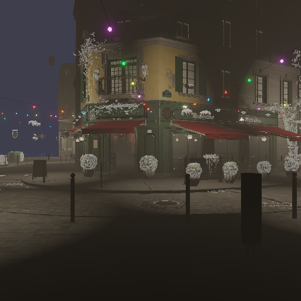

# Atlantis

<p align="center">
  
</p>

<p align="center">
  
</p>

<p align="center"><em>Atlantis rendering the <a href="https://developer.nvidia.com/orca/amazon-lumberyard-bistro">Amazon Bistro</a> reference scene —
glTF import, 64 point lights, emissive materials, alpha cutout, height fog, and bloom, in one frame.</em></p>

Atlantis is a long-term, real-time rendering engine written in C++20,
built on a backend-independent RHI (currently Vulkan) and a RenderGraph,
targeting **Windows and Android**. It is in active development; see
[docs/specs/README.md](docs/specs/README.md) for the current, authoritative
status of every module.

## Features

**Platform**
- Windows and Android, sharing one Renderer/RHI/RenderGraph stack
  (Android via Vulkan WSI + NDK; APK packaging with Gradle)
- Windowed and headless rendering through the same code path

**Rendering**
- Physically based rendering: metallic-roughness BRDF, image-based
  lighting (SH irradiance, prefiltered specular, DFG LUT), tangent-space
  normal mapping
- Clearcoat, sheen (cloth), and anisotropy BRDF extensions
- Up to 64 concurrent point lights + 1 directional light with shadow
- Emissive materials (factor + texture)
- Alpha blending and alpha testing (cutout) with back-to-front CPU
  draw-order sorting
- Height-based exponential fog (HDR colour, per-scene parameters)
- Bloom (downsample/upsample chain, 6 levels, threshold + strength)
- BC7 block-compressed textures with full mip-chain passthrough
- HDR color pipeline with tone mapping and manual camera exposure

**Assets & Tooling**
- glTF 2.0 scene importer (meshes, materials, textures, scene graphs,
  64-bit index meshes)
- A build-time Slang → SPIR-V shader pipeline
- A deterministic authoring-source → runtime-artifact Asset System
- Image-regression testing against human-reviewed golden images
  (30+ goldens, zero tolerance)

**Sample scenes** — `--list-scenes` in the Runtime binary:
integrated showcase (multi-object PBR), IBL material demo, normal-map
demo, clearcoat/sheen/anisotropy showcase, transparency demo, fog demo,
bloom demo, and the full Bistro reference scene.

iOS is a future target — backend undecided (MoltenVK vs. a native Metal
RHI backend). Linux is not a target platform.

## Spec-Driven Development

Atlantis is built with a strict, enforced workflow so that architecture is
always a deliberate, reviewed decision — including (especially) when the
work is done by an AI agent:

```
Spec  →  Plan  →  Human Review  →  Implementation  →  Verification  →  PR  →  Merge
```

| Stage | Lives in | Purpose |
|---|---|---|
| Spec | [docs/specs/](docs/specs/) | What problem, what requirements, what design, what's out of scope |
| Plan | [docs/plans/](docs/plans/) | How an approved spec becomes an ordered, reviewable set of changes |
| Human Review | — | Explicit human sign-off on spec + plan before implementation begins |
| ADR | [docs/adr/](docs/adr/) | Permanent record of any architectural decision and why it was made |
| Implementation | `src/`, `tests/` | Code written strictly against the approved plan |
| Verification | PR | Checked against the plan's verification checklist and the [Definition of Done](docs/process/definition-of-done.md) |
| PR → Merge | GitHub | An agent opens the PR; a human reviews and merges — never the reverse |

See [AGENTS.md](AGENTS.md) for the full rules that govern this — including
for AI agents working in this repo — and
[docs/process/git-workflow.md](docs/process/git-workflow.md) for how this
maps onto branches and PRs.

## Repository layout

```
AGENTS.md          Canonical agent operating rules (read this first)
CLAUDE.md          Claude Code–specific pointer to AGENTS.md
README.md          This file
docs/
  specs/           Proposed work, pre-implementation (specs/README.md is the status registry)
  plans/           Approved implementation plans
  adr/             Architectural decision records
  architecture/    As-built design records
  process/         Prescriptive process docs (git workflow, Definition of Done, CI/testing strategy)
  project-blueprint.md   Roadmap and status navigation index
src/               Source — see src/README.md for the full, up-to-date per-module breakdown
examples/          Non-shipping demo programs
tests/             Tests — see tests/README.md for what each suite covers
shaders/           Shader sources (Slang)
assets/            Engine/sample assets
tools/             Offline/dev tooling
cmake/             CMake helper modules
.github/           PR template and repository automation
```

For a full architecture overview and navigation entry point, see
[docs/architecture/engine_architecture.md](docs/architecture/engine_architecture.md).
For direction and roadmap beyond what's currently approved, see
[docs/project-blueprint.md](docs/project-blueprint.md) — naming a
milestone there does not authorize implementing it; every one still
requires its own Spec.

## Building

Requires CMake 3.21+, a C++20 compiler (MSVC, Windows), the Windows SDK,
and a pre-installed [Vulkan SDK](https://vulkan.lunarg.com/). CMake locates
the Vulkan SDK via `find_package(Vulkan REQUIRED)` — configuration fails
outright if no Vulkan SDK is found. If it is not discovered
automatically, set the `VULKAN_SDK` environment variable for the current
shell session before configuring, e.g.:

```
$env:VULKAN_SDK = 'C:\VulkanSDK\<version>'
```

The Vulkan SDK is an external prerequisite installed separately, not a
dependency this project downloads (see [ADR-0006](docs/adr/0006-dependency-management.md)'s
external-system-dependency category). The unit test framework (Catch2 v3)
remains the only dependency CMake fetches automatically, via
`FetchContent` on first configure.

```
cmake -S . -B build
cmake --build build --config Debug
cmake --build build --config Release
```

Run the GPU-independent test suite (excludes the Vulkan GPU integration
tests):
```
ctest --test-dir build -C Debug -LE gpu --output-on-failure
```
Run the GPU-required Vulkan integration tests, which need a real,
Vulkan-capable Windows machine (replace `Debug` with `Release` for a
Release build):
```
ctest --test-dir build -C Debug -L gpu --output-on-failure
```
A bare `ctest` runs every registered test regardless of label, including
the GPU-required ones — prefer the explicit `-LE gpu`/`-L gpu` commands
above. See [tests/README.md](tests/README.md) for what each suite covers.

Run the real product binary (see
[docs/specs/0032-runtime-sample-scene-selection.md](docs/specs/0032-runtime-sample-scene-selection.md)
for the `--scene`/`--list-scenes`/`--help` flags):
```
build/src/runtime/Debug/atlantis_runtime.exe
```
(path varies by generator/configuration). See
[examples/](examples/) for smaller, single-purpose demo programs.

## Status

Engineering-foundation stage. See [docs/specs/README.md](docs/specs/README.md) for
the full, authoritative registry of every Spec's status, its Plan, and
its implementation PR(s).

## License

Licensed under the [Apache License, Version 2.0](LICENSE).
