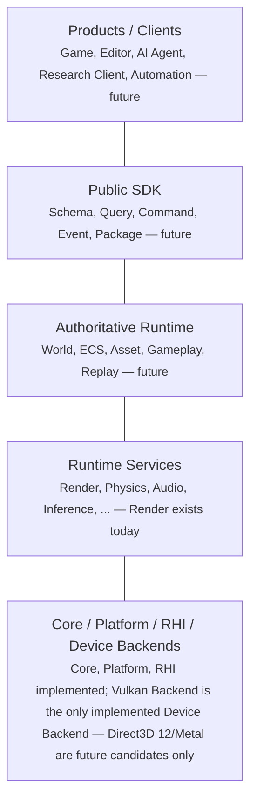

# Engine Architecture Overview

> **Document type: navigation, not authority.** This document combines
> current as-built architecture (linking `Approved` Specs and `Accepted`
> ADRs) with `Accepted`-but-not-yet-implemented long-term direction. It
> does not itself authorize anything; per [AGENTS.md](../../AGENTS.md)'s
> single-authoritative-source principle, the *why* of any decision stays
> in its `Accepted` ADR, the current *what* stays in `Approved` Specs and
> [module_boundaries.md](module_boundaries.md), and roadmap/status stays
> in [project-blueprint.md](../project-blueprint.md)/
> [specs/README.md](../../specs/README.md). Where this document and any
> of those disagree, they win, and that is a bug in this document to fix,
> not a license to follow this document instead.
>
> Every architectural element named below carries one of three status
> tags — **As-built**, **Approved direction (partially implemented)**,
> or **Long-term candidate** — see [Section 5](#5-status-legend-and-long-term-direction).
> Read each claim together with its tag; none of this document is a
> single, uniform state.

## 1. Purpose

This document is the entry point for understanding Atlantis's
architecture — both its current, implemented shape and its `Accepted`
long-term direction, and how the two relate. It connects the conceptual,
product-level view of the engine to the concrete source modules that
exist today, and points readers toward the authoritative document for
whatever they need next, rather than restating it here. It exists to
prevent a common failure mode: reading a long-term direction as if it
were already built, or reading today's narrow Phase 1 scope as if it
were the permanent ceiling.

## 2. Two Orthogonal Views

Per [ADR-0032](../../adr/0032-conceptual-architecture-layers-versus-source-module-ownership.md),
Atlantis is described by two views that answer different questions and
do not replace each other:

- The **conceptual architecture layers** (Section 3) answer "which kind
  of responsibility sits at which distance from raw hardware and from an
  external client?" — a descriptive, product-level lens.
- The **module ownership view** (Section 4) answers "which CMake target
  owns this file, and what may it depend on?" — the authoritative
  source/build structure. Not every named module has an implemented
  CMake target yet — Section 4 states, module by module, which do.

Neither view supersedes the other, and a given module's position in one
does not fix its position in the other. The module ownership view is
authoritative for CMake and dependency structure; the conceptual view is
not enforceable against source code and does not attempt to be.

## 3. Conceptual Architecture Layers

**Diagram caption (read together with the diagram above, not only in
surrounding prose):**

- This is a conceptual, descriptive layering, not a list of source
  modules and not a build/CMake dependency graph. The connecting lines
  do not represent call direction, ownership, or link order.
- The only Device Backend that exists and is implemented today is
  Atlantis Vulkan Backend. Direct3D 12 and Metal appear here solely as
  future candidate positions
  ([ADR-0037](../../adr/0037-long-term-device-backend-extensibility-without-phase1-scaffolding.md));
  naming them here authorizes no code, directory, target, dependency, or
  timetable.
- Atlantis's ten-module, source/build-ownership view (Section 4) remains
  the sole authoritative structure for CMake targets and module
  dependencies — this diagram never overrides it.
- Any future Device Backend, if and when approved by its own Spec,
  becomes an independent sibling module in that ten-module view, the
  same way Atlantis Vulkan Backend itself is a named module today. This
  diagram does not create, and nothing in this repository authorizes, a
  new public `DeviceBackend` abstraction module.
- Atlantis Vulkan Backend is not renamed, restructured, or reinterpreted
  by this diagram or by ADR-0037.

## 4. Module Ownership Navigation

The ten top-level modules named in [AGENTS.md](../../AGENTS.md) — the
authoritative list. Full per-module responsibility, dependency, and
lifetime detail lives in
[module_boundaries.md](module_boundaries.md), not here.

| Module | Responsibility | Status | Authoritative Detail |
|---|---|---|---|
| Atlantis Core | Foundation: logging, assertions, `Result<T,E>`, non-graphics utilities | As-built | [Spec 0001](../../specs/0001-project-foundation.md) |
| Atlantis Platform | Per-OS windowing/surface/lifecycle abstraction | As-built (Windows); Android/iOS architecture-only | [Spec 0002](../../specs/0002-platform-foundation.md), [ADR-0005](../../adr/0005-platform-module-multi-os-windowing.md) |
| Atlantis RHI | Backend-agnostic Render Hardware Interface | As-built | [Spec 0003](../../specs/0003-rhi-vulkan-windowed-foundation.md), [ADR-0001](../../adr/0001-rhi-backend-independence.md) |
| Atlantis Vulkan Backend | Sole Phase 1 implementation of RHI, on Vulkan | As-built | [Spec 0003](../../specs/0003-rhi-vulkan-windowed-foundation.md) |
| Atlantis RenderGraph | Central rendering abstraction: passes, dependencies, barriers | As-built | [Spec 0005](../../specs/0005-render-graph-foundation.md) |
| Atlantis Renderer | Frame orchestration built on RenderGraph + RHI | As-built | [Spec 0007](../../specs/0007-minimal-renderer.md) |
| Atlantis Shader System | Shader authoring/compilation/reflection (Slang → SPIR-V) | As-built | [Spec 0008](../../specs/0008-shader-system-foundation.md) |
| Atlantis Asset System | Deterministic authoring-source → runtime-artifact pipeline (three asset types: static mesh — position/color/UV0 — scene, texture); Core-only dependency | As-built | [Spec 0012](../../specs/0012-asset-system-foundation.md), [Spec 0015](../../specs/0015-scene-asset-serialization-foundation.md), [Spec 0016](../../specs/0016-texture-sampler-foundation.md), [Spec 0017](../../specs/0017-mesh-uv-attribute-foundation.md), [ADR-0043](../../adr/0043-asset-system-module-boundary.md)–[ADR-0045](../../adr/0045-asset-system-data-format-versioning-and-dependency-policy.md), [ADR-0058](../../adr/0058-static-mesh-uv0-vertex-layout-and-sampling-convention.md) |
| Atlantis Runtime | Windows windowed composition root | As-built (Windows windowed composition root); its future Client-boundary/multi-client authority principle remains Approved direction, not yet built | [Spec 0013](../../specs/0013-runtime-host-foundation.md), [ADR-0046](../../adr/0046-runtime-composition-ownership-and-frame-lifecycle.md), [ADR-0047](../../adr/0047-runtime-host-executable-library-structure-and-test-boundary.md), [ADR-0033](../../adr/0033-runtime-authority-and-client-boundary.md) (Client-boundary principle, separate from the module itself) |
| Atlantis Tools | Offline/developer tooling | As-built (shader-compiler and asset-cooker CLI content; broader scope not yet specced) | [Spec 0008](../../specs/0008-shader-system-foundation.md), [Spec 0012](../../specs/0012-asset-system-foundation.md) |

For the current, detailed dependency graph and per-milestone build
status, see [project-blueprint.md](../project-blueprint.md)'s own
diagram — this table is a navigation index, not a second copy of it.

`Device Backends` is not its own top-level module and not a public
interface — see [Section 6](#6-device-backend-boundary) below.

## 5. Status Legend and Long-Term Direction

| Tag | Meaning |
|---|---|
| **As-built** | `Approved` Spec, implemented, merged. Verifiable against [specs/README.md](../../specs/README.md). |
| **Approved direction (partially implemented)** | An `Accepted` ADR states a principle or boundary, but no concrete module/system implementing it yet exists. |
| **Long-term candidate** | Named in [Spec 0009](../../specs/0009-long-term-engine-architecture-alignment.md) or the Candidate Spec Backlog as a future direction; no `Accepted` ADR or `Approved` Spec commits to *building* it yet. |

The labels below describe the implementation state of each
architectural capability, not the formal status of the ADR that names
it. Every ADR cited in this section is `Accepted` — acceptance records
that the decision itself is settled, not that the capability it
describes has been built.

- **As-built:** Core, Platform (Windows), RHI, Vulkan Backend,
  RenderGraph, Renderer, Shader System, Asset System (three asset
  types: static mesh — position/color/UV0 — scene, texture), Runtime
  (Windows windowed composition root), Tools (shader-compiler and
  asset-cooker CLI content).
- **Approved direction (partially implemented):** the five-layer/
  ten-module coexistence
  ([ADR-0032](../../adr/0032-conceptual-architecture-layers-versus-source-module-ownership.md));
  Runtime authority and Client boundary
  ([ADR-0033](../../adr/0033-runtime-authority-and-client-boundary.md));
  stable schema/identity/protocol boundary
  ([ADR-0034](../../adr/0034-stable-public-boundary-versus-internal-cpp-layout.md),
  already realized narrowly by ADR-0001/ADR-0030); authoring/runtime
  data separation as an available option
  ([ADR-0035](../../adr/0035-authoring-runtime-data-separation-as-a-long-term-principle.md),
  already realized narrowly by Shader System and, since Spec 0012, by
  Asset System too); Agent-native/
  machine-verifiable development-tooling direction
  ([ADR-0036](../../adr/0036-agent-native-automation-and-machine-verifiable-architecture-as-long-term-goals.md));
  long-term Device Backend sibling-boundary reservation
  ([ADR-0037](../../adr/0037-long-term-device-backend-extensibility-without-phase1-scaffolding.md)).
- **Long-term candidate:** World/ECS, Public SDK, Package System, Job
  System, Editor/Tool Connection Protocol, Gameplay SDK,
  Research/Simulation API, AI Inference Integration, UGC Sandbox,
  Direct3D 12 Device Backend, Metal Device Backend, Android Platform
  implementation, iOS Platform, Agent-native CLI/manifest/diagnostic
  tooling — see [specs/README.md](../../specs/README.md) Section B for
  each item's Candidate Backlog row, where one exists. (Atlantis Runtime
  the module is now As-built, above — only its future Client-boundary/
  multi-client authority principle remains here, listed under Approved
  direction, not this tier.)
- **Explicitly not reserved, at any tier:** WebGPU — per ADR-0037, given
  no position at all, stated here so it is not silently omitted and
  mistaken for an oversight.

None of the above is implemented, scheduled, or committed to a
timetable unless its own `Approved` Spec explicitly says so.

## 6. Device Backend Boundary

Per [ADR-0037](../../adr/0037-long-term-device-backend-extensibility-without-phase1-scaffolding.md):

| Backend | Status | Notes |
|---|---|---|
| Vulkan Backend | As-built | The only implemented Device Backend, Phase 1 and today. |
| Direct3D 12 | Long-term candidate | No implementation timetable, no design started. |
| Metal | Long-term candidate | No implementation timetable, no design started. |

- A "Long-term candidate" Device Backend is not scheduled, not
  committed, and not being designed — naming it records a long-term
  architectural position only.
- "Reservation" for a future Device Backend means, and means only,
  keeping RHI's interface and Atlantis Renderer/RenderGraph's
  dependencies free of any concrete graphics API — nothing else.
- Phase 1 remains strictly Vulkan-only, per [AGENTS.md](../../AGENTS.md).
- Whether a future iOS Platform uses Vulkan via MoltenVK or a native
  Metal backend remains undecided.
- macOS and Linux are not Atlantis target platforms; naming Metal as a
  long-term candidate does not change that.

This document does not, and no repository content authorizes, any of the
following now: a Backend factory, registry, or plugin system; a
Capability/feature-tier framework; a Direct3D 12/Metal source directory,
CMake target, or SDK dependency; a DXIL or MSL shader target; a unified
backend-initialization API; or any change to RHI's current public API
made in anticipation of a future backend. A future Direct3D 12 or Metal
Backend requires its own Spec, ADR, Plan, and Human Review before any of
the above may exist — see ADR-0037's own "Future approval gate."

## 7. Common Misreadings to Avoid

- The conceptual layers (Section 3) are **not** source modules, CMake
  targets, or public C++ interfaces.
- A "Long-term candidate" is **not** a roadmap commitment or a scheduled
  deliverable.
- Vulkan Backend is the **only** Device Backend that exists today.
- iOS's graphics backend choice (Metal vs. Vulkan/MoltenVK) **remains
  undecided**.
- "Agent-native" ([ADR-0036](../../adr/0036-agent-native-automation-and-machine-verifiable-architecture-as-long-term-goals.md))
  is a **development-tooling direction** — not a runtime AI feature, not
  an in-game agent API.
- Headless rendering is **implemented and merged** (Spec 0010
  `Approved`, [PR #48](https://github.com/slmao/Atlantis/pull/48)),
  having followed windowed rendering per Phase 1 sequencing as required
  — see the Spec 0010 row in [specs/README.md](../../specs/README.md)
  for full scope and verification detail, including its own disclosed
  single-GPU-vendor verification limitation.
- Direct3D 12 and Metal are **not** Candidate Spec Backlog items — see
  [specs/README.md](../../specs/README.md) Section B, unmodified.
- RenderGraph remains the mandatory path for GPU work — no ad hoc
  direct-submission path bypasses it.
- Renderer's existing boundary from Platform, Window, Swapchain, and any
  concrete graphics API is unchanged — see
  [ADR-0001](../../adr/0001-rhi-backend-independence.md) and
  [ADR-0002](../../adr/0002-presentation-rendertarget-unification.md).

## 8. Where to Go Next

- [AGENTS.md](../../AGENTS.md) — governance rules and Phase 1
  constraints.
- [module_boundaries.md](module_boundaries.md) — detailed per-module
  responsibility, dependency, and ownership rules.
- [project-blueprint.md](../project-blueprint.md) — current build
  status, milestone sequencing, and roadmap.
- [threading.md](threading.md) — Phase 1 threading assumptions.
- [specs/README.md](../../specs/README.md) — the full Spec registry and
  the Candidate Spec Backlog.
- [Spec 0009](../../specs/0009-long-term-engine-architecture-alignment.md)
  — the long-term alignment Spec this document implements.
- [ADR-0032](../../adr/0032-conceptual-architecture-layers-versus-source-module-ownership.md)–[ADR-0037](../../adr/0037-long-term-device-backend-extensibility-without-phase1-scaffolding.md)
  — the six `Accepted` decisions this document surfaces.
