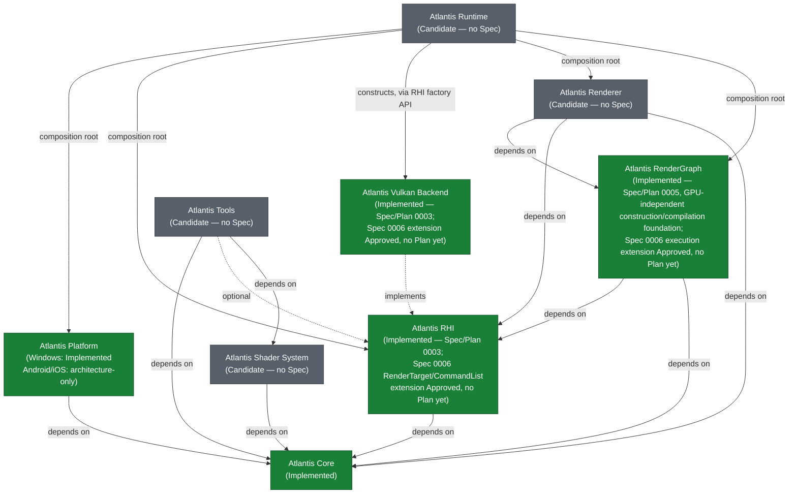

# Atlantis Project Blueprint

> **Document type: navigation, not authority.** This document sits
> alongside [docs/architecture/](architecture/) (as-built design records)
> and [docs/process/](process/) (prescriptive process docs), but is
> neither: it is a roadmap and status index. It is placed directly under
> `docs/` rather than in either subdirectory because it doesn't fit
> `docs/README.md`'s two-category split — it is not an as-built design
> record (most of what it describes is not built) and it is not a
> process rule. If the project later wants a named third category for
> this kind of document, that is a `docs/README.md` change for a human to
> decide, not something this document does on its own.

## 1. What this document is and isn't

This document exists to show, in one place: overall direction, module
dependency order, milestone sequencing, and current status. It is a
**navigation aid**, not a design authority. Specifically:

- **Accepted ADRs** (`adr/`) are the authoritative record of *why* an
  architectural decision was made. Where this document states an
  architectural fact, it links the ADR that actually decided it.
- **Approved Specs** (`specs/`) are the authoritative record of *what* a
  specific piece of work is scoped to build.
- **Approved Plans** (`plans/`) are the authoritative record of
  *implementation order and verification* for an approved spec.
- **Every future phase or milestone named below the current approved
  work is a candidate route, not an authorization to implement it.**
  Naming a milestone here does not skip Spec → Plan → Human Review →
  Implementation → Verification → PR → Merge (see
  [AGENTS.md](../AGENTS.md)) for a single line of it.
- Nothing in this document overrides [AGENTS.md](../AGENTS.md). Where
  this document and AGENTS.md appear to disagree, AGENTS.md wins, and
  that is a bug in this document to be fixed, not a license to follow
  this document instead.

## 2. Project vision and positioning

Atlantis's current, funded direction — the thing Phase 1 actually
builds toward — is: **a long-term, real-time rendering engine.** Its
first job is a stable, well-bounded stack: Platform, RHI, Vulkan
Backend, RenderGraph, Renderer, and Shader System, in that dependency
order. See [README.md](../README.md) and [AGENTS.md](../AGENTS.md)'s
Golden Rule and Phase 1 constraints.

A broader, longer-horizon ambition exists in the external reference
document `D:\blueprint.md` (outside this repository, not itself a spec
or ADR) describing a future engine that could also host game Runtime,
simulation, AI research, and UGC workloads on top of that renderer.
This document treats that material as **directional input, not decided
architecture**:

- Nothing in `D:\blueprint.md` is Atlantis-approved by virtue of
  existing in that file. Every concrete design choice it proposes
  (Runtime/Editor process split, ECS, ABI, UGC VM, inference backend,
  schema-driven SDK, ...) requires its own future Spec and, where
  architectural, its own ADR before it is anything more than a
  candidate.
- Where `D:\blueprint.md` conflicts with repository fact — approved
  specs, accepted ADRs, or [AGENTS.md](../AGENTS.md) — repository fact
  wins. Section 7 below lists the specific conflicts found and how they
  were resolved for this document.
- Atlantis does **not** target replicating Unity's or Unreal's full
  feature set in Phase 1. The near-term goal is a coherent,
  well-bounded renderer; broader Runtime/tooling/AI ambitions are
  future-phase candidates that must not shape Phase 1 interfaces (per
  [AGENTS.md](../AGENTS.md)'s "no speculative abstraction" principle).
- Long-term direction must not reach backward into Phase 1 module
  boundaries. If a future-phase idea would require Phase 1's RHI,
  RenderGraph, or Renderer to grow an interface it doesn't otherwise
  need, that is a signal to defer the idea, not to widen Phase 1.

## 3. Approved overall architecture

The module map and dependency directions below are drawn from
[docs/architecture/overview.md](architecture/overview.md) and
[docs/architecture/module_boundaries.md](architecture/module_boundaries.md).
**Both of those documents currently carry their own
`PROPOSED — pending spec/ADR approval. Not as-built` banner** — they
were drafted as an explicit, one-time bootstrap exception (see
[docs/architecture/README.md](architecture/README.md)) ahead of the
specs that would normally earn as-built status. That banner has not
been revised even though several ADRs they cite are now `Accepted` and
two of the modules they describe (Core, and Platform's Windows path)
are now implemented — this is a known, currently-open documentation gap
(see Section 4), not something this blueprint resolves by re-labeling
those documents itself.

Key boundary facts this diagram encodes (each traceable to an Accepted
ADR or the architecture docs above — see the links inline):

- **Runtime is the composition root** that connects Platform and RHI.
  Platform and RHI are **siblings** — RHI does not depend on Platform;
  Runtime passes the opaque native-surface handle Platform produces
  into RHI's `Presentation` construction. See
  [ADR-0001](../adr/0001-rhi-backend-independence.md) and
  [ADR-0014](../adr/0014-rhi-device-presentation-construction-boundary.md).
- **Vulkan Backend implements RHI's interfaces**; it is not a
  dependency of RHI. Only Vulkan Backend's private WSI boundary
  consumes `NativeWindowHandle` and interprets `Vk*` types — see
  [ADR-0005 (amended)](../adr/0005-platform-module-multi-os-windowing.md)
  and
  [docs/architecture/platform-vulkan-wsi-boundary.md](architecture/platform-vulkan-wsi-boundary.md).
- **Renderer depends only on Core, RHI, and RenderGraph.** It must
  never include a Win32/Android NDK/`Vk*` type, never see a window, a
  `Platform` instance, `VkSurfaceKHR`, or `VkSwapchainKHR` — see
  [docs/architecture/overview.md](architecture/overview.md#dependency-direction),
  [ADR-0001](../adr/0001-rhi-backend-independence.md),
  [ADR-0002](../adr/0002-presentation-rendertarget-unification.md).
- **All GPU work is mandatory through RenderGraph** — no subsystem
  submits ad hoc, hand-scheduled GPU work outside it (per
  [AGENTS.md](../AGENTS.md)'s Golden Rule and Architecture Principles,
  and reaffirmed operationally by Spec 0003 — see Section 4).
- **Windowed and headless rendering share the same
  Renderer/RHI/RenderGraph stack** — headless is a second way to
  produce a `RenderTarget`, not a fork of the rendering code. See
  [docs/architecture/overview.md](architecture/overview.md#windowed-vs-headless-the-shared-path-across-platforms).
- **RenderGraph's dependency on RHI (already drawn in the diagram above)
  is now a reviewed decision, not only an anticipated one** — Spec 0006
  ([ADR-0021](../adr/0021-render-graph-rhi-execution-integration-and-barrier-responsibility.md))
  realizes it for the frame-execution slice (`CommandList`,
  `ResourceState`, `RenderTarget`), splitting responsibility so
  RenderGraph decides *when*/*between what states* a resource transition
  is needed and RHI/Vulkan Backend decides *how* to perform it. Not yet
  implemented — see Section 4.

## 4. Current repository state (verified against source and history)

This section reflects the state of this repository as of 2026-08-09
(PR #20 merged 2026-08-09T20:23:21+08:00), verified by reading the
spec/plan/ADR files, the `src/`/`tests/`/`examples/` trees, and
`git log`/`git status` — not inferred from file names or intent.

| Item | Status | Evidence |
|---|---|---|
| **Spec 0001 — Project Foundation** | `Approved`, **Implemented** | [specs/0001-project-foundation.md](../specs/0001-project-foundation.md) status field; `src/core/` (log, assert, result), `tests/core/`, `examples/foundation_demo/` all exist and match the spec/plan's file list |
| Plan 0001 | `Approved / Ready for Implementation` | [plans/0001-project-foundation.md](../plans/0001-project-foundation.md) |
| **Spec 0002 — Platform Foundation** | `Approved`, **Windows path Implemented**; Android/iOS architecture-only, not implemented | [specs/0002-platform-foundation.md](../specs/0002-platform-foundation.md); `src/platform/` (Windows implementation, `windows_platform.cpp`), `tests/platform/` (including Windows-only smoke tests), `examples/platform_demo/` all exist. No `src/platform/src/android/` or `src/platform/src/ios/` directory exists. |
| Plan 0002 | `Approved / Ready for Implementation` (Windows portion) | [plans/0002-platform-foundation.md](../plans/0002-platform-foundation.md) |
| **Spec 0003 — RHI and Vulkan Windowed Foundation** | `Approved`, **Implemented** (windowed Vulkan presentation foundation; no acquire/present, no `RenderTarget`, no rendered output) | [specs/0003-rhi-vulkan-windowed-foundation.md](../specs/0003-rhi-vulkan-windowed-foundation.md) status field; `src/rhi/`, `src/vulkan_backend/`, `tests/rhi/`, `tests/vulkan_backend/`, `examples/rhi_vulkan_demo/` all exist and match the spec/plan's file list; implementation merged via [PR #14](https://github.com/slmao/Atlantis/pull/14). No `src/render_graph/` or `src/renderer/` directory exists. |
| Plan 0003 | `Approved / Ready for Implementation` | [plans/0003-rhi-vulkan-windowed-foundation.md](../plans/0003-rhi-vulkan-windowed-foundation.md); records a joint Spec + Plan Human Review completed 2026-08-08 |
| **Spec 0004 — Context-Efficient Documentation and Code Comment Guidelines** | `Approved`, **Implemented** | [specs/0004-context-efficiency-guidelines.md](../specs/0004-context-efficiency-guidelines.md); `AGENTS.md` now contains the `## Documentation and code comments` section, merged via PR #11. Governance/documentation convention only — no architecture or runtime module changed. |
| Plan 0004 | `Approved / Ready for Implementation` | [plans/0004-context-efficiency-guidelines.md](../plans/0004-context-efficiency-guidelines.md) |
| **Spec 0005 — RenderGraph Foundation (GPU-Independent Graph Core)** | `Approved`, **Implemented** (GPU-independent RenderGraph construction/compilation foundation; no RHI resource binding, command recording, GPU execution, barriers, pass culling, or resource lifetime/aliasing) | [specs/0005-render-graph-foundation.md](../specs/0005-render-graph-foundation.md) status field; all 16 architectural decisions this spec settles were reviewed and accepted (see the spec's own Human Review Approval note); `src/render_graph/`, `tests/render_graph/` exist and match the spec/plan's file list; implementation merged via [PR #18](https://github.com/slmao/Atlantis/pull/18). No `src/renderer/` directory exists. |
| Plan 0005 | `Approved / Ready for Implementation` | [plans/0005-render-graph-foundation.md](../plans/0005-render-graph-foundation.md); records a joint Spec + Plan Human Review completed 2026-08-09, accepting all 19 Plan-stage details in Section 7's disposition table with zero Human Review blockers |
| **Spec 0006 — RHI / RenderGraph Frame Execution Foundation** | `Approved`, **not implemented** — no Plan drafted yet | [specs/0006-rhi-render-graph-frame-execution-foundation.md](../specs/0006-rhi-render-graph-frame-execution-foundation.md) status field and its own Human Review Approval note (all four confirmed points recorded there); merged via [PR #20](https://github.com/slmao/Atlantis/pull/20). Fixes the concrete `RenderTarget`, `Presentation` acquire/present, minimal `CommandList`/`Device::submit()`, and RenderGraph execution contract a real frame needs — the prerequisite the "Minimal Renderer" backlog entry ([specs/README.md](../specs/README.md) Section B) needs in addition to Spec 0005. No `src/` change exists yet: this row records approval, not implementation. |
| Plan 0006 | **Not drafted** | No `plans/0006-*.md` file exists. Per [AGENTS.md](../AGENTS.md), drafting may begin now that the spec is `Approved`; implementation still requires that future Plan to pass its own (or a joint Spec+Plan) Human Review. |
| ADR-0001 through ADR-0016 | All 16 `Accepted` | Verified by grepping each ADR file's `Status:` field |
| ADR-0017 and ADR-0018 | Both `Accepted` (2026-08-09) | Filed alongside Spec 0005's Human Review Approval; verified by grepping each ADR file's `Status:` field |
| ADR-0019, ADR-0020, and ADR-0021 | All three `Accepted` (2026-08-09) | Filed alongside Spec 0006's Human Review Approval; verified by grepping each ADR file's `Status:` field |
| `docs/architecture/{overview,module_boundaries,threading,resource_lifetime}.md` | Still carry their own `PROPOSED — pending spec/ADR approval. Not as-built` banner | Read in full; banners unrevised as of this document — a known, still-open documentation gap (see above), not resolved by Spec 0006 |
| `docs/rhi/README.md`, `docs/render_graph/README.md`, `docs/renderer/README.md` | Same `PROPOSED`, no-code status | Read in full; also unrevised — same known gap |
| **Human Review** for Spec 0003 / Plan 0003 | Recorded | Plan 0003 records a joint Spec + Plan Human Review approval note, dated 2026-08-08, consistent with how Specs 0001 and 0002's plans record theirs |
| **Human Review** for Spec 0005 / Plan 0005 | Recorded | Plan 0005 records a joint Spec + Plan Human Review approval note, dated 2026-08-09 |
| **Human Review** for Spec 0006 | Recorded | Spec 0006 records its own Human Review Approval note directly (no Plan exists yet to record it in — same pattern as Spec 0005's spec-level note), dated 2026-08-09, confirming: `Device::submit()` command-list-ownership/single-frame-in-flight model; the ADR-0019/0020/0021 three-way split and both `execute()`-time guard checks; the four Phase 1 simplifications (single frame-in-flight, write-only `RenderTarget`, `clearColor()`-only, no same-frame acquire retry); and that roadmap/backlog updates are deferred to a separate docs PR (this section) |

**What is implemented today, concretely:** `Atlantis Core` (logging,
assertions, a `Result<T,E>` type); `Atlantis Platform`'s Windows path
(application lifecycle, `HWND` window creation/ownership/destruction,
`PlatformEvent` delivery, monotonic timing); `Atlantis RHI`'s
non-frame public interfaces (`Device`/`Presentation` construction
types); `Atlantis Vulkan Backend`'s Windows presentation
foundation (instance/device initialization, Windows WSI surface
creation, swapchain creation/metadata queries/destruction, and
resize-driven lazy recreation); and `Atlantis RenderGraph`'s
GPU-independent construction/compilation foundation (pass/logical-resource
declaration, single-producer dependency derivation, deterministic
compilation to a `CompiledGraph` or a `CompileError`) — each with Catch2
unit tests (GPU-independent for RHI/Vulkan Backend/RenderGraph logic,
GPU-required integration tests for the real Vulkan/WSI path) and, for
Core/Platform/RHI, a non-shipping demo executable
(`examples/foundation_demo`, `examples/platform_demo`,
`examples/rhi_vulkan_demo`; RenderGraph has none). **There is still no
rendered output**: no frame acquire/present loop, no `RenderTarget`, no
RHI resource binding, no command recording, and no GPU execution exist
anywhere in the repository.

**What is approved but not yet implemented:** **Spec 0006** (RHI /
RenderGraph Frame Execution Foundation — see the Spec 0006 row above) is
`Approved` with no Plan drafted and no matching implementation. It fixes
the concrete `RenderTarget`, acquire/present, `CommandList`/submission,
and RenderGraph-execution contract; none of it exists in `src/` yet.
Every other currently-`Approved` spec (0001–0005) has matching
implementation, following the same Spec → Plan → Human Review →
Implementation sequence Spec 0006 is next in line for.

**What has no spec yet:** Renderer, Shader System, Runtime (the module),
Tools, Android Platform implementation, iOS Platform, headless rendering,
image regression testing, and everything in Section 5's later milestones
and Section 5's "further candidate phases." These remain backlog
candidates (see [specs/README.md](../specs/README.md) Section B) and are
not `Approved` — no spec number, API shape, or Candidate-status promotion
is assigned to any of them by this document.

## 5. Phased roadmap

Each milestone below states its governance state explicitly. A
milestone being listed does not authorize starting it — see Section 1.

### Milestone 1 — Windows Vulkan windowed presentation foundation

- **Governance state:** Spec `Approved`
  ([specs/0003-rhi-vulkan-windowed-foundation.md](../specs/0003-rhi-vulkan-windowed-foundation.md)).
  Plan `Approved / Ready for Implementation`
  ([plans/0003-rhi-vulkan-windowed-foundation.md](../plans/0003-rhi-vulkan-windowed-foundation.md)),
  with a joint Spec + Plan Human Review completed 2026-08-08.
  Implementation merged via
  [PR #14](https://github.com/slmao/Atlantis/pull/14); verification
  complete. This milestone delivers a **windowed Vulkan presentation
  foundation**, not complete windowed rendering — see the Non-Goals
  below.
- **Scope (per the approved spec):** minimal RHI public interface for
  `Device`/`Presentation` construction; Vulkan device/queue
  initialization; Windows WSI surface creation; swapchain creation,
  metadata queries, and safe destruction; resize-driven lazy
  recreation via `notifyResized()`/`recreateIfNeeded()`; the
  zero-framebuffer-extent rule as a structural property of
  (re)creation, not caller discipline; Vulkan Validation Layers running
  clean throughout.
- **Explicitly not in this milestone's scope** (per the spec's own
  Non-Goals): any acquire/present operation, any `RenderTarget`, any
  command buffer, any draw call — the whole frame-level acquire →
  graph-recorded work → present cycle is bundled and deferred, per
  [ADR-0016](../adr/0016-presentation-acquire-present-and-recreation-contract.md).
  That bundle landed as its own Milestone 3 (Frame Execution Foundation,
  below) once RenderGraph's own compilation core (Milestone 2) existed to
  build execution against — not folded into Milestone 2 itself, whose
  `Approved`/implemented scope stayed GPU-independent.

### Milestone 2 — RenderGraph foundation

- **Governance state:** **`Approved` Spec, `Approved / Ready for
  Implementation` Plan, Implemented —
  [specs/0005-render-graph-foundation.md](../specs/0005-render-graph-foundation.md),
  [plans/0005-render-graph-foundation.md](../plans/0005-render-graph-foundation.md).**
  Human Review Approval recorded 2026-08-09: all sixteen architectural
  decisions the spec enumerates were reviewed and accepted (see the
  spec's own Human Review Approval note). Its Architectural Impact
  identified two new decisions, filed as
  [ADR-0017](../adr/0017-render-graph-construction-compile-layering.md)
  and
  [ADR-0018](../adr/0018-render-graph-dependency-derivation-and-ordering.md),
  both `Accepted` alongside this approval. A joint Spec+Plan Human Review
  completed 2026-08-09; implementation (the GPU-independent
  `Atlantis::RenderGraph` construction/compilation foundation) merged via
  [PR #18](https://github.com/slmao/Atlantis/pull/18). Its dependency,
  Spec 0003 (RHI/Vulkan windowed presentation foundation), is implemented
  (see Milestone 1).
- **Scope fixed by the Approved spec** (still candidate semantics for the
  Plan to turn into concrete C++, not architecture the Plan may
  reopen): a GPU-independent graph core only — pass declaration, a
  single-producer-per-resource usage model, dependency derivation, cycle
  detection, and deterministic compiled ordering. The spec deliberately
  excludes resource lifetime, command recording/submission, resource-
  state/barrier resolution, and any integration with `Presentation`'s
  acquire/present (the bundle Milestone 1 deferred) — RHI does not yet
  expose the resource/command surface that would require, and the spec
  treats extending RHI (and, separately, resource lifetime/versioning) as
  future specs' scope. See the spec's own Non-Goals and Alternatives
  Considered for the full reasoning.
- Per [AGENTS.md](../AGENTS.md), no ad hoc direct-submission path may
  bypass this module once it exists — and no code before it exists may
  invent one either.
- **This milestone alone does not yet unblock Minimal Renderer (now
  Milestone 4).** RenderGraph's own Non-Goals explicitly excluded
  execution, RHI resource binding, and any acquire/present integration —
  see Milestone 3 below, which fills exactly that gap.

### Milestone 3 — Frame Execution Foundation

- **Governance state:** **`Approved` Spec, no Plan drafted yet, not
  implemented —
  [specs/0006-rhi-render-graph-frame-execution-foundation.md](../specs/0006-rhi-render-graph-frame-execution-foundation.md).**
  Human Review Approval recorded 2026-08-09 (see the spec's own Human
  Review Approval note; also summarized in Section 4's table above).
  Its Architectural Impact identified three new decisions, filed as
  [ADR-0019](../adr/0019-presentation-acquire-present-and-rendertarget-frame-borrow-contract.md),
  [ADR-0020](../adr/0020-rhi-minimal-resource-command-recording-and-submission-interface.md),
  and
  [ADR-0021](../adr/0021-render-graph-rhi-execution-integration-and-barrier-responsibility.md),
  all `Accepted` alongside this approval, merged via
  [PR #20](https://github.com/slmao/Atlantis/pull/20). Its dependencies,
  Spec 0003 (RHI/Vulkan windowed foundation) and Spec 0005 (RenderGraph
  Foundation), are both implemented (see Milestones 1–2). **Approval is
  not implementation** — a Plan must still be drafted against this spec
  and pass its own Human Review before any code is written.
- **This milestone is why "Minimal Renderer" cannot be built directly
  against Milestone 2's output alone** — Spec 0005's own Non-Goals
  explicitly excluded "real GPU submission," "Vulkan barriers, image
  layout transitions, or any synchronization primitive," and
  "`Presentation` acquire/present, or any change to `Presentation`'s
  existing non-frame lifecycle contract." This milestone is where all
  three get designed and (once implemented) built — inserted here,
  between RenderGraph Foundation and Minimal Renderer, correcting an
  earlier version of this document's roadmap that positioned Minimal
  Renderer directly after Milestone 2 without this prerequisite.
- **Scope fixed by the Approved spec:** a concrete `RenderTarget` type
  (non-owning, frame-scoped, write-only); `Presentation::acquireNextTarget()`/
  `present()` covering zero-extent, resize, and out-of-date/suboptimal
  handling; a minimal RHI `CommandList` (`transitionResource`,
  `clearColor` only) and `Device::submit()` on a single-frame-in-flight
  baseline, with `Device` owning `CommandList`/fence lifetime internally;
  and a RenderGraph execution capability (`ResourceState`-tagged usages,
  a per-pass execution callback, frame-scoped external resource binding,
  automatic dependency-derived transitions) — RenderGraph records GPU
  work but never submits or presents. Explicitly excludes: Renderer,
  Shader System, pipeline/shader objects, general `Buffer`/`Texture`
  resources, a GPU memory allocator, resource lifetime/versioning, any
  caller-authored dependency edge or pass culling, multiple frames in
  flight, and multi-threading. See the spec's own Non-Goals for the full
  list.
- **Minimal acceptance target:** acquire a frame target from Windows
  Vulkan `Presentation`, execute at least one GPU pass through
  RenderGraph and RHI, submit and present a visible frame; correct
  behavior across resize and minimize/restore; Vulkan Validation Layers
  clean throughout.

### Milestone 4 — Minimal Renderer

- **Governance state:** Candidate — requires a new Spec/ADR. Not
  started.
- **Depends on:** Milestone 2 (RenderGraph Foundation, implemented) *and*
  Milestone 3 (Frame Execution Foundation, `Approved`, not yet
  implemented) — both are prerequisites, not Milestone 2 alone. See
  Milestone 3's own notes above for why.
- **Constraints this future spec must honor** (already fixed by
  Accepted ADRs, not decided by this document): Renderer receives a
  caller-supplied `RenderTarget` and has no knowledge of Platform,
  Window, Swapchain, or any `Vk*` type
  ([ADR-0001](../adr/0001-rhi-backend-independence.md)); all GPU work
  goes through RenderGraph; the minimal closed loop this milestone
  targets is mesh + depth + camera + material, not a feature-complete
  renderer.

### Milestone 5 — Shader System

- **Governance state:** Candidate — requires a new Spec/ADR. Not
  started.
- **Problem domain** (not decided): Phase 1 shader source language
  choice; SPIR-V compilation; reflection (bindings, push-constant
  layout); pipeline layout construction; cache/debug artifact handling.
- **Explicitly out of scope for this milestone and Phase 1 overall:**
  targeting more than one graphics API. Do not plan or scaffold DXIL/
  MSL/WGSL output — Phase 1 has one backend (Vulkan/SPIR-V only), per
  [AGENTS.md](../AGENTS.md).

### Milestone 6 — Android platform and Vulkan presentation

- **Governance state:** Candidate — requires a new Spec (Android
  Platform implementation) and likely an amendment/new ADR for the
  Vulkan Backend's Android WSI path. Architecturally anticipated by
  [ADR-0005](../adr/0005-platform-module-multi-os-windowing.md),
  [ADR-0012](../adr/0012-application-lifecycle-and-event-model.md), and
  [ADR-0013](../adr/0013-platform-window-ownership-and-lifetime.md),
  none of which authorize implementation on their own. Not started —
  no `src/platform/src/android/` directory exists.
- **Scope:** Android Activity/Surface lifecycle; `ANativeWindow`
  borrowed-not-owned semantics; surface destroy/recreate as full
  `Presentation` object teardown and reconstruction (not an in-place
  resize, per ADR-0013); `VK_KHR_android_surface`-based WSI; reuses the
  same RHI, RenderGraph, and Renderer built by Milestones 1–4, forking
  no rendering code.

### Milestone 7 — Headless rendering

- **Governance state:** Candidate — requires a new Spec/ADR. Not
  started. Must follow the windowed path, per
  [AGENTS.md](../AGENTS.md)'s explicit sequencing — this is a
  hard ordering constraint, not a scheduling preference.
- **Scope:** offscreen `RenderTarget` construction (no `Presentation`
  object involved); shares Renderer/RHI/RenderGraph unchanged with the
  windowed path; GPU readback; the foundation image regression testing
  (Milestone 8) depends on.

### Milestone 8 — Image regression testing

- **Governance state:** Candidate — requires a new Spec. Depends on
  Milestone 7. Not started.
- **Scope:** golden-image storage and comparison; tolerance/diff
  methodology (not yet decided, per
  [docs/process/testing-strategy.md](process/testing-strategy.md));
  CI integration (per
  [docs/process/ci-strategy.md](process/ci-strategy.md)); Vulkan
  Validation Layers as a hard gate, consistent with every earlier
  milestone.

### Further candidate phases (directional only, no Spec, no ADR)

The following are named only to communicate long-term direction drawn
from `D:\blueprint.md` and [README.md](../README.md)'s own "planned
future phases" list. **None has a Spec. None has a language, process
model, dependency, or API chosen.** Each requires its own Spec and, for
anything architectural, its own ADR before any of the below moves past
"named":

- Asset system
- Runtime Host / composition root (the actual `Atlantis Runtime`
  module — distinct from the informal, non-shipping composition
  Spec 0003's own verification demo used, which that spec explicitly
  states is *not* a preview of Runtime)
- World/ECS foundation — **no ECS implementation, library, or in-house
  design is chosen**
- Serialization and stable identity (GUID/handle schemes, schema
  migration)
- Tool/Editor connection protocol — **no process model (in-process vs.
  IPC) is chosen**
- Gameplay SDK — **no gameplay language is chosen**
- Research/simulation API (Python or otherwise)
- AI inference integration — **no inference backend is chosen**
- UGC sandbox and package model — **no UGC VM or language is chosen**
- GPU-driven rendering, neural rendering / neural shading, 3D Gaussian
  Splatting, world-model workloads — **future phases that must not
  shape Phase 1 abstractions**, per [AGENTS.md](../AGENTS.md)

## 6. Milestone acceptance — observable outcomes, not "module complete"

| Milestone | Observable acceptance signal |
|---|---|
| M1 | A Windows window continuously displays a live Vulkan swapchain lifecycle (create/recreate/destroy) surviving interactive resize and minimize/restore, with Vulkan Validation Layers clean throughout. (Per the approved spec's own scope, this milestone alone does not yet present a cleared color — that is bundled into M3, see Section 5.) |
| M2 | A RenderGraph-compiled graph exists and is unit-tested (GPU-independent construction/compilation only — this milestone's own scope does not yet execute, submit, or present anything; see M3). |
| M3 | A RenderGraph-scheduled frame acquires a swapchain image via `Presentation::acquireNextTarget()`, executes at least one graph-recorded pass through RHI's `CommandList`, submits, and presents it — the first actual pixels on screen, correct across resize and minimize/restore, Validation Layers clean. |
| M4 | A first mesh is drawn end-to-end through Renderer → RenderGraph → RHI → Vulkan Backend, with a working camera and at least one material, Validation Layers clean. |
| M5 | A shader authored in Phase 1's chosen source form compiles to SPIR-V, is reflected, and backs a working pipeline used by M4's mesh draw. |
| M6 | The same Renderer output from M4 appears on an Android device/emulator via the Android Platform + Vulkan Backend path, with no Renderer/RenderGraph code fork. |
| M7 | The same rendering stack from M4, driven headlessly, produces a GPU-readback image comparable to the windowed output, with no window or swapchain involved. |
| M8 | A CI-enforced golden-image comparison catches an intentionally introduced rendering regression and passes on a known-good build, gating merges. |

## 7. Explicitly deferred or off-limits for now

The following must not be designed, scaffolded, or implicitly decided
ahead of their own Spec/ADR — listed because `D:\blueprint.md` proposes
several of them and this document must not let that framing read as
already-approved:

- **Linux target support.** Not a target platform for Atlantis at all
  — see [AGENTS.md](../AGENTS.md) Phase 1 constraints. This directly
  conflicts with `D:\blueprint.md`'s §13 platform matrix and §18
  roadmap, which name "Linux x64 Headless" as a first-phase commitment;
  repository fact (AGENTS.md) governs, and Linux is excluded from every
  section of this document accordingly.
- **D3D12 backend.** Not planned for any Phase 1 or currently-scoped
  milestone. Conflicts with `D:\blueprint.md`'s §14 graphics-backend
  roadmap (Vulkan → D3D12 → Metal → WebGPU); resolved per
  [AGENTS.md](../AGENTS.md): Phase 1 is Vulkan-only, and no second
  backend is scaffolded "for later."
- **Metal backend** (native, for macOS/iOS). iOS's own graphics-backend
  choice (MoltenVK vs. a native Metal RHI backend) is explicitly
  undecided — see [README.md](../README.md) and
  [ADR-0005](../adr/0005-platform-module-multi-os-windowing.md).
- **WebGPU backend.** Same as D3D12 above — named in
  `D:\blueprint.md`'s roadmap, not in any Atlantis-approved scope.
- **iOS backend choice** (MoltenVK vs. native Metal). Named as a future
  target; the choice itself is explicitly not to be designed ahead of
  its own spec.
- **GPU-driven rendering.** Future phase; must not shape Phase 1
  abstractions, per [AGENTS.md](../AGENTS.md).
- **Neural rendering / neural shading.**
- **3D Gaussian Splatting.**
- **World Model workloads.**
- **ECS choice.** No engine-side ECS library or in-house design is
  chosen.
- **Gameplay language.** `D:\blueprint.md` §7 proposes a C++/C#/Luau/
  Python layering; none of this is Atlantis-approved.
- **Editor process model** (in-process vs. two-process IPC/RPC, per
  `D:\blueprint.md` §4). Not decided.
- **AI inference backend.** `D:\blueprint.md` §9 proposes an
  `IInferenceService` abstraction over ONNX/TensorRT/DirectML/etc.; not
  Atlantis-approved.
- **UGC VM.** `D:\blueprint.md` §10 proposes Luau; not Atlantis-approved.
- **GPU memory allocator strategy.** Explicitly deferred by
  [ADR-0015](../adr/0015-vulkan-memory-allocation-deferred.md) — no
  code before whichever future spec resolves this may depend on VMA or
  write a hand-rolled suballocator, and no RHI/Vulkan Backend interface
  may presume either strategy.

## 8. Blueprint maintenance rules

- Update this document's status tables and milestone governance states
  after a spec, plan, or implementation PR merges — not speculatively,
  not ahead of the merge.
- **This document does not grant architectural approval.** A candidate
  milestone or backlog item does not become Approved by being edited
  into this file with different wording. Only a Human-Review-approved
  Spec/Plan, or an Accepted ADR, changes governance state.
- Every status claim in this document must be traceable to a Spec, a
  Plan, an ADR, a merged PR, or a directly-observed repository fact
  (source tree, `git log`, `git status`). A status this document cannot
  trace this way should not be asserted.
- Reordering milestones, splitting one into several, or adding a new
  one is itself subject to [AGENTS.md](../AGENTS.md) if the reordering
  carries architectural or governance weight (e.g. it implies a module
  boundary change) — it is not a documentation-only edit in that case.
- If repository fact and this document ever disagree, repository fact
  wins; treat the mismatch as a bug in this document to fix, not as
  license to act on the document instead.
