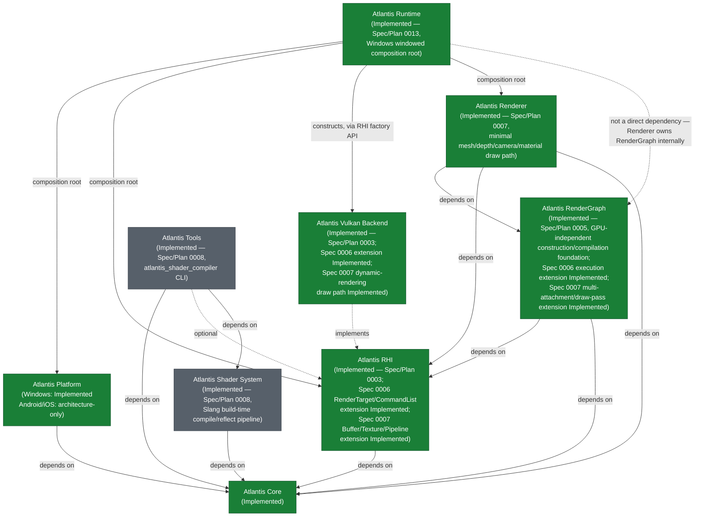

# Atlantis Project Blueprint

> **Document type: navigation, not authority.** This document sits
> alongside [docs/architecture/](architecture/) (as-built design records)
> and [docs/process/](process/) (prescriptive process docs), but is
> neither: it is a roadmap and status index. It is placed directly under
> `docs/` rather than in either subdirectory because it doesn't fit
> `docs/README.md`'s two-category split — it is not an as-built design
> record (most of what it describes is not built) and it is not a
> process rule. If the project later wants a named third category for
> this kind of document, that is a `docs/README.md` change for a human to
> decide, not something this document does on its own.

## 1. What this document is and isn't

This document exists to show, in one place: overall direction, module
dependency order, milestone sequencing, and current status. It is a
**navigation aid**, not a design authority. Specifically:

- **Accepted ADRs** (`adr/`) are the authoritative record of *why* an
  architectural decision was made. Where this document states an
  architectural fact, it links the ADR that actually decided it.
- **Approved Specs** (`specs/`) are the authoritative record of *what* a
  specific piece of work is scoped to build.
- **Approved Plans** (`plans/`) are the authoritative record of
  *implementation order and verification* for an approved spec.
- **Every future phase or milestone named below the current approved
  work is a candidate route, not an authorization to implement it.**
  Naming a milestone here does not skip Spec → Plan → Human Review →
  Implementation → Verification → PR → Merge (see
  [AGENTS.md](../AGENTS.md)) for a single line of it.
- Nothing in this document overrides [AGENTS.md](../AGENTS.md). Where
  this document and AGENTS.md appear to disagree, AGENTS.md wins, and
  that is a bug in this document to be fixed, not a license to follow
  this document instead.

## 2. Project vision and positioning

Atlantis's current, funded direction — the thing Phase 1 actually
builds toward — is: **a long-term, real-time rendering engine.** Its
first job is a stable, well-bounded stack: Platform, RHI, Vulkan
Backend, RenderGraph, Renderer, and Shader System, in that dependency
order. See [README.md](../README.md) and [AGENTS.md](../AGENTS.md)'s
Golden Rule and Phase 1 constraints.

A broader, longer-horizon ambition exists in the external reference
document `D:\blueprint.md` (outside this repository, not itself a spec
or ADR) describing a future engine that could also host game Runtime,
simulation, AI research, and UGC workloads on top of that renderer.
This document treats that material as **directional input, not decided
architecture**:

- Nothing in `D:\blueprint.md` is Atlantis-approved by virtue of
  existing in that file. Every concrete design choice it proposes
  (Runtime/Editor process split, ECS, ABI, UGC VM, inference backend,
  schema-driven SDK, ...) requires its own future Spec and, where
  architectural, its own ADR before it is anything more than a
  candidate.
- Where `D:\blueprint.md` conflicts with repository fact — approved
  specs, accepted ADRs, or [AGENTS.md](../AGENTS.md) — repository fact
  wins. Section 7 below lists the specific conflicts found and how they
  were resolved for this document.
- Atlantis does **not** target replicating Unity's or Unreal's full
  feature set in Phase 1. The near-term goal is a coherent,
  well-bounded renderer; broader Runtime/tooling/AI ambitions are
  future-phase candidates that must not shape Phase 1 interfaces (per
  [AGENTS.md](../AGENTS.md)'s "no speculative abstraction" principle).
- Long-term direction must not reach backward into Phase 1 module
  boundaries. If a future-phase idea would require Phase 1's RHI,
  RenderGraph, or Renderer to grow an interface it doesn't otherwise
  need, that is a signal to defer the idea, not to widen Phase 1.

## 3. Approved overall architecture

See [docs/architecture/engine_architecture.md](architecture/engine_architecture.md)
for a higher-level, navigation-oriented overview connecting the module
map below to Atlantis's conceptual architecture and long-term direction
— descriptive navigation only, no change to this section's own as-built
content.

The module map and dependency directions below are drawn from
[docs/architecture/overview.md](architecture/overview.md) and
[docs/architecture/module_boundaries.md](architecture/module_boundaries.md).
**Both of those documents currently carry their own
`PROPOSED — pending spec/ADR approval. Not as-built` banner** — they
were drafted as an explicit, one-time bootstrap exception (see
[docs/architecture/README.md](architecture/README.md)) ahead of the
specs that would normally earn as-built status. That banner has not
been revised even though several ADRs they cite are now `Accepted` and
two of the modules they describe (Core, and Platform's Windows path)
are now implemented — this is a known, currently-open documentation gap
(see Section 4), not something this blueprint resolves by re-labeling
those documents itself.

Key boundary facts this diagram encodes (each traceable to an Accepted
ADR or the architecture docs above — see the links inline):

- **Runtime is the composition root** that connects Platform and RHI.
  Platform and RHI are **siblings** — RHI does not depend on Platform;
  Runtime passes the opaque native-surface handle Platform produces
  into RHI's `Presentation` construction. See
  [ADR-0001](../adr/0001-rhi-backend-independence.md) and
  [ADR-0014](../adr/0014-rhi-device-presentation-construction-boundary.md).
- **Vulkan Backend implements RHI's interfaces**; it is not a
  dependency of RHI. Only Vulkan Backend's private WSI boundary
  consumes `NativeWindowHandle` and interprets `Vk*` types — see
  [ADR-0005 (amended)](../adr/0005-platform-module-multi-os-windowing.md)
  and
  [docs/architecture/platform-vulkan-wsi-boundary.md](architecture/platform-vulkan-wsi-boundary.md).
- **Renderer depends only on Core, RHI, and RenderGraph.** It must
  never include a Win32/Android NDK/`Vk*` type, never see a window, a
  `Platform` instance, `VkSurfaceKHR`, or `VkSwapchainKHR` — see
  [docs/architecture/overview.md](architecture/overview.md#dependency-direction),
  [ADR-0001](../adr/0001-rhi-backend-independence.md),
  [ADR-0002](../adr/0002-presentation-rendertarget-unification.md).
- **All GPU work is mandatory through RenderGraph** — no subsystem
  submits ad hoc, hand-scheduled GPU work outside it (per
  [AGENTS.md](../AGENTS.md)'s Golden Rule and Architecture Principles,
  and reaffirmed operationally by Spec 0003 — see Section 4).
- **Windowed and headless rendering share the same
  Renderer/RHI/RenderGraph stack** — headless is a second way to
  produce a `RenderTarget`, not a fork of the rendering code. See
  [docs/architecture/overview.md](architecture/overview.md#windowed-vs-headless-the-shared-path-across-platforms).
- **RenderGraph's dependency on RHI (already drawn in the diagram above)
  is now a reviewed decision, not only an anticipated one** — Spec 0006
  ([ADR-0021](../adr/0021-render-graph-rhi-execution-integration-and-barrier-responsibility.md))
  realizes it for the frame-execution slice (`CommandList`,
  `ResourceState`, `RenderTarget`), splitting responsibility so
  RenderGraph decides *when*/*between what states* a resource transition
  is needed and RHI/Vulkan Backend decides *how* to perform it.
  Implemented and merged via
  [PR #23](https://github.com/slmao/Atlantis/pull/23) and
  [PR #24](https://github.com/slmao/Atlantis/pull/24) — see Section 4.

## 4. Current repository state (verified against source and history)

This section reflects the state of this repository as of 2026-08-09
(PR #24, the Spec 0006 post-merge GPU-verification fix PR, merged
2026-08-09T18:32:19Z), verified by reading the spec/plan/ADR files, the
`src/`/`tests/`/`examples/` trees, and `git log`/`git status` — not
inferred from file names or intent.

| Item | Status | Evidence |
|---|---|---|
| **Spec 0001 — Project Foundation** | `Approved`, **Implemented** | [specs/0001-project-foundation.md](../specs/0001-project-foundation.md) status field; `src/core/` (log, assert, result), `tests/core/`, `examples/foundation_demo/` all exist and match the spec/plan's file list |
| Plan 0001 | `Approved / Ready for Implementation` | [plans/0001-project-foundation.md](../plans/0001-project-foundation.md) |
| **Spec 0002 — Platform Foundation** | `Approved`, **Windows path Implemented**; Android/iOS architecture-only, not implemented | [specs/0002-platform-foundation.md](../specs/0002-platform-foundation.md); `src/platform/` (Windows implementation, `windows_platform.cpp`), `tests/platform/` (including Windows-only smoke tests), `examples/platform_demo/` all exist. No `src/platform/src/android/` or `src/platform/src/ios/` directory exists. |
| Plan 0002 | `Approved / Ready for Implementation` (Windows portion) | [plans/0002-platform-foundation.md](../plans/0002-platform-foundation.md) |
| **Spec 0003 — RHI and Vulkan Windowed Foundation** | `Approved`, **Implemented** (windowed Vulkan presentation foundation; no acquire/present, no `RenderTarget`, no rendered output) | [specs/0003-rhi-vulkan-windowed-foundation.md](../specs/0003-rhi-vulkan-windowed-foundation.md) status field; `src/rhi/`, `src/vulkan_backend/`, `tests/rhi/`, `tests/vulkan_backend/`, `examples/rhi_vulkan_demo/` all exist and match the spec/plan's file list; implementation merged via [PR #14](https://github.com/slmao/Atlantis/pull/14). No `src/render_graph/` or `src/renderer/` directory exists. |
| Plan 0003 | `Approved / Ready for Implementation` | [plans/0003-rhi-vulkan-windowed-foundation.md](../plans/0003-rhi-vulkan-windowed-foundation.md); records a joint Spec + Plan Human Review completed 2026-08-08 |
| **Spec 0004 — Context-Efficient Documentation and Code Comment Guidelines** | `Approved`, **Implemented** | [specs/0004-context-efficiency-guidelines.md](../specs/0004-context-efficiency-guidelines.md); `AGENTS.md` now contains the `## Documentation and code comments` section, merged via PR #11. Governance/documentation convention only — no architecture or runtime module changed. |
| Plan 0004 | `Approved / Ready for Implementation` | [plans/0004-context-efficiency-guidelines.md](../plans/0004-context-efficiency-guidelines.md) |
| **Spec 0005 — RenderGraph Foundation (GPU-Independent Graph Core)** | `Approved`, **Implemented** (GPU-independent RenderGraph construction/compilation foundation; no RHI resource binding, command recording, GPU execution, barriers, pass culling, or resource lifetime/aliasing) | [specs/0005-render-graph-foundation.md](../specs/0005-render-graph-foundation.md) status field; all 16 architectural decisions this spec settles were reviewed and accepted (see the spec's own Human Review Approval note); `src/render_graph/`, `tests/render_graph/` exist and match the spec/plan's file list; implementation merged via [PR #18](https://github.com/slmao/Atlantis/pull/18). No `src/renderer/` directory exists. |
| Plan 0005 | `Approved / Ready for Implementation` | [plans/0005-render-graph-foundation.md](../plans/0005-render-graph-foundation.md); records a joint Spec + Plan Human Review completed 2026-08-09, accepting all 19 Plan-stage details in Section 7's disposition table with zero Human Review blockers |
| **Spec 0006 — RHI / RenderGraph Frame Execution Foundation** | `Approved`, **Implemented** — frame-scoped `RenderTarget`; `Presentation::acquireNextTarget()`/`present()`; a minimal RHI `CommandList`/`Device::submit()` single-frame-in-flight baseline; RenderGraph `execute()` with barrier/transition responsibility | [specs/0006-rhi-render-graph-frame-execution-foundation.md](../specs/0006-rhi-render-graph-frame-execution-foundation.md) status field and its own Human Review Approval note; implementation merged via [PR #23](https://github.com/slmao/Atlantis/pull/23), which itself merged before GPU verification could run. [PR #24](https://github.com/slmao/Atlantis/pull/24) is the deferred GPU verification — fresh Debug/Release builds, 138/138 GPU-independent tests, 2/2 GPU-required tests, and an interactive `frame_execution_demo` run (resize, minimize/restore, normal close), all with Vulkan Validation Layers clean — and fixed three real Validation Layer defects (missing `VK_IMAGE_USAGE_TRANSFER_DST_BIT` on swapchain images; an acquire-complete semaphore reuse race; a render-finished semaphore reuse race across `vkQueuePresentKHR`) plus a reproducible resize→minimize crash it found, none of which needed a public API, ownership, synchronization-model, module-boundary, or ADR change. `src/rhi/`, `src/vulkan_backend/`, `src/render_graph/`'s execution extension, and `examples/frame_execution_demo/` all exist and match the spec/plan. This was the prerequisite the "Minimal Renderer" backlog entry ([specs/README.md](../specs/README.md) Section B) needed in addition to Spec 0005 — both dependencies are now satisfied. |
| Plan 0006 | `Approved / Ready for Implementation` | [plans/0006-rhi-render-graph-frame-execution-foundation.md](../plans/0006-rhi-render-graph-frame-execution-foundation.md) |
| ADR-0001 through ADR-0016 | All 16 `Accepted` | Verified by grepping each ADR file's `Status:` field |
| ADR-0017 and ADR-0018 | Both `Accepted` (2026-08-09) | Filed alongside Spec 0005's Human Review Approval; verified by grepping each ADR file's `Status:` field |
| ADR-0019, ADR-0020, and ADR-0021 | All three `Accepted` (2026-08-09) | Filed alongside Spec 0006's Human Review Approval; verified by grepping each ADR file's `Status:` field |
| **Spec 0007 — Minimal Renderer** | `Approved`, **Implemented** — `Atlantis Renderer` (`src/renderer/`); RHI `Buffer`/`Texture`/`Pipeline` and draw-command surface; RenderGraph multi-attachment/draw-pass execution; Vulkan dynamic rendering (capability-detected Core/Extension dual path); a Windows Vulkan demo drawing a real, visible, depth-tested mesh with a camera and a minimal material | [specs/0007-minimal-renderer.md](../specs/0007-minimal-renderer.md) status field and Human Review Approval note (2026-08-11); `src/renderer/`, `tests/renderer/`, `shaders/minimal_renderer/`, `examples/minimal_renderer_demo/` all exist and match the spec/plan's file list. Implementation merged via [PR #28](https://github.com/slmao/Atlantis/pull/28). Post-merge review found the shipped dynamic-rendering Core path deviated from [ADR-0024](../adr/0024-vulkan-dynamic-rendering-for-attachments.md)'s approved design (it unconditionally depended on `VK_KHR_dynamic_rendering` even on Core-capable devices); [PR #29](https://github.com/slmao/Atlantis/pull/29) is the documentation-only Human Review that accepted a fix amendment (a loader-version-gated instance `apiVersion` strategy), and [PR #30](https://github.com/slmao/Atlantis/pull/30) is the code fix implementing it — Core and Extension dynamic-rendering paths are now fully separated, with the Core path never depending on the `VK_KHR_dynamic_rendering` extension. See [ADR-0024](../adr/0024-vulkan-dynamic-rendering-for-attachments.md)'s "Accepted Amendment — 2026-08-13" section for the full design. |
| ADR-0022 through ADR-0027 | All six `Accepted` (2026-08-11); ADR-0024 additionally carries an Accepted Amendment (2026-08-13) | Filed alongside Spec 0007's Human Review Approval; ADR-0024's amendment recorded via [PR #29](https://github.com/slmao/Atlantis/pull/29), implemented via [PR #30](https://github.com/slmao/Atlantis/pull/30); verified by grepping each ADR file's `Status:` field |
| `docs/architecture/{overview,module_boundaries,threading,resource_lifetime}.md` | Still carry their own `PROPOSED — pending spec/ADR approval. Not as-built` banner | Read in full; banners unrevised as of this document — a known, still-open documentation gap (see above), not resolved by Spec 0006 |
| `docs/rhi/README.md`, `docs/render_graph/README.md`, `docs/renderer/README.md` | Same `PROPOSED`, no-code status | Read in full; also unrevised — same known gap |
| **Human Review** for Spec 0003 / Plan 0003 | Recorded | Plan 0003 records a joint Spec + Plan Human Review approval note, dated 2026-08-08, consistent with how Specs 0001 and 0002's plans record theirs |
| **Human Review** for Spec 0005 / Plan 0005 | Recorded | Plan 0005 records a joint Spec + Plan Human Review approval note, dated 2026-08-09 |
| **Human Review** for Spec 0006 | Recorded | Spec 0006 records its own Human Review Approval note directly (no Plan exists yet to record it in — same pattern as Spec 0005's spec-level note), dated 2026-08-09, confirming: `Device::submit()` command-list-ownership/single-frame-in-flight model; the ADR-0019/0020/0021 three-way split and both `execute()`-time guard checks; the four Phase 1 simplifications (single frame-in-flight, write-only `RenderTarget`, `clearColor()`-only, no same-frame acquire retry); and that roadmap/backlog updates are deferred to a separate docs PR (this section) |

**What is implemented today, concretely:** `Atlantis Core` (logging,
assertions, a `Result<T,E>` type); `Atlantis Platform`'s Windows path
(application lifecycle, `HWND` window creation/ownership/destruction,
`PlatformEvent` delivery, monotonic timing); `Atlantis RHI`'s
frame-scoped interfaces (`Device`/`Presentation` construction,
`Presentation::acquireNextTarget()`/`present()`, a write-only
`RenderTarget`, a minimal `CommandList`/`Device::submit()`); `Atlantis
Vulkan Backend`'s Windows presentation and frame-execution
implementation (instance/device initialization, Windows WSI surface
creation, swapchain creation/metadata queries/destruction, resize-driven
lazy recreation, and the concrete acquire/execute/submit/present state
machine, including its per-swapchain-image semaphore pool); and
`Atlantis RenderGraph`'s construction/compilation/execution stack
(pass/logical-resource declaration, single-producer dependency
derivation, deterministic compilation to a `CompiledGraph` or a
`CompileError`, and `execute()`'s `ResourceState`-tagged usage binding,
per-pass execution callbacks, and automatic dependency-derived
transitions) — each with Catch2 unit tests (GPU-independent for RHI/
Vulkan Backend/RenderGraph logic, GPU-required integration tests for the
real Vulkan/WSI/frame-execution path) and, for Core/Platform/RHI/frame
execution, a non-shipping demo executable (`examples/foundation_demo`,
`examples/platform_demo`, `examples/rhi_vulkan_demo`,
`examples/frame_execution_demo`). **The Windows Vulkan path now draws a
real mesh, not just a cleared color.** Building on `frame_execution_demo`'s
acquire/clear/submit/present cycle, `Atlantis Renderer`
(`src/renderer/`, Spec 0007) is now implemented: `Renderer` → RenderGraph
→ RHI → Vulkan Backend draws a real, visible, depth-tested mesh (a fixed
cube with a per-vertex-color minimal material) with a working camera
transform, through RHI's new `Buffer`/`Texture`/`Pipeline` types and
RenderGraph's new multi-attachment/draw-pass execution support, using
Vulkan dynamic rendering (a capability-detected Core/Extension dual path —
see [ADR-0024](../adr/0024-vulkan-dynamic-rendering-for-attachments.md)).
`examples/minimal_renderer_demo` is the non-shipping verification
composition; this path is verified interactively across resize
(depth `Texture` recreated, `Pipeline` not) and minimize/restore, with
Vulkan Validation Layers clean — see the Spec 0007 row above and
[PR #28](https://github.com/slmao/Atlantis/pull/28)/[PR #30](https://github.com/slmao/Atlantis/pull/30)
for full verification detail and disclosed limitations (the
`VK_KHR_dynamic_rendering` Extension path and the swapchain
attachment-format-change case are both verified by code
inspection/GPU-independent tests only in this environment, not on real
hardware — no second GPU/driver combination or second monitor was
available). Shader System now exists (Spec/Plan 0008, see below); no
Android/iOS path exists yet. A headless rendering path now exists (Spec
0010, `Approved`, implemented and merged via
[PR #48](https://github.com/slmao/Atlantis/pull/48) — see Milestone 7 in
Section 5 and the Spec 0010 row in
[specs/README.md](../specs/README.md) for full scope and verification
detail, including its own disclosed single-GPU-vendor verification
limitation). A local/manual image-regression gate now exists too (Spec
0011, `Approved`, implemented and merged via
[PR #52](https://github.com/slmao/Atlantis/pull/52) — see Milestone 8 in
Section 5 and the Spec 0011 row in
[specs/README.md](../specs/README.md) for full scope, verification, and
the same disclosed single-GPU-vendor limitation); CI-enforced automatic
gating remains not implemented.

**Every currently-`Approved` spec (0001–0008) now has matching
implementation**, each merged following the same Spec → Plan → Human
Review → Implementation → Verification → PR → Merge sequence (see the
Spec 0006 row above for Spec 0006's own two-PR verification history, and
the Spec 0007 row above for Spec 0007's own three-PR history — an
implementation PR, a documentation-only ADR-amendment Human Review, and a
follow-up code-fix PR; see [specs/README.md](../specs/README.md)'s own
Spec 0008 row for that spec's single-PR implementation history,
[PR #36](https://github.com/slmao/Atlantis/pull/36)).

Spec 0008 replaced ADR-0027's temporary, checked-in, pre-compiled
SPIR-V shader bootstrap with a real build-time Slang compile/reflect
pipeline (`src/shader_system/`, `src/tools/shader_compiler/`); Minimal
Renderer's own shader now sources from that pipeline instead of a
checked-in `.spv`/`.glsl` pair. ADR-0027 itself remains `Accepted` and
unmodified — Spec 0008 superseded its *mechanism*, not the ADR record.

**What has no spec yet:** the remainder of Tools beyond its Spec 0008
(shader compiler) and Spec 0012 (asset cooker) content, Android Platform
implementation, iOS Platform, World/ECS, and everything else in Section
5's "further candidate phases." (Headless rendering, image regression
testing, Asset System foundation, and Runtime Host Foundation now have
specs — Spec 0010, Spec 0011, Spec 0012, and Spec 0013, all `Approved`,
implemented — see above and Milestone 10 in Section 5.) These remain
backlog candidates (see [specs/README.md](../specs/README.md) Section B)
and are not `Approved` — no spec number, API shape, or Candidate-status
promotion is assigned to any of them by this document.

## 5. Phased roadmap

Each milestone below states its governance state explicitly. A
milestone being listed does not authorize starting it — see Section 1.

### Milestone 1 — Windows Vulkan windowed presentation foundation

- **Governance state:** Spec `Approved`
  ([specs/0003-rhi-vulkan-windowed-foundation.md](../specs/0003-rhi-vulkan-windowed-foundation.md)).
  Plan `Approved / Ready for Implementation`
  ([plans/0003-rhi-vulkan-windowed-foundation.md](../plans/0003-rhi-vulkan-windowed-foundation.md)),
  with a joint Spec + Plan Human Review completed 2026-08-08.
  Implementation merged via
  [PR #14](https://github.com/slmao/Atlantis/pull/14); verification
  complete. This milestone delivers a **windowed Vulkan presentation
  foundation**, not complete windowed rendering — see the Non-Goals
  below.
- **Scope (per the approved spec):** minimal RHI public interface for
  `Device`/`Presentation` construction; Vulkan device/queue
  initialization; Windows WSI surface creation; swapchain creation,
  metadata queries, and safe destruction; resize-driven lazy
  recreation via `notifyResized()`/`recreateIfNeeded()`; the
  zero-framebuffer-extent rule as a structural property of
  (re)creation, not caller discipline; Vulkan Validation Layers running
  clean throughout.
- **Explicitly not in this milestone's scope** (per the spec's own
  Non-Goals): any acquire/present operation, any `RenderTarget`, any
  command buffer, any draw call — the whole frame-level acquire →
  graph-recorded work → present cycle is bundled and deferred, per
  [ADR-0016](../adr/0016-presentation-acquire-present-and-recreation-contract.md).
  That bundle landed as its own Milestone 3 (Frame Execution Foundation,
  below) once RenderGraph's own compilation core (Milestone 2) existed to
  build execution against — not folded into Milestone 2 itself, whose
  `Approved`/implemented scope stayed GPU-independent.

### Milestone 2 — RenderGraph foundation

- **Governance state:** **`Approved` Spec, `Approved / Ready for
  Implementation` Plan, Implemented —
  [specs/0005-render-graph-foundation.md](../specs/0005-render-graph-foundation.md),
  [plans/0005-render-graph-foundation.md](../plans/0005-render-graph-foundation.md).**
  Human Review Approval recorded 2026-08-09: all sixteen architectural
  decisions the spec enumerates were reviewed and accepted (see the
  spec's own Human Review Approval note). Its Architectural Impact
  identified two new decisions, filed as
  [ADR-0017](../adr/0017-render-graph-construction-compile-layering.md)
  and
  [ADR-0018](../adr/0018-render-graph-dependency-derivation-and-ordering.md),
  both `Accepted` alongside this approval. A joint Spec+Plan Human Review
  completed 2026-08-09; implementation (the GPU-independent
  `Atlantis::RenderGraph` construction/compilation foundation) merged via
  [PR #18](https://github.com/slmao/Atlantis/pull/18). Its dependency,
  Spec 0003 (RHI/Vulkan windowed presentation foundation), is implemented
  (see Milestone 1).
- **Scope fixed by the Approved spec** (still candidate semantics for the
  Plan to turn into concrete C++, not architecture the Plan may
  reopen): a GPU-independent graph core only — pass declaration, a
  single-producer-per-resource usage model, dependency derivation, cycle
  detection, and deterministic compiled ordering. The spec deliberately
  excludes resource lifetime, command recording/submission, resource-
  state/barrier resolution, and any integration with `Presentation`'s
  acquire/present (the bundle Milestone 1 deferred) — RHI does not yet
  expose the resource/command surface that would require, and the spec
  treats extending RHI (and, separately, resource lifetime/versioning) as
  future specs' scope. See the spec's own Non-Goals and Alternatives
  Considered for the full reasoning.
- Per [AGENTS.md](../AGENTS.md), no ad hoc direct-submission path may
  bypass this module once it exists — and no code before it exists may
  invent one either.
- **This milestone alone does not yet unblock Minimal Renderer (now
  Milestone 4).** RenderGraph's own Non-Goals explicitly excluded
  execution, RHI resource binding, and any acquire/present integration —
  see Milestone 3 below, which fills exactly that gap.

### Milestone 3 — Frame Execution Foundation

- **Governance state:** **`Approved` Spec, `Approved / Ready for
  Implementation` Plan, Implemented —
  [specs/0006-rhi-render-graph-frame-execution-foundation.md](../specs/0006-rhi-render-graph-frame-execution-foundation.md),
  [plans/0006-rhi-render-graph-frame-execution-foundation.md](../plans/0006-rhi-render-graph-frame-execution-foundation.md).**
  Human Review Approval recorded 2026-08-09 (see the spec's own Human
  Review Approval note; also summarized in Section 4's table above).
  Its Architectural Impact identified three new decisions, filed as
  [ADR-0019](../adr/0019-presentation-acquire-present-and-rendertarget-frame-borrow-contract.md),
  [ADR-0020](../adr/0020-rhi-minimal-resource-command-recording-and-submission-interface.md),
  and
  [ADR-0021](../adr/0021-render-graph-rhi-execution-integration-and-barrier-responsibility.md),
  all `Accepted` alongside this approval, merged via
  [PR #20](https://github.com/slmao/Atlantis/pull/20). Its dependencies,
  Spec 0003 (RHI/Vulkan windowed foundation) and Spec 0005 (RenderGraph
  Foundation), are both implemented (see Milestones 1–2).
  Implementation merged via
  [PR #23](https://github.com/slmao/Atlantis/pull/23); that PR merged
  before it could be verified on real GPU hardware, and
  [PR #24](https://github.com/slmao/Atlantis/pull/24) is the deferred
  GPU verification (fresh Debug/Release builds, 138/138 GPU-independent
  tests, 2/2 GPU-required tests, an interactive `frame_execution_demo`
  run across resize/minimize/restore/close, Validation Layers clean
  throughout) plus three real Validation Layer defect fixes and one
  crash fix it found — see Section 4's Spec 0006 row for the full list.
  None of PR #24's fixes required a public API, ownership,
  synchronization-model, module-boundary, or ADR change.
- **This milestone is why "Minimal Renderer" cannot be built directly
  against Milestone 2's output alone** — Spec 0005's own Non-Goals
  explicitly excluded "real GPU submission," "Vulkan barriers, image
  layout transitions, or any synchronization primitive," and
  "`Presentation` acquire/present, or any change to `Presentation`'s
  existing non-frame lifecycle contract." This milestone is where all
  three get designed and (once implemented) built — inserted here,
  between RenderGraph Foundation and Minimal Renderer, correcting an
  earlier version of this document's roadmap that positioned Minimal
  Renderer directly after Milestone 2 without this prerequisite.
- **Scope fixed by the Approved spec:** a concrete `RenderTarget` type
  (non-owning, frame-scoped, write-only); `Presentation::acquireNextTarget()`/
  `present()` covering zero-extent, resize, and out-of-date/suboptimal
  handling; a minimal RHI `CommandList` (`transitionResource`,
  `clearColor` only) and `Device::submit()` on a single-frame-in-flight
  baseline, with `Device` owning `CommandList`/fence lifetime internally;
  and a RenderGraph execution capability (`ResourceState`-tagged usages,
  a per-pass execution callback, frame-scoped external resource binding,
  automatic dependency-derived transitions) — RenderGraph records GPU
  work but never submits or presents. Explicitly excludes: Renderer,
  Shader System, pipeline/shader objects, general `Buffer`/`Texture`
  resources, a GPU memory allocator, resource lifetime/versioning, any
  caller-authored dependency edge or pass culling, multiple frames in
  flight, and multi-threading. See the spec's own Non-Goals for the full
  list.
- **Minimal acceptance target — met:** acquire a frame target from
  Windows Vulkan `Presentation`, execute at least one GPU pass through
  RenderGraph and RHI, submit and present a visible frame; correct
  behavior across resize and minimize/restore; Vulkan Validation Layers
  clean throughout. `examples/frame_execution_demo` satisfies this,
  verified interactively as part of PR #24.

### Milestone 4 — Minimal Renderer

- **Governance state:** **`Approved` Spec, `Approved / Ready for
  Implementation` Plan, Implemented —
  [specs/0007-minimal-renderer.md](../specs/0007-minimal-renderer.md),
  [plans/0007-minimal-renderer.md](../plans/0007-minimal-renderer.md).**
  Human Review Approval recorded 2026-08-11 (joint Spec 0007 + Plan 0007
  review). Its Architectural Impact identified six new decisions, filed
  as [ADR-0022](../adr/0022-minimal-renderer-public-api-and-resource-ownership.md)–[ADR-0027](../adr/0027-temporary-precompiled-spirv-shader-artifacts.md),
  all `Accepted` alongside this approval. Implementation merged via
  [PR #28](https://github.com/slmao/Atlantis/pull/28); a post-merge
  review found the shipped dynamic-rendering Core path deviated from
  ADR-0024's approved design, which was resolved by a Human-Review-accepted
  ADR amendment ([PR #29](https://github.com/slmao/Atlantis/pull/29)) and
  its follow-up code fix ([PR #30](https://github.com/slmao/Atlantis/pull/30))
  — see the Spec 0007 row in Section 4 above for the full record. Its
  dependencies, Milestone 2 (RenderGraph Foundation) and Milestone 3
  (Frame Execution Foundation), are both implemented.
- **Depends on:** Milestone 2 (RenderGraph Foundation, implemented) *and*
  Milestone 3 (Frame Execution Foundation, `Approved`, Implemented) —
  both are prerequisites, not Milestone 2 alone. See Milestone 3's own
  notes above for why.
- **Scope delivered:** `Atlantis Renderer` (`src/renderer/`) as a real
  module — `Mesh`/`Material`/`DrawItem`/`Renderer` — receiving a
  caller-supplied `RenderTarget` and having no knowledge of Platform,
  Window, Swapchain, or any `Vk*` type
  ([ADR-0001](../adr/0001-rhi-backend-independence.md)); all GPU work
  goes through RenderGraph; the minimal closed loop this milestone
  targeted — mesh + depth + camera + material — is drawn end-to-end on
  Windows/Vulkan, not a feature-complete renderer. See the Spec 0007 row
  in Section 4 above for verification detail and disclosed limitations.

### Milestone 5 — Shader System

- **Governance state:** **`Approved` Spec, `Approved / Ready for
  Implementation` Plan, Implemented —
  [specs/0008-shader-system-foundation.md](../specs/0008-shader-system-foundation.md),
  [plans/0008-shader-system-foundation.md](../plans/0008-shader-system-foundation.md).**
  Human Review Approval recorded 2026-08-14 (Spec) and 2026-08-15 (Plan).
  Its Architectural Impact identified four new decisions, filed as
  [ADR-0028](../adr/0028-shader-system-source-language-and-compiler.md)–[ADR-0031](../adr/0031-shader-system-artifact-versioning-and-reproducibility.md),
  all `Accepted` alongside the Spec approval. Implementation merged via
  [PR #36](https://github.com/slmao/Atlantis/pull/36) — see
  [specs/README.md](../specs/README.md)'s own Spec 0008 row for full
  scope/deviation/verification detail.
- **Problem domain, as resolved by the Approved Spec/ADRs:** Slang (a
  Khronos-governed shading language, bundled with the Vulkan SDK) as
  Phase 1's shader source language and compiler, invoked as a CLI
  subprocess (`slangc`) at build time, never linked as a library; SPIR-V
  1.0 output (Option A — the Vulkan Backend's physical-device floor
  stays `VK_API_VERSION_1_0`, unraised); `spirv-val --target-env
  vulkan1.0` mandatory; reflection via Slang's own `-reflection-json`,
  re-projected into an Atlantis-owned, versioned schema, scoped to
  validating a fixed descriptor/push-constant contract, not general
  pipeline-layout construction. Spec 0007's own narrow, temporary,
  checked-in-`.spv` sourcing mechanism
  ([ADR-0027](../adr/0027-temporary-precompiled-spirv-shader-artifacts.md))
  is superseded in *mechanism* by this milestone; ADR-0027 itself remains
  `Accepted` and unmodified.
- **Explicitly out of scope for this milestone and Phase 1 overall:**
  targeting more than one graphics API. No DXIL/MSL/WGSL output was
  planned or scaffolded — Phase 1 has one backend (Vulkan/SPIR-V only),
  per [AGENTS.md](../AGENTS.md). Also out of scope, unchanged: runtime/
  hot-reload shader compilation, a general descriptor-set/bindless
  system, and shader debug-info.

### Milestone 6 — Android platform and Vulkan presentation

- **Governance state:** Candidate — requires a new Spec (Android
  Platform implementation) and likely an amendment/new ADR for the
  Vulkan Backend's Android WSI path. Architecturally anticipated by
  [ADR-0005](../adr/0005-platform-module-multi-os-windowing.md),
  [ADR-0012](../adr/0012-application-lifecycle-and-event-model.md), and
  [ADR-0013](../adr/0013-platform-window-ownership-and-lifetime.md),
  none of which authorize implementation on their own. Not started —
  no `src/platform/src/android/` directory exists.
- **Scope:** Android Activity/Surface lifecycle; `ANativeWindow`
  borrowed-not-owned semantics; surface destroy/recreate as full
  `Presentation` object teardown and reconstruction (not an in-place
  resize, per ADR-0013); `VK_KHR_android_surface`-based WSI; reuses the
  same RHI, RenderGraph, and Renderer built by Milestones 1–4, forking
  no rendering code.

### Milestone 7 — Headless rendering

- **Governance state:** Spec 0010 `Approved`, ADR-0038/0039/0040
  `Accepted` (plus ADR-0022's Accepted Amendment). **Implemented and
  merged** via [PR #48](https://github.com/slmao/Atlantis/pull/48) —
  see the Spec 0010 row in [specs/README.md](../specs/README.md) for
  full scope and verification detail, including its own disclosed
  single-GPU-vendor verification limitation. Followed the windowed path
  per [AGENTS.md](../AGENTS.md)'s explicit sequencing, as required.
- **Scope:** offscreen `RenderTarget` construction (no `Presentation`
  object involved); shares Renderer/RHI/RenderGraph unchanged with the
  windowed path; GPU readback; the foundation image regression testing
  (Milestone 8) depends on.

### Milestone 8 — Image regression testing

- **Governance state:** **`Approved` Spec, `Approved` Plan, Implemented
  (local/manual gate only) —
  [specs/0011-image-regression-testing-foundation.md](../specs/0011-image-regression-testing-foundation.md),
  [plans/0011-image-regression-testing-foundation.md](../plans/0011-image-regression-testing-foundation.md).**
  Human Review Approval recorded 2026-08-16 (Spec) and 2026-08-17
  (Plan). Its Architectural Impact identified two new decisions, filed
  as
  [ADR-0041](../adr/0041-image-regression-testing-golden-image-data-format-and-codec-dependency.md)
  and
  [ADR-0042](../adr/0042-image-regression-testing-comparison-methodology-and-test-ownership-boundary.md),
  both `Accepted` alongside the Spec approval; ADR-0042 additionally
  carries an **Accepted Amendment** (2026-08-17, adding an "Initial
  baseline bootstrap" golden-update-reason category for a scene's
  first-ever golden) recorded via
  [PR #53](https://github.com/slmao/Atlantis/pull/53). Implementation
  merged via [PR #52](https://github.com/slmao/Atlantis/pull/52) — see
  the Spec 0011 row in [specs/README.md](../specs/README.md) for full
  scope, verification, and deviation detail. Its dependency, Milestone
  7 (Headless rendering), is implemented.
- **Partially complete — the local/manual half of this milestone's own
  scope is done; the CI-enforced half (this milestone's full Section 6
  acceptance signal, below) is not.** A human or agent runs the
  `gpu`-labeled image regression suite against real Windows/Vulkan
  hardware and reports pass/fail — verified for real, including a
  deliberately introduced rendering regression genuinely caught and a
  reverted-before-merge fixture change. **CI-enforced automatic
  gating on every merge remains not implemented**, blocked on the same
  GPU-in-CI-approach and dependency-fetch-in-CI-strategy prerequisites
  [docs/process/ci-strategy.md](process/ci-strategy.md) already logs as
  open, plus actual infrastructure provisioning — neither decided nor
  fabricated by Spec 0011 itself.
- **Scope actually delivered:** golden-image storage, naming, and
  provenance (`tests/image_regression/goldens/`, a 13-field sidecar
  per golden); a strict, zero-tolerance per-pixel comparison algorithm
  (channel tolerance 0, failing-pixel budget 0 — empirically confirmed
  for the one reused fixture and reference GPU/driver, not generalized
  beyond it); a dedicated golden validity check (`INVALID GOLDEN` as
  its own outcome) and a `PROVENANCE MISMATCH` diagnostic kept separate
  from pass/fail; a standalone, non-CTest-registered golden
  regeneration tool; Vulkan Validation Layers as a hard gate,
  consistent with every earlier milestone.

### Milestone 9 — Asset System foundation

- **Governance state:** **`Approved` Spec, `Approved` Plan, Implemented —
  [specs/0012-asset-system-foundation.md](../specs/0012-asset-system-foundation.md),
  [plans/0012-asset-system-foundation.md](../plans/0012-asset-system-foundation.md).**
  Human Review Approval recorded 2026-08-19 for both the Spec (with
  three targeted corrections applied at approval time — see the Spec's
  own Human Review Approval note) and the Plan. Its Architectural Impact
  identified three new decisions, filed as
  [ADR-0043](../adr/0043-asset-system-module-boundary.md) (module
  boundary — a new, tenth top-level module, Atlantis Asset System,
  depending on Core only),
  [ADR-0044](../adr/0044-asset-system-identity-provenance-and-import-methodology.md)
  (path-derived Asset ID, provenance, import methodology), and
  [ADR-0045](../adr/0045-asset-system-data-format-versioning-and-dependency-policy.md)
  (hand-rolled data formats, no new third-party dependency), all
  `Accepted` alongside the Spec approval. Does not depend on, and is not
  blocked by, a future Atlantis Runtime — see the Spec's own "Why this
  does not wait for Runtime." Implementation merged via
  [PR #58](https://github.com/slmao/Atlantis/pull/58), including a
  post-implementation independent review round (commit `bc7fc02`) that
  found and fixed real gaps before merge — see the Spec 0012 row in
  [specs/README.md](../specs/README.md) for full verification detail.
- **Scope actually delivered:** a deterministic authoring-source →
  runtime-artifact pipeline for one asset type (a static
  position/colour mesh) — logical-path normalization, a 64-bit FNV-1a
  Asset ID, declared-set collision/case-conflict validation, three
  hand-rolled versioned formats (all unconditionally little-endian on
  disk, never a host-endian struct dump), a deterministic cooker with
  atomic (write-to-temp-then-`rename()`) output, a CMake stamp-based
  build integration mirroring Shader System's own precedent, a
  file-level runtime loader returning CPU-only data, and a composition
  root (`tests/image_regression/fixture/`) that loads that data and
  calls the existing, unmodified `atlantis::renderer::createMesh()` —
  proven end to end by rendering the one real, checked-in asset
  (`assets/meshes/minimal_cube.mesh.txt`) and comparing it against the
  already-committed Milestone 8 golden with **zero** channel difference.
- **Not implemented** (per Spec 0012's own Non-Goals, unchanged): a
  second asset type, `glTF`/Assimp import, a rename-stable GUID identity
  scheme, a real derived-data cache, any new Renderer/RHI/Vulkan public
  API, and Android/iOS/Linux implementation of any kind.

### Milestone 10 — Runtime Host Foundation

- **Governance state:** **`Approved` Spec, `Approved` Plan, Implemented and
  merged** via [PR #63](https://github.com/slmao/Atlantis/pull/63) —
  [specs/0013-runtime-host-foundation.md](../specs/0013-runtime-host-foundation.md),
  [plans/0013-runtime-host-foundation.md](../plans/0013-runtime-host-foundation.md).
  Human Review Approval recorded 2026-08-20 for the Spec and 2026-08-20
  for the Plan (14 explicitly accepted review items). Its Architectural
  Impact identified two new decisions, filed as
  [ADR-0046](../adr/0046-runtime-composition-ownership-and-frame-lifecycle.md)
  (object ownership order, six-step initialization, ten-step per-frame
  orchestration, unified idempotent shutdown) and
  [ADR-0047](../adr/0047-runtime-host-executable-library-structure-and-test-boundary.md)
  (`atlantis_runtime_host` static library / `atlantis_runtime` thin
  executable split, purely for GPU-independent testability — not a
  dependency surface for any other module), both `Accepted` alongside the
  Spec approval. During implementation, a real MSVC compiler-behavior
  misconception in the approved Plan (`C4715` does not, by itself, detect
  an incomplete enum `switch`) was found, corrected via an independent
  Plan amendment ([PR #62](https://github.com/slmao/Atlantis/pull/62)),
  and folded back in before Steps 2-7 continued. A post-implementation
  independent review round (commit `131b49a`, merged in the same PR)
  additionally found and fixed a real lifetime hazard: both
  `PlatformSession` and `RuntimeApplication` originally kept a
  move-assignment operator that could call `platform::shutdown()` a
  second time, or tear the window down ahead of still-live GPU resources
  — both are now deleted, move-construction-only. See the Spec 0013 row
  in [specs/README.md](../specs/README.md) for full verification detail.
- **Scope actually delivered:** a real Windows windowed composition root
  drawing the same Asset-System-sourced `minimal_cube` mesh and
  Shader-System-compiled material used by earlier milestones, through the
  existing, unmodified Renderer → RenderGraph → RHI → Vulkan Backend
  stack. A `PlatformSession` RAII guard makes window-outlives-GPU-resources
  a compiler-enforced invariant (first member, destroyed last) rather than
  a hand-sequenced convention; a single unified, idempotent `shutdown()`
  is the sole caller of GPU-resource teardown and the sole indirect
  trigger (via `PlatformSession`'s own destructor) of
  `platform::shutdown()` — confirmed to be its only real call site in
  `src/runtime/` by grep. Verified by a real windowed GPU smoke test
  (`tests/runtime`, `gpu`-labeled — the first test in the repository that
  creates a real, visible OS window during automated `ctest`; 18/18 `gpu`
  tests pass both configurations), by clean Debug and Release full builds
  (`ctest -LE gpu`: 389/389 Debug, 388/388 Release), by real in-project
  `C4062` positive/negative re-verification, and by programmatic
  interactive verification (real Win32 message injection for resize,
  minimize/restore, close) against the real executable, with Vulkan
  Validation Layers grepped clean throughout.
- **Disclosed limitation:** no automated literal pixel/visual screenshot
  comparison of the Runtime window's rendered output exists yet —
  standard Win32 screen-capture APIs were confirmed unusable from the
  implementing agent session (captured the session's own UI, not the
  real desktop). The programmatic interactive verification above is
  lifecycle/liveness evidence, not a pixel comparison; the existing
  `image_regression_gpu_tests` golden match (Milestone 8/9) is
  pixel-exact evidence for the same mesh/shader/camera combination in
  its own headless fixture, not for `atlantis_runtime`'s own windowed
  output. PR #63 recorded an actual by-eye windowed check against the
  existing golden as an outstanding, human-only verification step.
- **Not implemented** (per Spec 0013's own Non-Goals, unchanged):
  Android/iOS/Linux, a headless Runtime entry point, World/ECS, a Client
  API, hot-reload or async asset streaming, a Job System, and any
  DI/service-locator framework.

### Milestone 11 — World / Scene Foundation

- **Governance state:** **`Approved` Spec, `Approved` Plan, code complete
  on [PR #68](https://github.com/slmao/Atlantis/pull/68) (OPEN, not yet
  merged)** —
  [specs/0014-world-scene-foundation.md](../specs/0014-world-scene-foundation.md),
  [plans/0014-world-scene-foundation.md](../plans/0014-world-scene-foundation.md).
  Human Review Approval recorded 2026-08-22 for the Spec (17
  explicitly accepted items) and 2026-08-22 for the Plan, following four
  independent Plan Review rounds; a fifth round (2026-08-23) applied a
  mechanical encapsulation correction. Its Architectural Impact
  identified four new decisions, filed as
  [ADR-0048](../adr/0048-world-scene-module-boundary-and-ownership.md)
  (module boundary and ownership),
  [ADR-0049](../adr/0049-entity-identity-and-handle-invalidation.md)
  (entity identity and handle invalidation, including its own Accepted
  Amendment adding a stable, per-`World` identity token after Human
  Review rejected leaving cross-`World`-instance `EntityId` use as
  undetectable UB),
  [ADR-0050](../adr/0050-transform-hierarchy-composition-and-update-model.md)
  (transform hierarchy composition and update model), and
  [ADR-0051](../adr/0051-world-to-renderer-extraction-and-asset-resolution-boundary.md)
  (World-to-Renderer extraction and asset resolution boundary), all
  `Accepted`.
- **Scope actually delivered:** a new, eleventh top-level module,
  `Atlantis::World` (`src/world/`) — entity lifecycle with a formally
  overflow-safe `EntityId` handle carrying a private, non-owning
  reference to its own `World` instance's heap-allocated identity token
  (`WorldError::WrongWorld` on cross-instance misuse, never silent
  aliasing), fixed-type `Transform`/`Camera`/`Renderable` component
  storage, an atomic parent/child hierarchy with cycle prevention and
  cascading destroy, and a fully iterative (non-recursive)
  `updateTransforms()`. Runtime (`src/runtime/`) gained a Runtime-private
  extraction adapter (`scene_extraction.h`/`.cpp`) and now drives its own
  fixed, six-entity validation scene end to end through the existing,
  unmodified `Renderer::drawFrame()`/`DrawItem` path. A new headless
  image-regression golden (`world_scene`) and the existing windowed GPU
  smoke test (extended to confirm all 5 `DrawItem`s reach `drawFrame()`)
  both pass on real Vulkan-capable hardware; the existing `minimal_cube`
  golden is untouched. Verified by a clean Debug and Release full build
  (`ctest -LE gpu`: 434/434 Debug, 433/433 Release), `ctest -L gpu` 19/19
  both configurations, Vulkan Validation Layers grepped clean throughout,
  and programmatic interactive verification (real Win32 message
  injection for resize, minimize/restore, close) against the real
  `atlantis_runtime` executable.
- **Disclosed limitations:** carried forward from Milestone 10 (no
  automated literal pixel/visual screenshot comparison of the Runtime
  window's own live output; the headless golden match is pixel-exact
  evidence for the same World-driven scene in its own offscreen fixture,
  not for `atlantis_runtime`'s own windowed output). Two minor,
  mechanical Implementation-time interpretations, neither architectural:
  `getRenderable()` on a valid entity with no `Renderable` reuses
  `WorldError::NoCameraComponent` (the closest existing semantic fit,
  since `WorldError` fixes exactly four enumerators and this Plan's own
  scene never exercises the path); the standalone `world_scene` golden
  generator takes three positional arguments (golden name, asset artifact
  path, asset metadata path) rather than the Plan's own illustrative
  single-argument form, since `WorldSceneFixture` has no hand-authored-
  vertex construction path.
- **Not implemented** (per Spec 0014's own Non-Goals, unchanged):
  scene serialization or a scene file format, a scene-asset cooker, a
  general/data-driven/multi-threaded ECS, keyframe or time-driven
  mutation, and any Client/Editor/second-process consumer of `World`
  state.

### Further candidate phases (directional only, no Spec, no ADR)

The following are named only to communicate long-term direction drawn
from `D:\blueprint.md` and [README.md](../README.md)'s own "planned
future phases" list. **None has a Spec. None has a language, process
model, dependency, or API chosen.** Each requires its own Spec and, for
anything architectural, its own ADR before any of the below moves past
"named":

- Serialization and stable identity (GUID/handle schemes, schema
  migration) — World/Scene foundation itself is now Milestone 11 above,
  not a directional-only item; this remaining item is scoped to
  *durable* (save/load, cross-session) identity, which Milestone 11's own
  Non-Goals explicitly excluded
- Tool/Editor connection protocol — **no process model (in-process vs.
  IPC) is chosen**
- Gameplay SDK — **no gameplay language is chosen**
- Research/simulation API (Python or otherwise)
- AI inference integration — **no inference backend is chosen**
- UGC sandbox and package model — **no UGC VM or language is chosen**
- GPU-driven rendering, neural rendering / neural shading, 3D Gaussian
  Splatting, world-model workloads — **future phases that must not
  shape Phase 1 abstractions**, per [AGENTS.md](../AGENTS.md)

## 6. Milestone acceptance — observable outcomes, not "module complete"

| Milestone | Observable acceptance signal |
|---|---|
| M1 | A Windows window continuously displays a live Vulkan swapchain lifecycle (create/recreate/destroy) surviving interactive resize and minimize/restore, with Vulkan Validation Layers clean throughout. (Per the approved spec's own scope, this milestone alone does not yet present a cleared color — that is bundled into M3, see Section 5.) |
| M2 | A RenderGraph-compiled graph exists and is unit-tested (GPU-independent construction/compilation only — this milestone's own scope does not yet execute, submit, or present anything; see M3). |
| M3 | A RenderGraph-scheduled frame acquires a swapchain image via `Presentation::acquireNextTarget()`, executes at least one graph-recorded pass through RHI's `CommandList`, submits, and presents it — the first actual pixels on screen, correct across resize and minimize/restore, Validation Layers clean. |
| M4 | **Met.** A first mesh is drawn end-to-end through Renderer → RenderGraph → RHI → Vulkan Backend, with a working camera and one material, Validation Layers clean — see `examples/minimal_renderer_demo` and the Spec 0007 row in Section 4. |
| M5 | A shader authored in Phase 1's chosen source form compiles to SPIR-V, is reflected, and backs a working pipeline used by M4's mesh draw. |
| M6 | The same Renderer output from M4 appears on an Android device/emulator via the Android Platform + Vulkan Backend path, with no Renderer/RenderGraph code fork. |
| M7 | **Met** (headless GPU-readback path). The same rendering stack from M4, driven headlessly via `OffscreenTarget`, produces a GPU-readback image with no window or swapchain involved — see `examples/headless_rendering_demo` and the Spec 0010 row in [specs/README.md](../specs/README.md). Pixel/image-level comparison *against the windowed output* is explicitly Milestone 8/Image Regression Testing's own, separate scope, not part of M7/Spec 0010 — see the M8 row below (`Approved`, implemented, partially met). |
| M8 | **Partially met.** A human/agent-run golden-image comparison (`ctest -L gpu` against `tests/image_regression/`) genuinely catches an intentionally introduced rendering regression and passes on a known-good build — see `specs/README.md`'s Spec 0011 row and [PR #52](https://github.com/slmao/Atlantis/pull/52) for the real, recorded proof. **Not yet met:** this comparison does not yet run in CI or gate merges automatically — no CI pipeline exists in this repository (see [docs/process/ci-strategy.md](../docs/process/ci-strategy.md)). |
| M9 | **Met.** A real, checked-in authoring-source mesh (`assets/meshes/minimal_cube.mesh.txt`) is cooked deterministically, loaded as CPU-only data, and rendered through the existing, unmodified Renderer → RenderGraph → RHI → Vulkan Backend stack by a test-owned composition root — pixel-identical (zero channel difference) to the M8 golden — see the Spec 0012 row in [specs/README.md](../specs/README.md). |
| M10 | **Met** (composition and lifecycle). A real `atlantis_runtime` Windows executable, backed by the `atlantis_runtime_host` composition library, opens a live window and draws the same Asset-System-sourced mesh and Shader-System-compiled material through the existing, unmodified Renderer → RenderGraph → RHI → Vulkan Backend stack; interactive resize, minimize/restore, and close verified programmatically (real Win32 message injection), Vulkan Validation Layers clean throughout. **Not yet met:** an actual by-eye windowed pixel/visual check of the rendered frame against the existing golden — no automated screenshot capture was possible from the implementing agent session; this remains an outstanding, human-only verification step (see the Spec 0013 row in [specs/README.md](../specs/README.md)). |

## 7. Explicitly deferred or off-limits for now

The following must not be designed, scaffolded, or implicitly decided
ahead of their own Spec/ADR — listed because `D:\blueprint.md` proposes
several of them and this document must not let that framing read as
already-approved:

- **Linux target support.** Not a target platform for Atlantis at all
  — see [AGENTS.md](../AGENTS.md) Phase 1 constraints. This directly
  conflicts with `D:\blueprint.md`'s §13 platform matrix and §18
  roadmap, which name "Linux x64 Headless" as a first-phase commitment;
  repository fact (AGENTS.md) governs, and Linux is excluded from every
  section of this document accordingly.
- **D3D12 backend.** Not planned for any Phase 1 or currently-scoped
  milestone. Conflicts with `D:\blueprint.md`'s §14 graphics-backend
  roadmap (Vulkan → D3D12 → Metal → WebGPU); resolved per
  [AGENTS.md](../AGENTS.md): Phase 1 is Vulkan-only, and no second
  backend is scaffolded "for later." [ADR-0037](../adr/0037-long-term-device-backend-extensibility-without-phase1-scaffolding.md)
  additionally now records Direct3D 12 as a long-term candidate sibling
  Device Backend — a boundary-level direction only, not a change to
  this milestone/Phase-1 conclusion.
- **Metal backend** (native, for macOS/iOS). iOS's own graphics-backend
  choice (MoltenVK vs. a native Metal RHI backend) is explicitly
  undecided — see [README.md](../README.md) and
  [ADR-0005](../adr/0005-platform-module-multi-os-windowing.md).
  [ADR-0037](../adr/0037-long-term-device-backend-extensibility-without-phase1-scaffolding.md)
  additionally now records Metal as a long-term candidate sibling Device
  Backend, without deciding the MoltenVK-vs-native-Metal question above.
- **WebGPU backend.** Same as D3D12 above — named in
  `D:\blueprint.md`'s roadmap, not in any Atlantis-approved scope.
- **iOS backend choice** (MoltenVK vs. native Metal). Named as a future
  target; the choice itself is explicitly not to be designed ahead of
  its own spec.
- **GPU-driven rendering.** Future phase; must not shape Phase 1
  abstractions, per [AGENTS.md](../AGENTS.md).
- **Neural rendering / neural shading.**
- **3D Gaussian Splatting.**
- **World Model workloads.**
- **ECS choice.** No engine-side ECS library or in-house design is
  chosen.
- **Gameplay language.** `D:\blueprint.md` §7 proposes a C++/C#/Luau/
  Python layering; none of this is Atlantis-approved.
- **Editor process model** (in-process vs. two-process IPC/RPC, per
  `D:\blueprint.md` §4). Not decided.
- **AI inference backend.** `D:\blueprint.md` §9 proposes an
  `IInferenceService` abstraction over ONNX/TensorRT/DirectML/etc.; not
  Atlantis-approved.
- **UGC VM.** `D:\blueprint.md` §10 proposes Luau; not Atlantis-approved.
- **GPU memory allocator strategy.** Explicitly deferred by
  [ADR-0015](../adr/0015-vulkan-memory-allocation-deferred.md) — no
  code before whichever future spec resolves this may depend on VMA or
  write a hand-rolled suballocator, and no RHI/Vulkan Backend interface
  may presume either strategy.

## 8. Blueprint maintenance rules

- Update this document's status tables and milestone governance states
  after a spec, plan, or implementation PR merges — not speculatively,
  not ahead of the merge.
- **This document does not grant architectural approval.** A candidate
  milestone or backlog item does not become Approved by being edited
  into this file with different wording. Only a Human-Review-approved
  Spec/Plan, or an Accepted ADR, changes governance state.
- Every status claim in this document must be traceable to a Spec, a
  Plan, an ADR, a merged PR, or a directly-observed repository fact
  (source tree, `git log`, `git status`). A status this document cannot
  trace this way should not be asserted.
- Reordering milestones, splitting one into several, or adding a new
  one is itself subject to [AGENTS.md](../AGENTS.md) if the reordering
  carries architectural or governance weight (e.g. it implies a module
  boundary change) — it is not a documentation-only edit in that case.
- If repository fact and this document ever disagree, repository fact
  wins; treat the mismatch as a bug in this document to fix, not as
  license to act on the document instead.
