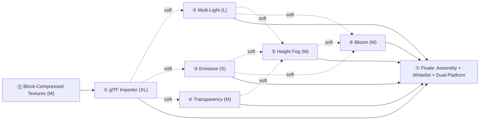

# Spec: Bistro Parity Roadmap

- **Status:** Approved
- **Author:** slmao (drafted by Claude Code at explicit human direction)
- **Created:** 2026-09-15
- **Related Plan(s):** None yet — this Spec is roadmap-stage; each named
  workflow below gets its own future Spec + Plan before any
  Implementation begins on it.
- **Approval:** slmao, 2026-09-15 (chat confirmation, no reviewing PR —
  this roadmap-stage Spec has no Implementation of its own to gate;
  approval authorizes each of the seven named workflows to open its own
  Spec → Plan → Human Review → Implementation cycle independently. This
  Spec itself still authorizes no Implementation, per its own
  Architectural Impact and Proposed Design sections above.)
- **Amendment (2026-09-15, post-Approval; confirmed 2026-09-17):**
  workflow ⓪ (Block-Compressed Texture Support) added — a real,
  investigation-discovered gap workflow ①'s own Spec 0037 surfaced
  mid-drafting, not present in this Spec's own originally-Approved
  seven-workflow set. Ruled by slmao on 2026-09-15 (the same ruling that
  settled ADR-0083's own D4), and formally confirmed alongside the
  documents that ruling produced — [Spec 0037](0037-gltf-importer.md)'s
  own Approval, [Spec 0038](0038-block-compressed-textures.md) (new,
  `Approved`), and [ADR-0082](../adr/0082-gltf-parser-dependency-selection.md)/[ADR-0083](../adr/0083-gltf-to-atlantis-asset-format-mapping.md)/[ADR-0084](../adr/0084-gltf-importer-tools-subsystem-boundary.md)/[ADR-0085](../adr/0085-block-compressed-sampled-texture-format-and-vulkan-mapping.md)
  (all `Accepted`) — all slmao, chat confirmation, no reviewing PR,
  2026-09-17, one and the same approval pass covering this amendment
  and its own sibling documents together. A real, disclosed widening of
  this Spec's own workflow count from seven to eight, not a silent edit
  to the original, already-Approved text (which remains unchanged above
  and throughout, per this repository's own established "amendments are
  appended, originals are not rewritten" discipline, ADR-0045's own
  precedent applied here to a Spec instead of an ADR). See the amended
  Requirements/Dependency-graph sections below for the workflow's own
  full definition.
- **Related ADR(s):** None of this Spec's own — every decision surface
  it identifies is explicitly deferred to that workflow's own future
  Spec + ADR (see Architectural Impact). Workflow ⓪'s own ADR is
  [Spec 0038](0038-block-compressed-textures.md)'s (`Approved`), namely
  [ADR-0085](../adr/0085-block-compressed-sampled-texture-format-and-vulkan-mapping.md)
  (`Accepted`), not this Spec's own.

Authoring/lifecycle rules: [AGENTS.md](../../AGENTS.md#documentation-and-code-comments).
State each requirement once; link ADR rationale and map verification to the
requirements rather than adding duplicate acceptance or review-decision lists.
Keep implementation code, diffs, review transcripts, and execution logs in PRs.

This Spec is **roadmap-shaped, not implementation-shaped**: its
Requirements section decomposes the target into ordered workflows and a
dependency graph rather than functional acceptance criteria, and its
Testing section maps a verification *strategy* per workflow rather than
naming concrete test cases — both adaptations stated explicitly per
section below, matching this Spec's own stated purpose.

## Summary

Atlantis's current showcase ceiling — `integrated_showcase_demo`,
`pbr_materials_showcase` (Spec 0028, Spec 0035) — demonstrates PBR, IBL,
directional shadow, and the three new BRDFs, but only on primitive-mesh,
hand-authored scenes lit by at most one directional and four point
lights, with no emissive materials, no transparency, no fog, and no
post-processing beyond tone mapping. This Spec proposes a **roadmap**
toward the next real fidelity target — Filament's own
`example_bistro1.jpg`/`example_bistro2.jpg` reference images (a Parisian
street-corner night scene) — decomposed into seven ordered workflows,
each sized, dependency-ordered, and scoped only down to "what
architectural decisions does its own future Spec+ADR still owe," never
resolving those decisions here. This mirrors Spec 0035's own
milestone-sequenced-BRDF-roadmap shape, scaled from one Spec's own
internal milestones to a multi-Spec roadmap, since bistro parity spans
substantially more new engine surface than one Spec/Plan pair can hold
per AGENTS.md's own per-decision ADR granularity.

## Motivation / Problem Statement

Every fidelity gain Atlantis has shipped so far (Spec 0023 PBR, Spec
0025 IBL, Spec 0026 sky, Spec 0027 shadow, Spec 0035 clearcoat/sheen/
anisotropy) has been demonstrated on the engine's own small, hand-rolled
asset vocabulary — primitive meshes, single-digit light counts, opaque
materials only. Filament's own `example_bistro1.jpg` (Non-functional
below) names a materially different target: a complex, externally-
authored scene (Haussmann-style architecture, dozens of individual
light sources — string lights and neon), glass storefronts, wet
reflective cobblestone, warm atmospheric height fog, and bloom halos
around every bright light — none of which Atlantis's current engine can
represent today (each gap cited against real source/Spec/ADR evidence
below, not asserted).

Six distinct, mostly-independent engine capabilities stand between the
current baseline and that target: a real 3D-scene import path (nothing
this size can be hand-authored the way `pbr_materials_showcase`'s 28
spheres were), many more concurrent light sources than the current
hard-capped four, self-lit (emissive) materials, alpha
transparency, atmospheric fog, and a first post-processing pass
(bloom). Speccing these six ad hoc, as each becomes convenient, risks
exactly the failure mode AGENTS.md's Golden Rule exists to prevent:
uncoordinated architectural decisions (e.g. bloom's own pass-insertion
point decided before multi-light lands the bright sources it needs to
bracket; a transparency queue-sort decision made without knowing
emissive materials will commonly sit on the same translucent glass
surfaces). This Spec fixes the target, names the six workflows plus a
seventh capstone-assembly workflow, orders their dependencies, sizes
them, and names every architectural decision surface each one owes its
own future Spec+ADR — deciding none of them itself.

## Goals

- Freeze the target reference (Filament `example_bistro1.jpg`) and this
  roadmap's own fidelity bar: visual comparability, not pixel-identical
  reproduction — matching Spec 0035's own established "神似而非像素级"
  (similar in spirit, not pixel-level) precedent, reused explicitly, not
  re-litigated.
- Settle Bistro asset content-sourcing/licensing (Requirement 1 below)
  before any of the six workflows' own future Specs assume the asset is
  available to import against.
- Decompose the gap into seven ordered workflows (Requirement 2), each
  with: a size estimate, its dependency edges, what it unlocks beyond
  bistro itself, its own Non-Goals, and the specific ADR obligation(s)
  its own future implementation Spec must discharge.
- Record Filament's own real, checkable engine-capability boundaries
  (froxel light-count ceiling, `BloomOptions`/`FogOptions` parameter
  shape and default magnitude) as calibration data for later workflow
  Specs to weigh — explicitly not adopted as this Spec's own numeric
  decision.
- Record Atlantis's own current per-workflow capability ceiling, cited
  against real Spec/ADR/source evidence, so each later workflow Spec
  starts from a checked baseline instead of re-deriving it.
- Name every architectural decision this roadmap can already see coming
  (Architectural Impact) so no future workflow Spec discovers one of
  these as a surprise mid-draft.

## Non-Goals

Pinned explicitly to prevent scope creep across seven workflows and
their eventual Specs — each of the following stays out for this
roadmap's entire span, not just its first workflow:

- **Screen-space reflections / wet-surface reflections.** IBL plus a
  low-roughness material compromise on the cobblestone/glass, matching
  this engine's own existing IBL-only reflection model (Spec 0025) — no
  screen-space ray march of any kind.
- **Per-light shadows.** Exactly one directional "moonlight" shadow
  caster, matching Spec 0027's existing single-shadow-caster model
  unchanged — no shadow atlas, no per-point-light cube shadow map, no
  shadow map for any of workflow ②'s new point lights.
- **SSAO / contact shadows.** Matches Spec 0035's own already-disclosed
  Non-Goal precedent (Spec 0025's own investigation) — still no ambient-
  occlusion mechanism of any kind.
- **Stereo rendering.**
- **Multi-window.**
- **GPU-driven rendering / instancing.** Already a Phase-1-wide Non-Goal
  (AGENTS.md Phase 1 constraints) — restated here, not reopened, because
  Bistro's own repeated-prop density (chairs, bottles, foliage clusters)
  is exactly the kind of content that tempts an instancing shortcut.
- **Asynchronous asset loading.** Phase 1's single-threaded frame-
  orchestration baseline (ADR-0004, AGENTS.md Threading rules) is
  unchanged — Bistro's own multi-thousand-draw import stays a
  synchronous, load-time cost, however large.
- **Depth of field.**
- **Color grading beyond the existing tone-mapping contract.** No LUT-
  based grading, no exposure-curve authoring tool — ADR-0068's existing
  tone-mapping math is reused unchanged, exactly as Spec 0035's own
  Non-Goals already established for its own scope.

## Requirements

### Functional — the workflow decomposition and dependency graph

This roadmap's own functional requirements ARE its eight workflows
(seven originally approved, plus one investigation-discovered
supplementary workflow, ⓪ — see the amendment note immediately below)
and the edges between them, in place of a conventional acceptance-
criteria list — stated once here per AGENTS.md's "state each
requirement once" rule; each workflow's own future Spec restates none
of this, it only cites this Spec by number.

**Legend:** Size is a rough engineering-effort order-of-magnitude (S/M/L/
XL), not a schedule commitment. "Unlocks" is this workflow's own
leverage beyond Bistro specifically — qualitative, anchored against the
one hard count this Spec's own investigation actually confirmed
(`google/filament/samples/` contains 35 sample program files today, per
this Spec's own repository listing — Non-functional below), not a
fabricated per-feature unlock count.

---

**⓪ Block-Compressed Texture Support** — Size: **M**

**Amendment (2026-09-15), post-Approval; confirmed 2026-09-17 (slmao,
chat confirmation, no reviewing PR, alongside Spec 0037/0038's own
Approval and ADR-0082/0083/0084/0085's own Acceptance).** This workflow
did not exist in this Spec's own original, Approved draft — it was
discovered mid-implementation of workflow ①'s own Spec
([Spec 0037](0037-gltf-importer.md)), when that Spec's own required
pre-drafting investigation measured the actual recommended Bistro
source and found its real texture set (390 files, ~2.18 GB,
`BC7_UNORM_SRGB`-compressed) has no usable uncompressed fallback in the
source repository at all (the `.png`/`.jpg` paths the glTF JSON itself
references do not exist as real files). Decoding that data to this
engine's existing uncompressed `Rgba8Unorm`/`Rgba8Srgb` pipeline would
produce an estimated ~8-9 GB of raw texture bytes — quantified,
infeasible, and rejected by Human Review (2026-09-15,
[ADR-0083](../adr/0083-gltf-to-atlantis-asset-format-mapping.md) D4).
This is exactly the kind of real, investigation-surfaced gap this
roadmap's own Requirements section (Goals: "record Atlantis's own
current per-workflow capability ceiling... so each later workflow Spec
starts from a checked baseline") exists to catch — added here as a
genuine roadmap amendment, not silently absorbed into workflow ①'s own
scope, per this document's own "Accepted ADRs are not silently
rewritten" discipline (AGENTS.md) applied to an Approved Spec instead.

Adds a native block-compressed `SampledTextureFormat` to the RHI's
public API (BC7 at minimum — Non-functional below), the matching
Vulkan Backend image-creation/upload path, and an asset-pipeline
cooker path that passes compressed texel data through verbatim (no
CPU-side decode) — see [Spec 0038](0038-block-compressed-textures.md),
drafted alongside this amendment.

**Unlocks:** any future Filament sample, or any other externally-
authored glTF asset, shipping block-compressed textures — not specific
to Bistro (qualitative).

**Dependency:** none upstream — this workflow needs nothing from ①-⑥.
**Hard downstream dependency:** workflow ①'s own texture-import
milestone specifically (mesh/material/scene-graph mapping are
unaffected and unblocked) — recorded in the Dependency graph below.

**ADR obligation:** `SampledTextureFormat` extension and `VkFormat`
mapping decision — [Spec 0038](0038-block-compressed-textures.md)'s own
ADR, drafted alongside it, extending
[ADR-0055](../adr/0055-sampled-texture-and-sampler-rhi-module-boundary-and-ownership.md)'s
own already-established, deliberately-extensible `SampledTextureFormat`
boundary.

---

**① glTF 2.0 Importer** — Size: **XL**

A new Tools subsystem (mirroring the existing `atlantis_asset_cooker`/
`atlantis_shader_compiler` precedent under `src/tools/`) that parses a
glTF 2.0 file (`.gltf` + `.bin` + textures — the exact shape the
recommended Bistro source ships in, Requirement 1) and produces
Atlantis's own asset-pipeline input. Whether that means directly
emitting cooked `.a*` artifacts, or glTF-to-`.mesh.txt`/`.material.txt`/
`.scene.txt` source-text generation feeding the *existing* cooker
unchanged, is a format-mapping decision this workflow's own Spec must
make, not decided here.

This directly revisits [ADR-0045](../adr/0045-asset-system-data-format-versioning-and-dependency-policy.md)'s
own recorded decision to reject glTF/Assimp as a dependency — that ADR's
own stated condition for reopening the question ("future work if and
when a real multi-mesh/multi-material authoring workflow" exists,
[Spec 0012](0012-asset-system-foundation.md) Alternatives Considered) is
exactly what Bistro now provides. This workflow's own Spec must treat
ADR-0045 as a decision to *revisit*, explicitly, not silently override.

**Unlocks:** the highest-leverage workflow in this roadmap — every
`google/filament`-style gltf-viewer-compatible sample scene becomes
reachable once a real importer exists, not only Bistro (qualitative;
`google/filament/samples/` totals 35 program files today, several
`gltf_*`-prefixed, as the anchoring count — Non-functional below).

**Dependency:** none — root of the DAG (Sequencing below). Gated by
Requirement 1 (content licensing) before real development/test data
exists.

**ADR obligations for its own future Spec:** (a) format-mapping
decisions — mesh attribute layout, material model mapping (core glTF
metallic-roughness vs. whichever `KHR_*` extensions the actual chosen
Bistro file uses — unverified by this Spec, Risks below), texture/
sampler mapping, scene-graph/node-hierarchy mapping, coordinate-system
convention (glTF is Y-up/right-handed by spec; Atlantis's own convention
is Plan-stage-confirmed elsewhere, not restated here); (b) Tools
subsystem/dependency choice — a new `src/tools/gltf_importer/` module
boundary, and whether to adopt a third-party glTF parser (`cgltf`/
`tinygltf`) or hand-roll one, explicitly reopening ADR-0045's own "no
glTF/Assimp dependency" line.

---

**② Multi-Light Architecture** — Size: **L**

Current ceiling, confirmed against real source (`src/runtime/include/
atlantis/runtime/scene_extraction.h:77-120`, [ADR-0062](../adr/0062-runtime-frame-lighting-data-and-rhi-uniform-buffer-stage-visibility.md),
[Spec 0019](0019-lighting-foundation.md)): `FrameLightingData` is a
fixed, 176-byte uniform-buffer struct holding **at most 1 Directional
light and up to 4 Point lights** (`directionalLights[1]`,
`pointLights[4]`), re-extracted live every frame from `World`'s own
`Light` components since [Spec 0022](0022-dynamic-frame-uniform-updates-foundation.md)'s
own correction (not a one-time snapshot, as Spec 0019 originally
shipped it) — a hard, `ATLANTIS_CHECK_MSG`-enforced structural cap, not
a soft convention. Bistro's own reference image shows dozens of
individual bulb/string-light sources plus neon signage — far beyond
today's 4-point ceiling.

This workflow must widen point-light capacity and decide the underlying
data-structure strategy. Two real, named options, decided by neither
this Spec nor implicitly: **(a)** simply widen the fixed array (e.g. to
some larger constant N) — simplest, bounded, but wastes uniform-buffer
bandwidth on scenes with far fewer lights and silently truncates any
scene needing more than N; **(b)** a froxel/clustered light structure —
Filament's own real, checked precedent (`filament/src/Froxelizer.h`:
"256 lights max," frustum subdivided into froxels, per-froxel light-
index lists) — scales better but is a materially larger lift: a new
per-frame spatial structure, shader-side indirection, likely its own
RenderGraph pass. This is exactly the decision point this Spec commits
to leaving open for that workflow's own ADR.

**Unlocks:** Bistro's own defining "string lights + neon" look; any
future Filament sample needing more than 4 point lights (qualitative,
same 35-sample anchor as ①).

**Dependency:** soft on ① — a hand-authored multi-light test scene can
validate this workflow's own data structure before the importer lands;
integrates with Bistro's real light count once ① exists.

**ADR obligations:** `FrameLightingData`'s own successor structure
(widened-fixed-cap vs. clustered/froxel), its binding strategy (uniform
vs. storage buffer — a fixed array this size may outgrow the uniform-
buffer-friendly shape ADR-0062 chose), and the resulting shader-side
light-iteration cost.

---

**③ Emissive Materials** — Size: **S**

Current ceiling: [Spec 0035](0035-clearcoat-sheen-anisotropy-materials.md)'s
own Non-Goals already disclosed "no emissive term added to the material
schema by this Spec" — a real, still-open gap, not newly discovered
here. Bistro's neon signage, lit windows, and the string-light bulbs
themselves (as *surfaces that appear self-lit*, distinct from workflow
②'s job of those bulbs acting as light *sources* illuminating other
surfaces) need an `emissiveFactor` (plus optionally an emissive texture)
added to the material's color output, independent of its BRDF-lit
response.

Sized S: small enough to ride along with workflow ②'s own material/
schema-touching milestone, or land as its own tiny schema bump — this
Spec deliberately leaves that coordination choice to whichever of ②'s
or ③'s own future Spec drafts first, mirroring (not re-deciding) Spec
0035's own established "one schema bump per BRDF slice, not batched"
policy.

**Unlocks:** any future Filament sample with self-lit surfaces
(qualitative).

**Dependency:** none structurally; shares schema-bump budget with ② if
coordinated (see above).

**ADR obligation:** likely none on its own — a material-schema field
addition following established precedent may not clear AGENTS.md's own
"what counts as significant" bar for a new ADR. Left as **TBD, decided
by its own future Spec**, not asserted either way here.

---

**④ Transparency** — Size: **M**

Current ceiling, confirmed against real source and ADR
([ADR-0066](../adr/0066-pbr-material-asset-parameter-set-and-color-space-contract.md)
item 7; `vulkan_device.cpp:1125`): **this engine has zero alpha-blending
capability on any Pipeline today** (`colorBlendAttachment.blendEnable =
VK_FALSE`, hardcoded). `baseColorFactor.a` and the sampled texture's own
alpha channel are already stored and validated end-to-end — deliberately
kept RGBA, glTF-compatible, "to avoid a future schema bump for a
Transparency spec" (ADR-0066's own words) — but currently **inert**.
Bistro's glass storefronts/windows need real alpha blending; some
foliage/signage elements more plausibly need alpha-test (cutout/
discard) instead — two distinct, both-real rendering paths, both named,
neither designed here.

**Unlocks:** any future Filament sample needing glass or foliage
(qualitative).

**Dependency:** soft on ① — Bistro's own real glTF materials will carry
a `KHR_materials` alpha mode (`OPAQUE`/`MASK`/`BLEND`) per material,
giving the importer and this workflow real test data together — but the
underlying Pipeline blend-state change has no hard dependency on ① and
can be built/verified against a hand-authored translucent test material
first.

**ADR obligation:** the RenderGraph draw-queue/sort-order decision
(opaque-first, then back-to-front transparent; the sort-key definition;
where sorting happens — a CPU-side `DrawItem` list vs. a RenderGraph
pass-level concern) — explicitly named, explicitly deferred to that
workflow's own ADR, per this roadmap's own instruction not to resolve
it here.

---

**⑤ Height Fog** — Size: **M**

Current ceiling: **zero** — this Spec's own investigation found no
mention of fog anywhere in `docs/specs/` or `docs/adr/` (a plain-text
search, not a design search); unlike bloom (below), no prior Spec has
even logged it as a disclaimed Non-Goal yet. Bistro's own reference
image shows a warm-toned, height-based fog (denser near street level,
thinning with altitude) consistent with a humid Parisian night.

Filament's own public `FogOptions` (`filament/include/filament/
Options.h`) is cited here as a **parameter-shape and rough-magnitude
reference only** — `density` (default `0.1`, described as an
"extinction factor") and `heightFalloff` (default `1.0` per meter) —
**not** as Bistro's own tuned value, which this Spec's own investigation
(Non-functional below) confirmed is not published anywhere Filament
ships.

**Unlocks:** any future outdoor/atmospheric Filament sample
(qualitative).

**Dependency:** no hard technical dependency, but sequenced after ②/③/④
— fog is a post-lighting compositing effect best tuned once the
underlying lit/emissive/transparent scene already looks right, avoiding
re-tuning it twice.

**ADR obligation:** where fog blending happens — a per-pixel term added
to every existing forward fragment shader (touches every material kind)
vs. a depth-reconstruction-based RenderGraph post-process pass (smaller
shader footprint, but needs a linear/reconstructable depth resource this
engine may not currently expose within Spec 0021's own descriptor-pool
scope) — named as a real, open architectural fork, not resolved here.

---

**⑥ Bloom** — Size: **M**

Current ceiling, confirmed against [ADR-0068](../adr/0068-hdr-color-pipeline-output-transfer-architecture-and-tone-mapping-contract.md):
the engine's real pipeline today is exactly two passes — a geometry pass
writing an `HdrColorTarget`, then a single output-transform pass
(tone-map + gamma) reading it. Bloom would be **this engine's first-ever
additional post-processing pass**. Bloom itself has been a repeatedly-
named, repeatedly-deferred Non-Goal across four prior Specs (0024, 0025,
0026, 0027) — a long-standing, explicitly-tracked gap, not a surprise.

Filament's own public `BloomOptions` (same `Options.h`) is cited again
as a parameter-shape/magnitude reference only: `strength` (default
`0.10`), `levels` (default `6`, valid range `1`-`11`, a mip-chain blur
strategy), `threshold` (enabled by default), `dirtStrength` (default
`0.2`) — again explicitly **not** Bistro's own tuned value (unpublished,
Non-functional below).

**Unlocks:** any future Filament sample with HDR highlights — alongside
⑤, one of this roadmap's two most broadly-reusable workflows
(qualitative).

**Dependency:** sequenced after ②/③ (needs real bright light/emissive
sources to have anything worth blooming) and benefits from landing after
⑤ (fog and bloom are both atmospheric/post effects; tuning order matters
for a coherent final look) — a soft ordering preference, not a hard
technical dependency.

**ADR obligation:** where the new pass(es) insert into ADR-0068's
existing two-pass structure (RenderGraph pass-insertion point, new
intermediate HDR target(s) for bright-pass extraction and blur,
mip-chain-vs-fixed-resolution blur strategy — Filament's own real
mip-chain precedent is cited above, not adopted) — named, deferred.

---

**⑦ Finale: Bistro Scene Assembly + Whitelist + Dual-Platform
Verification** — Size: capstone (not sized S–XL; effort scales with
however much of ①–⑥ is already stable)

Depends on **all** of ①–⑥ — the only true join point in the dependency
graph (Sequencing below). Reuses the established
[Spec 0028](0028-integrated-multi-object-showcase-scene.md)/
[Plan 0034 Milestone 6](0034-android-platform-vulkan-presentation.md)/
[Plan 0035 Milestone 6](0035-clearcoat-sheen-anisotropy-materials.md)
pattern exactly, not a new one: import Bistro via ①'s importer, wire
multi-light + emissive + transparency + fog + bloom together in one real
scene, add it as the next `--scene` whitelist entry (Spec 0032's own
established, closed-whitelist pattern), verify on Windows (full
regression + Initial-baseline golden, ADR-0042) and Android (temporary
`BootstrapConfig` scene-switch verification, `screencap`/`logcat`,
confirmed revert, inheriting Plan 0034's own disclosed no-real-
Validation-Layer-coverage gap on the emulator translation layer —
carried forward again, not re-litigated). This workflow's own future
Spec should state explicitly that it invents no new verification
pattern and cite these three precedents by number.

Human visual-comparability review against `example_bistro1.jpg`
(and/or `example_bistro2.jpg`), "神似而非像素级" bar — same as Spec
0035's own established precedent, not a pixel diff.

**ADR obligation:** expected **none** beyond what ①–⑥ each already
discharge — a capstone assembly, following established precedent,
matching how Spec 0028 itself needed no new ADR and Spec 0035's own
Milestone 5/6 needed none either. Confirmed at that Spec's own drafting
time, not asserted as certain here.

---

### Dependency graph

Solid edges are real technical dependencies (the target must exist
before the source can integrate against it); dashed edges are soft/
development-order preferences only (②/③/④ can each be developed and
verified against a hand-authored test scene before ① lands, matching
how Spec 0035's own per-BRDF milestones were each independently
verifiable before its own Milestone 5 assembly). ⓪ and ⑦ are the
graph's only hard join/root points — ⓪ gates ①'s own texture-import
milestone specifically (①'s own mesh/material/scene-graph mapping are
unblocked by ⓪, per Spec 0037's own Architectural Impact section); this
single `W0 --> W1` edge is a simplification of that narrower, milestone-
scoped reality, not a claim that all of workflow ① waits on ⓪.

### Non-functional

- **Performance:** Bistro-scale content (Requirement 1; real triangle/
  texture counts not yet measured against an actual downloaded file —
  Risks below) is a materially larger draw-call and texture-memory
  footprint than any existing scene; each workflow's own future Spec
  must state its own performance envelope against real measurement, not
  this roadmap's estimate.
- **Memory:** Same caveat — texture memory in particular is a named,
  unquantified risk (Risks below) until workflow ①'s own Spec measures
  the real asset.
- **Portability (Vulkan-only Phase 1):** No workflow named here proposes
  a second backend or platform-specific rendering path; all six sit
  inside the existing RHI/RenderGraph/Vulkan Backend stack Spec 0034
  already proved cross-platform for Windows/Android. Workflow ⑦'s own
  Android verification inherits Plan 0034's already-disclosed emulator
  gap, not a new portability concern.
- **Other — content licensing:** See Requirement/Risk below
  (Investigation 1).

### Requirement — Content licensing (Investigation 1, required before ① proceeds)

**Finding: the Bistro asset is available under license terms compatible
with import and redistribution, subject to attribution — no CC0
fallback is required as this roadmap's primary path**, a materially
different outcome from Spec 0035's own "nothing is reusable" finding for
its own reference image, reached the same way: direct inspection of
primary sources, not assumption.

- **Original scene license.** The Amazon Lumberyard Bistro scene, as
  published on NVIDIA's Open Research Content Archive
  (`https://developer.nvidia.com/orca/amazon-lumberyard-bistro`), is
  licensed **Creative Commons CC-BY 4.0** — confirmed by directly
  fetching that page (license field states "Creative Commons CC-BY
  4.0"). CC-BY permits commercial use, modification, and redistribution,
  conditioned on attribution — compatible with this repository's own
  established CC0-content attribution-sidecar precedent (Spec 0035
  Requirement/Non-functional, `<name>_source.provenance.txt`), extended
  here to a CC-BY-required credit line rather than CC0's optional one.
- **A real, official glTF 2.0 conversion exists and is separately, more
  permissively licensed.** `NVIDIA-RTX/RTXDI-Assets` (formerly
  `NVIDIAGameWorks/rtxdi-assets`, an official NVIDIA GameWorks/NVIDIA-RTX
  organization repository) ships `bistro/bistro.gltf` +
  `bistro/bistro.bin` + `bistro/objects/` + `bistro/textures/` — a
  complete, ready-to-parse glTF 2.0 scene, already in the exact format
  workflow ①'s importer needs, requiring no independent Blender/FBX
  conversion step. The repository's own license, confirmed via GitHub's
  license API against the real repository, is **MIT** — a
  community-maintained downstream port (`zeux/niagara_bistro`, by
  meshoptimizer/niagara author Arseny Kapoulkine) independently confirms
  this same provenance and license in its own `LICENSE`/`README.md`
  ("This is a lightly edited version of Amazon Lumberyard Bistro from
  NVidia's samples. Original repository: `github.com/NVIDIAGameWorks/
  rtxdi-assets`"). MIT is strictly more permissive than CC-BY 4.0 (no
  share-alike, attribution satisfied by preserving the license file) —
  this Spec recommends `NVIDIA-RTX/RTXDI-Assets`' own `bistro.gltf` as
  the primary content source for workflow ①, over independently
  re-converting the original ORCA FBX/OBJ.
- **Filament's own bistro screenshot content is not reusable, matching
  Spec 0035's own precedent finding.** Directly confirmed via
  `google/filament`'s own GitHub Issue #3248: Filament's lead developer
  (`romainguy`) states their own bistro glTF is "the scene from
  [the NVIDIA ORCA page] opened in Blender and exported as glTF... we
  simply added light sources and emissive properties," and explicitly
  "I don't know what the license would be to redistribute our version."
  Filament's own public repository contains no checked-in bistro source
  content — only the two marketing screenshots
  (`docs/images/samples/example_bistro1.jpg`/`example_bistro2.jpg`,
  embedded captionless in `README.md`) — exactly Spec 0035's own already-
  established "hero image with no committed source content" pattern,
  confirmed again here rather than assumed from precedent.
- **CC0 fallback (documented per this Spec's own instruction, not
  currently needed).** Should `NVIDIA-RTX/RTXDI-Assets` become
  unavailable, change license terms, or prove technically unsuitable at
  workflow ①'s own implementation time (format edge cases, unsupported
  `KHR_*` extensions), a CC0 night-street-scene alternative remains
  available by composing Poly Haven/ambientCG-class CC0 architectural/
  street-furniture assets and an existing or newly-sourced CC0 night-
  time HDRI — following the exact sourcing precedent Spec 0035's own
  Milestone 1 already established for this repository. Workflow ①'s own
  future Spec must re-confirm the chosen source's license at that time
  regardless of this finding — licenses and repository availability can
  change between this roadmap's own drafting and that Spec's.
- **Residual risk:** carried into Risks & Open Questions below (repo
  availability, exact `KHR_*` extension surface unverified).

## Proposed Design

This section describes the roadmap's own shape, not any workflow's
internal technical design — each workflow's "Proposed Design" is its own
future Spec's job.

Seven workflows, six independently-shippable engine capabilities (①–⑥)
plus one capstone join (⑦), each gated by AGENTS.md's own Spec → Plan →
Human Review → Implementation → Verification → PR → Merge path
independently — this roadmap does not propose a combined Plan or a
shared PR; each workflow lands as its own Spec/Plan/PR sequence, exactly
like Spec 0035's own per-milestone PRs did within one Spec, scaled up to
per-workflow Specs here because the architectural surface (six unrelated
subsystems: Tools, RenderGraph lighting data, material schema, Vulkan
Backend blend state, a new fog term, a new post-process pass) is too
wide for one Spec's own single Architectural Impact section to carry
without diluting per-decision review, per AGENTS.md's Golden Rule.

The dependency graph (Requirement 2) is this roadmap's real deliverable:
it lets ②/③/④ each begin drafting and even implementing against a
hand-authored test scene without waiting on ①'s own XL-sized effort, so
long as each one's own future Spec states that soft-dependency choice
explicitly rather than silently assuming Bistro content is already
available. ⑤ and ⑥ are sequenced strictly after the workflows that give
them something to act on (lit/emissive/transparent surfaces to fog and
bloom). ⑦ is the only workflow this Spec asserts cannot start before
every other one has already landed.

"Leverage accounting" (Requirement 2's own "Unlocks" field per workflow)
is stated qualitatively, anchored against the one hard, source-confirmed
count this Spec's own investigation obtained (`google/filament/samples/`
= 35 program files today) — not a fabricated per-feature unlock number,
since this Spec's own investigation did not attempt to classify which of
those 35 samples each workflow would individually newly satisfy.

## Architectural Impact

**None decided by this Spec itself** — by explicit design, matching this
Spec's own stated purpose (a roadmap names decision surfaces, it does
not resolve them). Every architectural decision this roadmap's own
investigation already identified is named in Requirement 2 above and
summarized here as a checklist, each owed to that workflow's own future
Spec + ADR, none pre-decided:

| Workflow | ADR obligation(s) owed by its own future Spec |
|---|---|
| ① glTF Importer | Format-mapping decisions (mesh/material/texture/scene-graph/coordinate-system mapping); Tools subsystem boundary and third-party-parser-dependency choice (reopens ADR-0045) |
| ② Multi-Light | `FrameLightingData` successor structure (widened-fixed-cap vs. clustered/froxel) and its buffer-binding strategy |
| ③ Emissive | TBD — likely none, confirmed by its own future Spec against AGENTS.md's "what counts as significant" bar |
| ④ Transparency | RenderGraph transparent draw-queue/sort-order decision |
| ⑤ Height Fog | Fog-compositing insertion point (per-pixel shader term vs. depth-based post-process pass) |
| ⑥ Bloom | RenderGraph post-process pass-insertion point and intermediate-target/blur-strategy decision (first pass added to ADR-0068's own two-pass structure) |
| ⑦ Finale | Expected none (precedent: Spec 0028, Spec 0035 Milestones 5-6) — confirmed at drafting time |

## Alternatives Considered

- **One combined Spec covering all six workflows.** Rejected: would
  force six structurally unrelated architectural-decision surfaces
  (Tools subsystem, RenderGraph lighting data, material schema, Vulkan
  Backend blend state, a new fog term, a new post-process pass) into one
  Spec's own single Architectural Impact section, diluting the
  per-decision review AGENTS.md's Golden Rule exists to preserve — Spec
  0035 itself kept three BRDFs as three separately-schema-bumped,
  separately-ADR'd milestones within *one* Spec precisely because they
  shared one coherent architectural surface (`MaterialKind` extension);
  these six workflows do not share one surface the same way.
- **Spec each workflow ad hoc, as convenient, with no declared roadmap.**
  Rejected: no declared dependency order risks exactly the sequencing
  mistakes named in Motivation (e.g. bloom's pass-insertion point decided
  before multi-light exists to give it real bright sources to act on).
- **Target a different Filament reference image** (e.g.
  `example_materials2.jpg`, `example_helmet.jpg`) instead of bistro.
  Rejected per explicit human direction this session — bistro specifically
  named as this roadmap's own target.
- **Re-convert the original ORCA FBX/OBJ Bistro independently** (matching
  Filament's own undocumented Blender-conversion approach) rather than
  using `NVIDIA-RTX/RTXDI-Assets`' own pre-made `bistro.gltf`. Rejected as
  the primary path: redoing a conversion NVIDIA's own GameWorks org has
  already published, under a more permissive license (MIT vs. CC-BY),
  in the exact target format, is strictly more work for a strictly worse
  license outcome — not ruled out as a fallback if the pre-made glTF
  proves technically unsuitable (Risks below).

## Testing & Verification Plan

Adapted per this Spec's own roadmap shape: a per-workflow verification
*strategy* (what category of evidence its own future Spec/Plan must
produce, mapped against AGENTS.md's Testing requirements and
[docs/process/testing-strategy.md](../process/testing-strategy.md)), not
concrete test names — those are each workflow's own Plan-stage detail.

| Workflow | Verification strategy its own future Spec/Plan must satisfy |
|---|---|
| ① glTF Importer | GPU-independent unit tests over the parser/mapping logic (mirroring `atlantis_asset_cooker`'s own existing test shape); at least one real end-to-end cook-and-load test against the actual chosen Bistro glTF file |
| ② Multi-Light | GPU-independent tests over the new light-count/data-structure logic (mirroring `extractFrameLightingData()`'s own existing unit-test precedent); image-regression goldens proving the widened light count actually reaches the shader; Vulkan Validation Layers clean |
| ③ Emissive | Image-regression golden(s) proving the emissive term is visually additive and light-independent (dark-scene sanity check, mirroring existing per-BRDF golden precedent) |
| ④ Transparency | Image-regression golden(s) covering both blend and alpha-test paths; a real back-to-front ordering test if the chosen sort strategy needs one; Vulkan Validation Layers clean (new blend state is a real Pipeline-creation surface) |
| ⑤ Height Fog | Image-regression golden(s) sweeping density/height-falloff; a GPU-independent unit test over the fog-factor math itself if it is CPU/shader-shared logic |
| ⑥ Bloom | Image-regression golden(s) proving a bright source actually produces a visible halo; Vulkan Validation Layers clean (new pass = new Pipeline/RenderGraph resource surface) |
| ⑦ Finale | Full Windows Debug+Release regression + new Bistro golden (Initial-baseline category, ADR-0042); Android dual-platform verification (Plan 0034/0035 Milestone 6 pattern, screencap+logcat, disclosed emulator Validation-Layer gap, confirmed revert of any temporary scene-switch); **human visual-comparability review against `example_bistro1.jpg`/`example_bistro2.jpg`**, "神似而非像素级" bar, executed once here — not repeated per workflow |

No workflow here is exempt from AGENTS.md's own standing rules: Vulkan
Validation Layers clean on every GPU-touching path, build-and-test after
every implementation step, no PR merges with failing tests.

## Risks & Open Questions

- **Bistro asset availability is a live GitHub repository, not a vendored
  copy.** `NVIDIA-RTX/RTXDI-Assets` could rename, move, or delete its own
  `bistro/` content between this Spec's own drafting and workflow ①'s
  implementation. Mitigation (for that workflow's own Spec to adopt, not
  decided here): vendor a copy into this repository's own asset pipeline
  at import time with a provenance sidecar, matching the existing CC0-
  texture precedent (Spec 0035) — never a live fetch at build or runtime.
- **Real scene scale is unmeasured.** This Spec's own investigation did
  not download and measure the actual `bistro.gltf` file (triangle
  count, texture count/resolution, total size) — workflow ①'s own Spec
  must do so against the real file before committing to a performance/
  memory envelope; this roadmap only names the risk.
- **Light-count capacity ceiling's real visual compromise is unknown
  until ① measures Bistro's own real light count.** If workflow ②
  chooses a hard-capped (non-clustered) array sized under Bistro's real
  count, some lights get dropped or merged — a real visual-fidelity
  compromise whose magnitude cannot be assessed until the real glTF's
  own `KHR_lights_punctual` array is actually counted.
- **Android/emulator Validation-Layer coverage gap, inherited again.**
  Plan 0034's own disclosed "no real Validation Layer coverage on this
  translation-layer emulator" gap is inherited by workflow ⑦ unchanged —
  not re-investigated or re-litigated by this roadmap, exactly as Spec
  0035's own Milestone 6 already inherited it a second time.
- **glTF format-mapping open questions**, explicitly workflow ①'s own
  future Spec's job, flagged here only so that Spec does not discover
  them cold: which `KHR_*` extensions the actual `bistro.gltf` file uses
  beyond core metallic-roughness (this Spec's own investigation did not
  open and inspect the file's own JSON — a real gap in this Spec's own
  diligence, disclosed rather than papered over); glTF's Y-up/right-
  handed convention vs. Atlantis's own (not restated here, confirmed
  elsewhere in this codebase's existing math contract); camera-node
  mapping, if the chosen glTF file carries its own camera.
- **CC-BY/MIT attribution mechanics at scale.** Bistro's real texture
  count (unmeasured, above) may mean dozens of individual attributed
  files rather than the single-HDRI/handful-of-textures scale Spec
  0035's own provenance-sidecar precedent was built against — workflow
  ①'s own Spec should confirm the sidecar-per-asset pattern still scales
  reasonably, or propose a single scene-level provenance file instead,
  not decided here.

## Out of Scope / Future Work

- Everything named in Non-Goals above, for this roadmap's entire span.
- Any of the seven workflows' own actual technical design — each is this
  roadmap's own future Spec's job, not drafted here.
- Whether Bistro becomes a new *permanent* default/showcase scene beyond
  workflow ⑦'s own verification-scene whitelist entry — left undecided,
  matching Spec 0035's own identical "Android's real default boot scene
  stays undecided" pattern for a structurally similar question.
- A decision on whether workflows ③ and ② share one schema-bump
  milestone or land as two — left to whichever of their own future Specs
  drafts first (Requirement 2, workflow ③).
