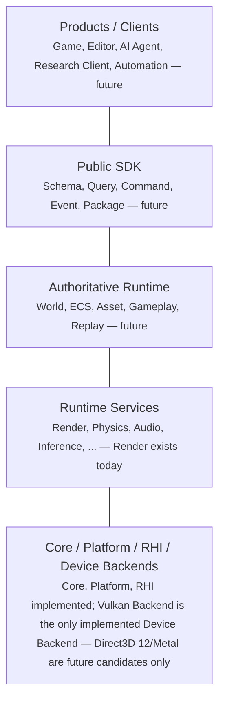

# Plan: Long-Term Engine Architecture Documentation

- **Spec:** [specs/0009-long-term-engine-architecture-alignment.md](../specs/0009-long-term-engine-architecture-alignment.md) (`Approved`)
- **Status:** Approved
- **Author:** Drafted by Claude Code (AI agent) at explicit human
  direction, against `Approved` Spec 0009 and `Accepted` ADR-0032–0037.
- **Human Review Approval (2026-08-15):** Reviewed and approved by slmao
  (`slmao <slmaosjtu@gmail.com>`), following an independent review of this
  Plan and PR #40 (Spec 0009/ADR-0032–0037 traceability; the planned
  `docs/architecture/engine_architecture.md` structure; the Device Backend
  boundary against ADR-0037's prohibition list; the file range,
  Implementation Order, and Verification Checklist) plus an HR-PLAN-0009
  decision table covering sixteen topics. Approved as drafted, with three
  points confirmed as part of the approval: (1) the optional `README.md`
  (repository root) link is **included** — a single short line pointing to
  `engine_architecture.md`, no longer optional; (2) this Plan's own
  approval-status update (this file's `Status`, and Spec 0009's `Related
  Plan(s)` field) is handled by this Human Review Approval itself, not by
  this Plan's Implementation; (3) a brief acknowledgment is added to the
  planned `docs/architecture/README.md` edit, framing
  `engine_architecture.md` as a second, narrower documented exception to
  that directory's as-built-only policy, alongside the existing "Bootstrap
  exception". This approval does **not** itself authorize Implementation —
  creating `engine_architecture.md` and making the navigation-link edits
  requires its own Implementation branch/PR, opened only after PR #40 is
  merged by a human, following this Plan's own Implementation Order and
  Verification Checklist.
- **Editorial revision:** [Spec 0033](../specs/0033-documentation-lifecycle-and-compaction.md);
  [PR #150](https://github.com/slmao/Atlantis/pull/150) Batch 3. Original
  scope, planned document design, and verification retained; the
  HR-PLAN-0009 topic-by-topic narration is preserved in PR #40 history.

## Objective

Turn Spec 0009's approved long-term architecture direction into one
concrete, reviewable documentation deliverable —
`docs/architecture/engine_architecture.md`, a new architecture
overview/navigation document — plus the minimal, non-duplicative
navigation-link updates to existing documents that Spec 0009's
Architectural Impact named as this Plan's expected scope. This Plan
produces no code, no test, no CMake, no Shader, and no new dependency: one
new file and a small number of link-only edits.

## Approval Baseline (what this Plan builds on, unchanged)

Re-verified fresh against `origin/main` immediately before drafting (see
Milestone 1 for the standing re-verification step):

- **Spec 0009** — `Approved`, Human Review 2026-08-15.
- **ADR-0032–0037** — all `Accepted` 2026-08-15 (Conceptual Architecture
  Layers versus Source-Module Ownership; Runtime Authority and Client
  Boundary; Stable Public Boundary versus Internal C++ Layout;
  Authoring/Runtime Data Separation as a Long-Term Principle; Agent-Native
  Automation and Machine-Verifiable Architecture as Long-Term Goals;
  Long-Term Device Backend Extensibility Without Phase 1 Scaffolding).
- None of these are reopened, modified, or reinterpreted by this Plan. Its
  only job is to turn their already-decided content into navigable
  documentation — it makes no new architectural decision.

## Authoritative Sources (what this Plan reads from, not restates)

Every claim `engine_architecture.md` makes must trace to one of these, by
link, not by paraphrase-without-citation:

- [AGENTS.md](../AGENTS.md) — governance rules, the nine-module list,
  Phase 1 constraints (Vulkan-only, target platforms, threading baseline);
  the sole governance authority.
- [specs/0009-long-term-engine-architecture-alignment.md](../specs/0009-long-term-engine-architecture-alignment.md)
  — the exact wording of the conceptual-layer diagram, its caption, and
  the three-tier (current / long-term direction / deferred) Device Backend
  treatment.
- [adr/0032](../adr/0032-conceptual-architecture-layers-versus-source-module-ownership.md)–[adr/0037](../adr/0037-long-term-device-backend-extensibility-without-phase1-scaffolding.md)
  — the six `Accepted` decisions this document surfaces.
- [docs/architecture/module_boundaries.md](../docs/architecture/module_boundaries.md)
  and [docs/architecture/overview.md](../docs/architecture/overview.md) —
  detailed per-module responsibility/dependency source of truth (still
  carrying their own `PROPOSED — pending spec/ADR approval, not as-built`
  banners — see "What this Plan deliberately does not touch").
- [docs/project-blueprint.md](../docs/project-blueprint.md) — current
  as-built status per spec/milestone, and the existing "Explicitly
  deferred or off-limits for now" list this Plan's ADR-0037 update
  extends, not replaces.
- [specs/README.md](../specs/README.md) — the spec registry (Section A)
  and the unmodified Candidate Spec Backlog (Section B).

## Non-Goals (confirmed matching Spec 0009's own Non-Goals)

This Plan does not:

- Write, generate, or modify any source code, test, CMake file, Shader, or
  CI configuration.
- Create any Direct3D 12/Metal directory, CMake target, SDK dependency,
  backend registry/factory, capability-tier abstraction, or `#ifdef`
  scaffolding of any kind — ADR-0037's prohibitions apply to this Plan as
  to any other future work.
- Decide, design, or implement Runtime, World/ECS, Asset, SDK, Package
  System, Job System, or any other Candidate Backlog item — this Plan
  documents that they are *not yet* implemented, it does not move them
  forward.
- Modify any existing `Accepted` ADR or `Approved` Spec/Plan.
- Modify `AGENTS.md`.
- Reorder or edit the Candidate Spec Backlog (`specs/README.md` Section B).
- Resolve the still-open `PROPOSED — pending spec/ADR approval, not
  as-built` banners on `module_boundaries.md`/`overview.md`/
  `threading.md`/`resource_lifetime.md` — a pre-existing, separately
  tracked documentation gap (see `project-blueprint.md` Section 3), larger
  in scope than this Plan and not decided by Spec 0009.

## Critical Architectural Boundaries (preserved, not re-decided here)

- Vulkan remains the only implemented Device Backend; the nine-module
  source-ownership list in AGENTS.md is unchanged and remains
  authoritative for CMake/dependency structure.
- The five-layer conceptual view is descriptive only — this Plan does not
  let it imply a new source directory, public interface, or CMake target,
  and does not create a `DeviceBackend` module of any kind.
- `docs/architecture/engine_architecture.md` is a navigation/overview
  layer, not an authority — per Spec 0009's Documentation Authority
  section, the *why* stays in `Accepted` ADRs, the current *what* in
  `Approved` Specs and `module_boundaries.md`, and roadmap/status in
  `project-blueprint.md`/`specs/README.md`.

## What this Plan deliberately does not touch, and why

- **`AGENTS.md`** — surveyed for a gap only a governance-document change
  could close and found none: every navigation need is met by adding a
  link in an existing navigation document. Default-not-modified.
- **`docs/architecture/overview.md`, `threading.md`, `resource_lifetime.md`,
  `platform-vulkan-wsi-boundary.md`** — not edited.
  `engine_architecture.md` links to `overview.md` for the existing
  module-map/dependency-direction content rather than duplicating it; the
  other three are unrelated to Spec 0009's scope.
- **The stale `PROPOSED — ... not as-built` banners** on those four files
  — `project-blueprint.md` Section 3 already named this as a known open
  documentation gap predating Spec 0009. Fixing it is its own
  Human-Review-worthy scope (which ADRs retire each banner, per-module or
  per-document), larger than and orthogonal to what Spec 0009 approved.
  This Plan does not fix it.
- **`docs/architecture/README.md`** — *is* touched (see Files below), by
  exception: it is the direct index for the very directory
  `engine_architecture.md` is added to; adding one link line there is the
  same "add a link, don't duplicate" treatment given to
  `module_boundaries.md`.

## Files / Modules Touched (expected)

### Files to Create

- `docs/architecture/engine_architecture.md` — the architecture
  overview/navigation document. Created by the Implementation PR that
  follows this Plan's Human Review approval, not by this Plan. See
  "Planned Document Structure" below for its full designed content.

### Files to Modify (link-only, non-duplicative)

- `docs/architecture/module_boundaries.md` — one short paragraph near the
  top pointing to `engine_architecture.md` as the directory's overview
  entry point. No per-module content changed; no banner changed.
- `docs/architecture/README.md` — one short "See also" line pointing to
  `engine_architecture.md`, plus one sentence framing it as a second,
  narrower documented exception to this directory's as-built-only policy
  (alongside, not replacing, the existing "Bootstrap exception"). No other
  change to the existing policy text or "Anticipated topics" list.
- `docs/project-blueprint.md` — two small, targeted edits: (1) a one-line
  pointer to `engine_architecture.md` near Section 3's opening, stated as
  "descriptive navigation added, no change to this section's own as-built
  content"; (2) Section 7's existing "D3D12 backend" and "Metal backend"
  bullets each gain one sentence noting ADR-0037 now records a long-term,
  boundary-level candidate position for both — explicitly not a change to
  "not planned for any Phase 1 or currently-scoped milestone" (a
  factual-currency fix: those bullets predate ADR-0037).
- `specs/0009-long-term-engine-architecture-alignment.md` — the `Related
  Plan(s)` field updated from "None yet" to link this Plan.
- `specs/README.md` — Spec 0009's registry row, Plan column updated from
  "None yet" to link this Plan. Section B (Candidate Spec Backlog)
  untouched.
- `README.md` (repository root) — a single short line, in the "Repository
  layout" section's `docs/` row or as one new bullet, pointing to
  `docs/architecture/engine_architecture.md`. **Confirmed in scope** as of
  this Plan's Human Review Approval — no longer optional.

### Files/Directories This Plan Does Not Touch

- Any existing `Accepted` ADR (`adr/0001`–`adr/0037`) or `Approved` Spec
  (`specs/0001`–`specs/0009`) or their Plans.
- `AGENTS.md`.
- `docs/architecture/overview.md`, `threading.md`, `resource_lifetime.md`,
  `platform-vulkan-wsi-boundary.md`.
- `specs/README.md` Section B (Candidate Spec Backlog).
- `src/`, `tests/`, `examples/`, `shaders/`, `cmake/`, any
  `CMakeLists.txt`, any dependency manifest, any CI configuration.
- Any Direct3D 12, Metal, Apple SDK, DXIL, or MSL file, directory, or
  reference of any kind, anywhere in the repository.

## Planned Document Structure: `docs/architecture/engine_architecture.md`

The actual design of the future document — concrete enough to review now,
not created as a file until Implementation.

### Status banner (top of file)

Follows `project-blueprint.md`'s precedent for a mixed as-built/
future-direction document (rather than `overview.md`'s pure `PROPOSED —
not as-built` banner):

> **Document type: navigation, not authority.** This document combines
> current as-built architecture (linking `Approved` Specs and `Accepted`
> ADRs) with `Accepted`-but-not-yet-implemented long-term direction. It
> does not itself authorize anything; per
> [AGENTS.md](../../AGENTS.md)'s single-authoritative-source principle,
> the *why* of any decision stays in its `Accepted` ADR, the current
> *what* stays in `Approved` Specs and
> [module_boundaries.md](module_boundaries.md), and roadmap/status stays
> in [project-blueprint.md](../project-blueprint.md)/
> [specs/README.md](../../specs/README.md). Where this document and any
> of those disagree, they win, and that is a bug in this document to
> fix, not a license to follow this document instead.

### Section 1 — Purpose

One paragraph: this is the entry point for understanding Atlantis's
architecture at both its current, implemented shape and its `Accepted`
long-term direction, and how the two relate.

### Section 2 — Two Orthogonal Views (per ADR-0032)

States, in the document's own words but not re-arguing ADR-0032's
reasoning: the conceptual product/layer view and the source/build
module-ownership view describe the same system from two different angles;
neither replaces the other; the module-ownership view is authoritative for
CMake/dependency structure.

### Section 3 — Conceptual Architecture Layers

The Mermaid diagram (below) using the exact five-layer names and content
`Approved` in Spec 0009's Proposed Design section — **not** the
illustrative placeholder names from the request that produced this Plan
(`Experiences/Applications`, `Runtime/World`, ...). The real, verified
layer names are:

1. **Products / Clients** (Game, Editor, AI Agent, Research Client,
   Automation — future)
2. **Public SDK** (Schema, Query, Command, Event, Package — future)
3. **Authoritative Runtime** (World, ECS, Asset, Gameplay, Replay —
   future)
4. **Runtime Services** (Render, Physics, Audio, Inference, ... — Render
   exists today)
5. **Core / Platform / RHI / Device Backends** (Core, Platform, RHI
   implemented today; Atlantis Vulkan Backend is the only implemented
   Device Backend — Direct3D 12 and Metal are named only as future
   candidates, per ADR-0037)

Immediately below the diagram, the diagram caption from ADR-0032/Spec 0009
is reproduced (not reworded): not a source-module list, not a build/CMake
dependency graph; connecting lines carry no call-direction or link-order
meaning; the nine-module view remains the sole authoritative source/build
structure; any future Device Backend becomes an independent sibling
module, not a new `DeviceBackend` abstraction; Atlantis Vulkan Backend is
not renamed or restructured by this diagram.

### Section 4 — Module Ownership Navigation

**Not a second diagram** — a short table listing Atlantis's nine
`AGENTS.md`-named modules, one line each: name, current status tag (see
Section 5), and a link to its owning Spec/`Accepted` ADR(s). Ends with an
explicit pointer: "For the current, detailed dependency graph and
per-milestone build status, see
[project-blueprint.md](../project-blueprint.md)'s own diagram — this table
is a navigation index, not a second copy of it."

### Section 5 — Status Legend and Long-Term Direction

A three-tag legend, applied consistently through the rest of the document:

| Tag | Meaning |
|---|---|
| **As-built** | `Approved` Spec, implemented, merged. Verifiable against `specs/README.md`. |
| **Approved direction / partially implemented** | An `Accepted` ADR states a principle or boundary, but no concrete module/system implementing it yet exists (e.g. ADR-0033's Client boundary). |
| **Long-term candidate** | Named in Spec 0009 or the Candidate Spec Backlog as a future direction; no `Accepted` ADR or `Approved` Spec commits to *building* it yet. |

Applies the tags, e.g.:

- **As-built:** Core, Platform (Windows), RHI, Vulkan Backend,
  RenderGraph, Renderer, Shader System, Tools (shader-compiler content).
- **Approved direction / partially implemented:** the five-layer/
  nine-module coexistence (ADR-0032); Runtime authority and Client
  boundary (ADR-0033); stable schema/identity/protocol boundary (ADR-0034,
  already realized narrowly by ADR-0001/ADR-0030); authoring/runtime data
  separation as an available option (ADR-0035, already realized narrowly
  by Shader System); Agent-native/machine-verifiable development tooling
  direction (ADR-0036); long-term Device Backend sibling-boundary
  reservation (ADR-0037).
- **Long-term candidate:** Atlantis Runtime (the module), World/ECS, Asset
  System, Public SDK, Package System, Job System, Editor/Tool Connection
  Protocol, Gameplay SDK, Research/Simulation API, AI Inference
  Integration, UGC Sandbox, Direct3D 12 Device Backend, Metal Device
  Backend, Android Platform implementation, iOS Platform, Agent-native
  CLI/manifest/diagnostic tooling. Each links to its Candidate Backlog row
  (`specs/README.md` Section B) where one exists.
- **Explicitly not reserved, any tier:** WebGPU (per ADR-0037, given no
  position at all — stated once, here, so it is not silently omitted and
  mistaken for an oversight).

### Section 6 — Common Misreadings to Avoid

A short, direct list (the section that most directly prevents the six
misreadings named in this Plan's governing request):

- Runtime, World, SDK, and Asset are **long-term candidates** — none is
  implemented, and none has an implementation timetable.
- Direct3D 12 and Metal are **long-term candidates only** — no code, no
  timetable, no Phase 1 authorization (ADR-0037).
- "Agent-native" (ADR-0036) is a **development-tooling direction** — not a
  runtime AI feature, not an in-game agent API.
- iOS's graphics backend choice (Metal vs. Vulkan/MoltenVK) **remains
  undecided** — this document does not decide it either.
- Headless rendering **remains a Phase 1 deliverable**, sequenced after
  windowed rendering (already complete) — not moved out of Phase 1 by any
  of this.
- Direct3D 12 and Metal are **not** Candidate Spec Backlog items — see
  `specs/README.md` Section B, unmodified.

### Section 7 — Where to Go Next

Links only, no restated content: `AGENTS.md` (governance rules),
`module_boundaries.md` (per-module detail), `project-blueprint.md`
(roadmap/status), `specs/README.md` (spec registry and Candidate
Backlog), and each `Accepted` ADR cited above.

## Diagrams

**One Mermaid diagram, not two** — the module-ownership view is a table
(Section 4), not a second diagram, to avoid maintaining two dependency
graphs that could drift out of sync with `project-blueprint.md`'s own
authoritative Mermaid diagram. If Plan Review prefers a second, lighter
diagram instead of a table, that is a Plan Review question (see Open
Questions); this Plan recommends the table.

The one diagram (conceptual layers, Section 3), in Mermaid, using
undirected edges (`---`, no arrowhead) specifically because a directed
arrow (`-->`) would visually imply the call/dependency direction this
diagram is required to disclaim:

Constraints on this diagram, verified at Implementation time (Milestone 5)
and again at review time (Milestone 9):

- No arrowheads (`-->`) anywhere in it.
- No node named after an unimplemented concrete module (`DeviceBackend`,
  `Runtime`-as-a-box-with-children, etc.) — only the five layer names
  above.
- No Direct3D 12/Metal node styled as equivalent-looking to the
  implemented Vulkan Backend — they appear only in the layer-5 descriptive
  text, not as their own boxes.
- Renders without error in GitHub's native Mermaid support and in the
  Mermaid Live Editor (manual check, since this repository has no Mermaid
  linter).

## Implementation Order

Each step's own verification and stop condition applies; a genuine need to
restructure a section is a Plan deviation to disclose in the
Implementation PR, not a silent change.

1. **Re-verify authoritative baseline** (read-only). Confirm Spec 0009
   still `Approved`, all six ADRs still `Accepted`, no conflicting change
   landed since this Plan's approval — a short confirmation note in the
   Implementation PR, from a fresh `grep` of each file's `Status:` field.
   Stop condition: if any status reverted or a conflicting architectural
   change landed on `main`, halt and report a Blocker.
2. **Draft `engine_architecture.md`'s skeleton** — status banner and all
   seven section headings, no body content. Heading list matches this
   Plan's design exactly.
3. **Write Section 1 (Purpose) and Section 2 (Two Orthogonal Views)** from
   ADR-0032's Decision text — two short paragraphs, no new argument;
   every claim traces to a specific ADR-0032 sentence.
4. **Write Section 3 (Conceptual Architecture Layers) and its diagram**
   from Spec 0009's Proposed Design (verbatim layer names/content) and
   ADR-0032's diagram-caption requirement. Diagram node text matches Spec
   0009's approved diagram; caption bullets present and unmodified in
   meaning.
5. **Write Section 4 (Module Ownership Navigation)** — the nine-row table
   (names match `AGENTS.md` verbatim, no tenth "Device Backend" row) plus
   the pointer to `project-blueprint.md`.
6. **Write Section 5 (Status Legend and Long-Term Direction)** — the
   three-tag legend and its applied tags. Every "Long-term candidate" item
   has a Candidate Backlog row or Spec 0009 mention; every "Approved
   direction" item cites its ADR; no item double-counted.
7. **Write Section 6 (Common Misreadings to Avoid) and Section 7 (Where to
   Go Next)** — the six-bullet list (worded to match this Plan's list, not
   loosened) and the closing links-only section.
8. **Update navigation-only files** — `module_boundaries.md`,
   `docs/architecture/README.md`, `project-blueprint.md` (two edits),
   `specs/0009-*.md`, `specs/README.md`, `README.md` (root). Each file's
   current content read fresh immediately before editing; exactly the
   additions described under "Files to Modify", no other line changed;
   `git diff` per file reviewed line-by-line; any unplanned line reverted
   before commit.
9. **Duplicated-authority and scope check** — a pass/fail note per section
   confirming no paragraph restates governance rules, ADR reasoning, or
   roadmap/status information beyond a one-line summary plus a link. Stop
   condition: rewrite any duplicating section before proceeding — do not
   carry a duplication forward "to fix later."
10. **Full verification pass and PR preparation** — the Verification
    Checklist below fully executed; Implementation PR opened, linking Spec
    0009, ADR-0032–0037, this Plan, and merged PR #39. Any Verification
    Checklist item failing means the PR is not opened (or is opened as a
    Draft with the failure disclosed) until fixed — there is no "fix in a
    follow-up PR" precedent for a documentation-only PR.

## Sequencing & Dependencies

- Depends on Spec 0009 (`Approved`) and ADR-0032–0037 (`Accepted`) — both
  satisfied, verified fresh at Milestone 1.
- Steps 2–7 (drafting `engine_architecture.md`'s sections) are sequential
  within the file but do not block Step 8 (navigation-file updates) — Step
  8 may proceed once the target anchor sections exist, in parallel with
  later drafting steps.
- Steps 9 and 10 must follow all drafting and navigation-update steps —
  they check the finished state.
- No dependency on any other in-flight Spec, Plan, or PR.

## Verification Checklist

Maps every item this Plan's governing request required, made concrete and
executable:

- [ ] Every Spec 0009 Requirement (Immediately-effective invariants,
      Long-term direction, Deferred, Explicitly rejected/deferred) is
      represented somewhere in `engine_architecture.md`'s Section 5 or
      Section 6, or explicitly out of scope per this Plan's Non-Goals.
- [ ] Every ADR-0032–0037 Decision is represented in Section 3, 4, 5, or 6
      — spot-checked by grepping each ADR's Decision-section bullets
      against the drafted document.
- [ ] Current Vulkan-only status stated unambiguously in Section 5 and
      Section 6 — no sentence implies a second backend exists or is
      scheduled.
- [ ] Direct3D 12/Metal appear only as "Long-term candidate," never as
      "As-built" or "Approved direction / partially implemented".
- [ ] No second-Device-Backend scaffolding, code, directory, CMake target,
      or dependency exists anywhere in the diff (`git diff --stat`
      reviewed against the Files list).
- [ ] iOS's Metal-vs-MoltenVK choice stated as undecided, matching
      `AGENTS.md`'s own wording (not loosened).
- [ ] macOS and Linux not named as target platforms anywhere in the new or
      modified text.
- [ ] The nine-module `AGENTS.md` list is not superseded, restructured, or
      contradicted by the conceptual-layer diagram or Section 4's table —
      `module_boundaries.md` remains the cited authority for per-module
      detail.
- [ ] "Device Backends" never described as a public module, C++ interface,
      or CMake target — only as a conceptual-layer label and a descriptive
      category.
- [ ] RenderGraph stated as the mandatory path for GPU work (per
      `AGENTS.md`'s Golden Rule), unchanged.
- [ ] Renderer's boundary from Platform/Window/Swapchain/concrete graphics
      API stated unchanged, citing ADR-0001/ADR-0002.
- [ ] Runtime, World, SDK, Asset status not overstated — each tagged
      "Long-term candidate," none implied implemented or scheduled.
- [ ] Agent-native (ADR-0036) stated as development-tooling direction
      only, not runtime AI capability.
- [ ] Windowed-then-headless Phase 1 sequencing unchanged; headless still
      described as a Phase 1 (not later-phase) deliverable.
- [ ] `specs/README.md` Section B (Candidate Spec Backlog) diff is empty —
      confirmed via `git diff` on that section specifically.
- [ ] All internal Markdown links in every touched file resolve (a script
      or manual pass resolving each `[text](relative/path.md)` link
      against the actual file tree).
- [ ] The Mermaid diagram renders without syntax error (GitHub PR preview
      and/or the Mermaid Live Editor) and satisfies the diagram
      constraints under "Diagrams".
- [ ] No section of `engine_architecture.md` reproduces more than one
      sentence of `AGENTS.md`, any `Accepted` ADR's Decision/Context text,
      or `module_boundaries.md`'s per-module detail verbatim.
- [ ] `git status`/`git diff --stat` shows no source, test, CMake, Shader,
      or dependency-manifest file in the diff.
- [ ] `git diff --check` passes (no trailing-whitespace/newline errors
      beyond this repository's existing CRLF-on-touch warning).
- [ ] Final diff's file list matches this Plan's "Files / Modules Touched"
      section exactly — any addition or omission called out as an
      explicit, disclosed deviation in the Implementation PR.

This is a documentation-only Plan: verification is entirely documentation
review (link resolution, terminology/scope grep, duplicated-authority
check, Mermaid syntax) — no GPU test, no CTest suite, no build is relevant
here.

## Rollback Plan

Every change this Plan authorizes is Markdown-only and additive or
narrowly corrective (the two `project-blueprint.md` Section 7 bullets). If
a problem is found post-merge:

- `docs/architecture/engine_architecture.md` can be reverted (deleted) in
  a single follow-up commit with no effect on any other module, build, or
  test — it has no consumer other than human/AI readers.
- The link-only edits to `module_boundaries.md`,
  `docs/architecture/README.md`, and `project-blueprint.md` can each be
  reverted independently, file by file.
- The `specs/0009-*.md` and `specs/README.md` Plan-link updates can be
  reverted by restoring the "None yet" wording — this does not invalidate
  Spec 0009's `Approved` status or ADR-0032–0037's `Accepted` status.
- No code, test, or build artifact exists to roll back.

## Definition of Done

Per [docs/process/definition-of-done.md](../docs/process/definition-of-done.md),
with these deltas specific to this documentation-only Plan:

- No build, test suite, or Vulkan Validation Layers run applies — this
  Plan produces no code.
- "Builds cleanly with no new warnings" is replaced by: all items in this
  Plan's own Verification Checklist pass, and `git diff --check` is clean.
- Human Review of the Implementation PR replaces GPU/manual-demo
  verification as the acceptance gate, consistent with how Spec 0009
  itself (also code-free) defined its Testing & Verification Plan.

## Open Questions for Plan Review

Recorded as recommendations, not decisions — Plan Review may accept,
reject, or amend any independently. **Resolved by this Plan's Human Review
Approval:** the `README.md` root-link question — confirmed in scope. Still
open, left to Implementation-time judgment or a future Spec:

- Whether the five-layer conceptual diagram should use different visual
  styling (left-to-right layout, or color-coding by status tier) than the
  plain top-down `flowchart TD` with undirected edges proposed here.
- Whether Section 4 should be a second, lighter Mermaid diagram instead of
  a table — this Plan recommends a table to avoid a second dependency
  graph drifting out of sync with `project-blueprint.md`'s own.
- Whether Agent-native/machine-verifiable tooling (ADR-0036) should
  eventually get its own Candidate Backlog entry — unresolved by Spec 0009
  itself, not decided here either.
- Whether `engine_architecture.md` should name Direct3D 12/Metal directly
  in its prose (this Plan's default, matching ADR-0037's own choice) or
  refer to "future candidate Device Backends" without naming products.
- Runtime-Host-vs-Headless relative priority — unresolved by Spec 0009,
  not addressed by this Plan; Section 4's table implies no ordering
  between Candidate Backlog items.
